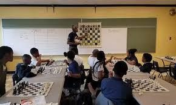

# ♟️ Should Chess be added in academics?

Chess is a mental sport which is played since ancient times, the Chess
we play today is evolved from many different variants of chess but the
*'Chaurang'* believed as first of such variants played in India and
later travelled across the world in different variants played in
different parts of the World. Today, Chess has developed lots of
theories, studies, strategies, principles, etc. and have become a very
rich and entertaining game to play as well as watch. Even though being a
board game Chess is not solved and there are so many permutations,
combination, uncountable positions which keep the game evolving and
professional explore through it with so much passion. With modern
engines and technology like Stockfish, Leela, Alpha-zero, etc., coming
in picture human has started to learn different and unexplored factors
which ultimately improves quality and excitement in chess game. To watch
engines play and the moves which engines play or suggest in particular
position of chess game boggles mind of top Grandmasters and persons
studying chess.

Chess is a game which requires focus, calculation, mental strength,
creativity, strategy, decision making and countless other things which
make a person good not only in game but in Life and Academics. It is not
only about winning material, protecting king but also about coordinates,
finding geometrical patterns, deciding on best possible outcome,
consequences of decision, etc. The chess can become an excellent
educational tool which will help child to improve and inculcate all this
qualities which will be lifelong.

>Chess in Education Commission(FIDE)

A study by Smith and Cage (2000) posited that students who received
chess instruction scored significantly higher on all measures of
academic achievement, including math, spatial analysis, and non-verbal
reasoning ability. Other findings in various locations around the United
States and Canada indicate that chess results in improved scores on
standardized tests in both math and reading.

Playing chess also improves memory which is proved by Robert Ferguson in
an experiment conducted where he took fourteen 6th graders to provide
them with chess lessons to check their memorizing capabilities. Students
played chess daily for a year. In the end, with the help of the \"memory
subtest from California
Achievement Test battery,\" the results revealed that students who
played chess daily had developed their memory power more effectively as
compared to the general population. Research indicated that students who
play chess instantly understand concepts and better correlate them with
cognitive patterns. In short words, it connects the symbolic equations
with understandings.

After going all this studies and researches conducted across the world
it is certain that chess has only benefitted and by adding chess in
academics and making a standardized syllabus or studying pattern can
help children to excel in different fields and as a whole increase
productivity and efficiency of whole world. This is truly exceptional by
adding particular game in academics can change the future.

>CPS Academic Chess Programs

## Reference

Smith, J. P. and Cage, B. N. (2000). The effects of chess instruction on
the mathematics achievements of southern, rural, black secondary
students. Research in the Schools, 7, 19-26.

## About the Author

Jashwaneel Patil is a student pursuing Bachelor of Engineering in
Electrical and a young mind who likes to explore and research in
different areas. His vision lies in making Earth to make a better place
to live with taking small steps towards sustainability and making best
use of technology available to make easier life for mankind.
