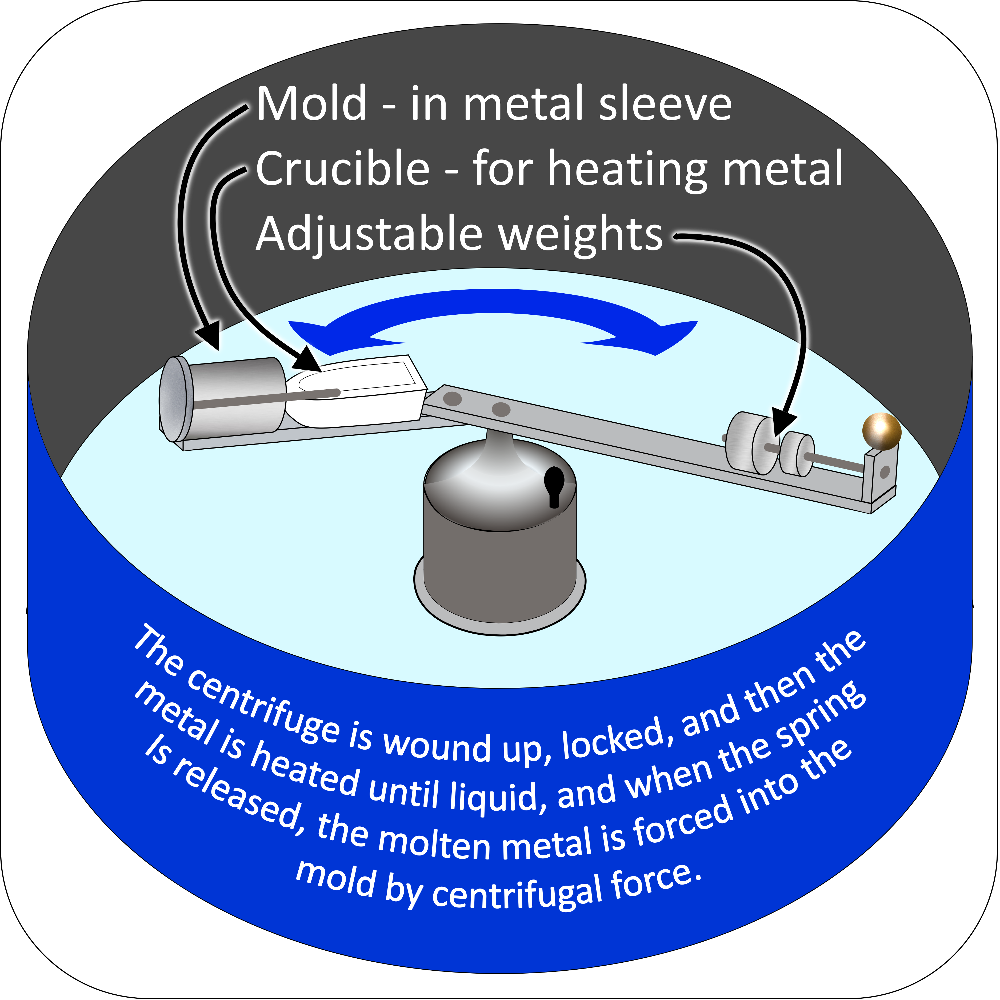

# 🥈 Silversmith

In my youth I was a jeweler, a Silversmith primarily, so most of this article
will be written from my own perspective as a designer and producer of small
items of jewelry. Some Silversmiths work with large pieces, constructing vases,
candelabras, plates, etc, but I stayed with the small stuff.

There are many tools that can be used to construct large or small pieces.
Various sizes and shapes of hammers, saws, snips, files, grinders and of course
tools for gripping and polishing, as well as anvils come in handy. Solder,
torches and fuel are part of the inventory too.

Although I did some “construction”, most of my work involved a technique called
“Lost Wax Casting”, primarily used for small jewelry pieces. There are many ways
to create a mold (or in non-American usage, mould), but the lost wax method is
most often used for small pieces.

The process, simplified here, is described in detail in the references. First of
all a piece must be created out of wax (although other materials are sometimes
used). The wax comes in different forms. Some are wires, ribbons or other shapes
that are preformed commercially. Also wax comes in different hardnesses, so in
some cases it can be squeezed and shaped by hand or with small metal tools, or
in other cases it can be shaved, cut, or scraped with an engraving type of tool.
Wax is available to be dispensed using a heated tool sort of like a pen or small
injector. Regardless of how it is shaped, very simple or very intricate wax
models of the finished piece are the result. The finished wax model then has a
wax “sprue” attached to it. The sprue is funnel shaped, with the small end being
attached to a part of the wax model where the resulting metal casting can be
smoothed when the metal sprue is removed. The sprue forms a funnel shape within
the mold, so that hot, molten silver or other metal can be poured or forced into
the mold.

Imagine a “carving” or piece of wax the exact size and shape that the jeweler
will duplicate in silver. Then attach the funnel shaped sprue at a point where
the flow of molten silver will be the greatest as it enters the mold that will
be created. Then that sprue is attached to a rubber base with the widest part
resting on that base. A metal cylinder is then attached to that same rubber base
(they are designed to fit together to form a perfect tight seal), so one can
look into the cylinder and see the wax piece and the rubber bottom. Then fill
the cylinder with a plaster like material called “investment” which is very fine
grained. A vacuum is then applied to remove any air bubbles. After the
investment hardens and dries, the cylinder, investment and wax are separated
from the rubber bottom and they are placed in a kiln to melt out the wax (with
the sprue facing down of course). There will be a specific schedule for this
process, to ensure removal of ALL residual wax and proper temperature for the
following…

This next step must be done rapidly and immediately following the wax removal,
so that the molten silver will flow easily into the mold that has been created
by removing the wax.

The plaster/investment mold and it’s cylinder are turned sideways and placed at
one end of a pre-balanced centrifuge that will spin at high speed and force
molten silver (or other metal) into the mold. The mold, with the sprue facing
toward the center of the centrifuge, has a crucible snuggled up to it, so molten
silver from the crucible will flow into the sprue and the rest of the empty
space in the mold as the centrifuge is spinning. One quickly places the hot mold
that has just had the wax melted out, then heats silver in the crucible and
releases the spring loaded centrifuge to force the silver into the mold. At that
point, The metal is forced into the mold, and the flask, plaster and metal can
be dipped into cold water afterward to remove the investment from around the
metal (Careful!). From that point on, cut the sprue off of the piece and begin
the process of smoothing and polishing. Caution: This process takes some time to
learn and perfect, and there will be a significant investment in equipment as
well.

- <https://en.wikipedia.org/wiki/Silversmith>
- <https://en.wikipedia.org/wiki/Lost-wax_casting>
- <https://www.jewelry-tutorials.com/lost-wax-casting-jewelry-process-steps.html>

## About The Author

Harley Armentrout is a happy husband and father, former silversmith, aerospace
electronics prototype assembler, test, calibration & repair technician, also
writing test procedures at [BallAerospace](https://www.ball.com/aerospace). Then
21 years in the gaming industry, in a range of positions, culminated as a Gaming
Inspector, observing and reporting on rules violations, safety issues and
criminal activities for the
[Yavapai Prescott Indian Tribe](https://buckyscasino.com/). After “retiring”
Harley taught himself a few graphic design skills and he works as a freelance
designer.
