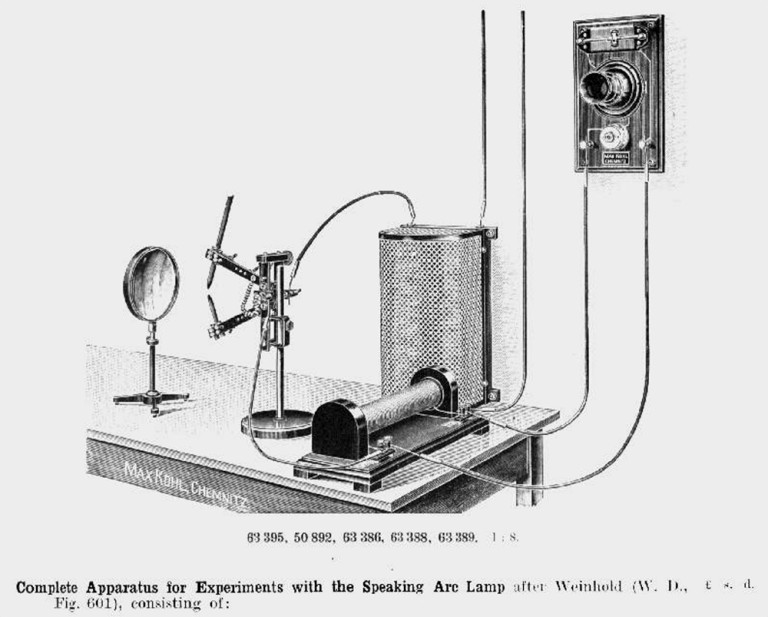

# 🎶 Singing Arc

Prior to the invention of the incandescent light bulb, arc lamps were used to light the streets. They created light using an electrical arc between two carbon electrodes.

The problem with this method of lighting, apart from the dullness of the light and inefficient use of electricity was a constant humming, shrieking or hissing noise emitted by the electric arc.

The British physicist and electrical engineer William Duddell was appointed to solve the problem in London in 1899. During his experiments Duddell found that by varying the voltage supplied to the lamps he could create controllable audible frequencies from a resonant circuit caused by the rate of pulsation of exposed electrical arcs.

Duddell connected a tuned circuit consisting of an inductor and capacitor across an arc. The negative resistance of the arc excited audio frequency oscillations in the tuned circuit at its resonant frequency, which could be heard as a musical tone coming from the arc.

Duddell used his oscillograph to determine the precise conditions required to produce oscillations. To demonstrate his invention before the London Institution of Electrical Engineers, he wired a keyboard to produce different tones from the arc, and used it to play a tune, God Save the Queen making it one of the first examples of electronic music. This device, which became known as the "singing arc", was one of the first electronic oscillators.

When Duddell exhibited his invention to the London institution of Electrical Engineers it was noticed that arc lamps on the same circuit in other buildings also played music from Duddell’s machine this led to speculation that music delivered over the lighting network could be created.

“All three arcs were found to be supplied with current from the street mains, and it was clear that this main current had been varied in such a way by Mr. Duddell’s keyboard as to reproduce in the two other laboratories the tunes which he supposed he was playing only to his audience in the lecture room…This obviously meant that by playing on one properly arranged keyboard tunes could be reproduced in a number of different arcs and at a distance from the musician.“

The carbon arc lamp’s audio capabilities were also used by Thaddeus Cahill to amplify the sound produced by his Telharmonium during his public demonstrations of the instrument some ten years later – a direct ancestor of today’s plasma-loudspeaker. In the 1930s Wolja Saraga experimented with spark-gap sound with his Saraga Generator.

Here you can see the singing arc in action: <https://youtu.be/cCEU3ShVE2E>

## Next topic: Helmholtz Sound Synthesiser

## Sources

- Wikipedia / 120years.net / Youtube

## About the Author

"Guido F. Matis (a.k.a. widosub), a seasoned producer-composer authority with an unquenchable compassion towards the musical expression, and many years of experience in the fields of event organizing, movie post-production, and recording with professional musicians. His devotion to movie sounds shows in his art - widosub's music is filled with landscapes of emotions, dramatic twists and melancholic moods. He's one of the hosts of Tilos Rádió's MustBeat show, in which he's is focusing on drum'n'bass and chillout
music. He's also one half of the duo Empty Universe."
