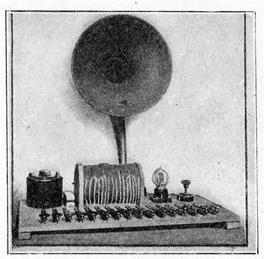

# 🎷 Staccatone

The staccatone is an electronic musical instrument invented in 1923, by the journalist radio and writer of science fiction Hugo Gernsback.

As Audion piano of Lee Forest, the staccatone was based on the vacuum valve .

Hugo Gernsback (born Hugo Gernsbacher, August 16, 1884 – August 19, 1967) was a Luxembourgish–American inventor, writer, editor, and magazine publisher, best known for publications including the first science fiction magazine. His contributions to the genre as publisher—although not as a writer—were so significant that, along with the novelists H. G. Wells and Jules Verne, he is sometimes called "The Father of Science Fiction". In his honour, annual awards presented at the World Science Fiction Convention are named the "Hugos".

Hugo Gernsback, perhaps better known as the ‘Father of Science Fiction’ (and currently eponymously celebrated in the ‘Hugos’ Science Fiction Awards) also invented and built an early electronic instrument called the Staccatone in 1923 (with Clyde.J.Fitch) which was later developed into one of the first polyphonic instruments, the Pianorad in 1926. Gernsback was a major figure in the development and popularisation of television, radio and amateur electronics, his multiple and sometimes shady businesses included early science fiction publishing, pulp fiction, self-help manuals and DIY electronics magazines as well as his own science fiction writing.

The Staccatone was conceived as a self-build project for amateur electronics enthusiasts via Gernsback’s ‘Practical Electrics’ magazine. The instrument consisted of a single
vacuum tube oscillator controlled by a crude switch based 16 note ‘keyboard’. The switch based control gave the note a staccato attack and decay – hence the ‘Staccatone’. Gernsback promoted the instrument through his many publication
and on his own radio station WJZ New York:

[Hugo Gernsback’s ‘Staccatone’ c 1923]

“The musical notes produced by the vacuum tubes in this manner have practically no overtones. For this reason the music produced on the Pianorad is of an exquisite pureness of tone not realised in any other musical instrument. The quality is better than that of a flute and much purer. the sound however does not resemble that of any known musical instrument. The notes are quite sharp and distinct, and the Pianorad can be readily distinguished by its music from any other musical instrument in existence.”

Next topic: Sphäraphon

## Sources

- Wikipedia / 120years.net / Oxfordreference.com

## About the author

"Guido F. Matis (a.k.a. widosub), a seasoned producer-composer authority with an unquenchable compassion towards the musical expression, and many years of experience in the fields of event organizing, movie post-production, and recording with professional musicians. His devotion to movie sounds shows in his art - widosub's music is filled with landscapes of emotions, dramatic twists and melancholic moods. He's one of the hosts of Tilos Rádió's MustBeat show, in which he's is focusing on drum'n'bass and chillout music. He's also one half of the duo Empty Universe."
