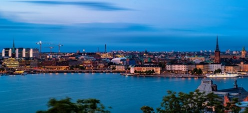
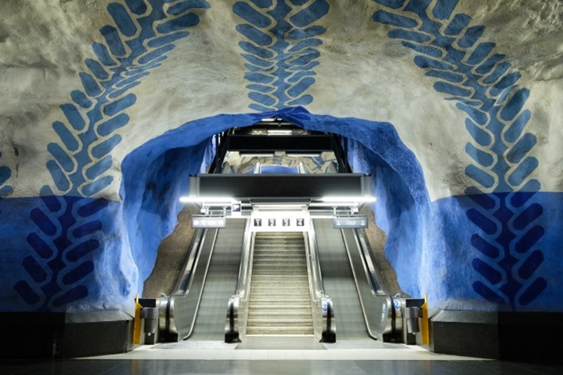
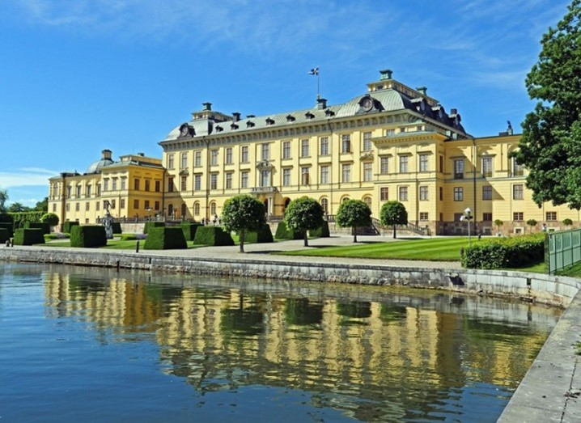

# 🇸🇪 Stockholm

Stockholm is the capital of Sweden and is made up of 14 islands, it is one of the most beautiful and surprising cities in Europe. Located in an archipelago with more than 24,000 islands bathed by the North Seas, this Baltic capital is known as the Venice of the North for its large number of canals.
Stockholm is a cosmopolitan city that falls in love at first sight, with a historic center full of charming corners, it has fantastic museums and perfectly maintained parks.

We are going to guide you through this clean and tidy city, through its most iconic places for you to visit and not miss the most important things in Stockholm.

## Gamla Stan

Gamla Stan is the historic center of the city, with medieval buildings with colorful facades and squares such as Köpmantorget, Järntorget and Stortorget that make this part of the city a charming place. This neighborhood also has other tourist sites such as the Cathedral of Saint Nicholas, the Royal Palace, the Parliament and the Nobel Museum where you can discover the history of Alfred Nobel.

In this part of the city you will also find restaurants where you can eat typical dishes of the city, you can go to Stockholms Gastabud and Nystekt Stromming to eat the traditional meatballs, fresh salmon or herring.

## Royal Palace

The Royal Palace is the residence of the Swedish monarchy, this fortress was built in the 13th century and is one of the largest palaces in Europe with more than 600 rooms. Its most outstanding rooms are the Royal Apartments, the Banquet Hall, the Royal Chapel, the Carriage Museum, the Armory and the Library and it has approximately 100,000 old books.

## Riddarholmen Church

The Riddarholmen Church is the pantheon of the most important kings of the country, it was built in the 13th century and impresses with its high spire and its brick facade. Inside you can see the spectacular Bernadotte Chapel with several stone sarcophagi, decorated with precious brials and a valuable collection of shields.

## Parliament of Sweden

The Parliament is based in an imposing building on the island of Helgeandsholmen, decorated with frescoes bathed in natural light through a glass dome. During your visit you will be able to see some of its most emblematic rooms such as the Bank Lobby, the Plenary Hall, the beautiful Second Chamber Hall and the Communication Corridor.

## Saint Nicholas Cathedral

It is the oldest church in Stockholm and this baroque-style cathedral was built just over seven centuries ago. Inside you can see a large number of works of art and a 15th-century sculpture representing Saint George and the Dragon, as well as the Vädersoltavlan painting, which is the oldest in Stockholm. It is important to note that this cathedral has been the site of several coronations and royal weddings.

## Stockholm City Hall

Climbing the 365 steps to reach the highest part of the Town Hall tower, you can have the best views of the historic center. It is located on the shores of Kungsholmen Island with its tower that culminates in a needle with three crowns and the red color of its bricks stands out and when you leave the building, you can go to Stadshuset Park where you can see the beautiful Lake Mälaren and excellent views by Gamla Stan.

## Kungstradgarden Park

The Kungstradgarden Park offers you a beautiful walk among plants, fountains, trees and flowers. But it also has several cafes where you can drink something hot and if it's winter, you can skate on its ice rink.

## Subway

The Stockholm metro is one of the most impressive in the world, since in 90 of its 100 stations you can see them decorated with works of art by renowned artists. It is the largest art gallery in the world and although all the stations have something interesting, we are going to recommend the ones with the most important works: Radhuset, Solna Centrum, Kungsttadgarden, Tekniska Höskolan, Thorildsplan, Stadium and Slussen.

## Vasa Museum

The Vasa Museum houses the largest warship in the Swedish fleet, which sank in 1628 due to its excessive weight and was recovered 331 years later (1961). It is preserved almost intact by the low salinity of the Baltic Sea. But in addition to seeing this great ship from the 17th century, you can enjoy more than 4,000 preserved objects from that time.

## Skansen-Museum

This open-air museum located on the island of Djurgarden was opened in 1891 and is considered to be the oldest in the world. In this room with a large green space, the culture and history of Sweden in the time before the industrial revolution is shown. You'll be able to see more than 150 characteristic houses and farms from that era for each region of the country, including the town hall, an 18th-century stave church, and the Bollnästorget market square.

## Drottningholm Palace

Drottningholm Palace was declared a UNESCO World Heritage Site. The palace built at the end of the 16th century is located on Lovön Island and is the best representation of the Swedish imperial era. Many tourists equate its beauty with the Palace of Versailles and during your visit you can enjoy the Royal Theater, the exquisite decoration of the rooms, the design of the Chinese Pavilion and its beautiful gardens.

## ABBA Museum

This museum is dedicated to the group ABBA that revolutionized the music of the 80's and were able to sell more than 400 million records. You will be able to see the history of the group from its beginnings in 1970 until its separation in 1983.

## A boat ride

The routes made by boat through the Stockholm archipelago is one of the best activities you can do. You can take one of the cruises that leave every day from the city center and you will be able to get great views of the center of Stockholm, the island of Djurgarden and its bridges.

## Sodermalm neighborhood

Södermalm is located on an island of the same name and is a bohemian neighborhood with a great atmosphere, art galleries, alternative shops and designer cafes. But it also has other points of interest such as the church of Santa Catalina, the Museum of Photography, the Church of María Magdalena, the Medborgarplatsen Square and Götagatan street where you can find a wide variety of stalls with vintage clothing. It can also bring you closer to the Mariatorget park at sunset or go up the Katarina elevator, where you can have incredible views of the city while the beautiful sunset occurs.

## Sergel Square

This original square has the Kulturhuset, which is a cultural center full of galleries, bars and interesting activities at all hours, as well as a fountain and a spectacular glass obelisk.
Stockholm is an especially beautiful city full of interesting things to do and places to see.
