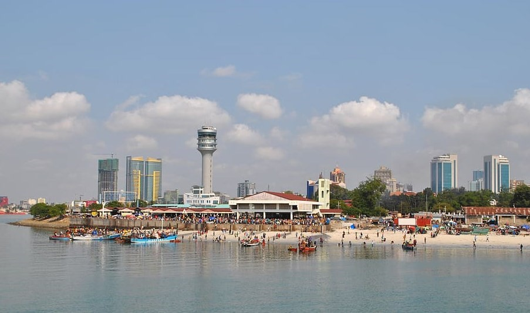
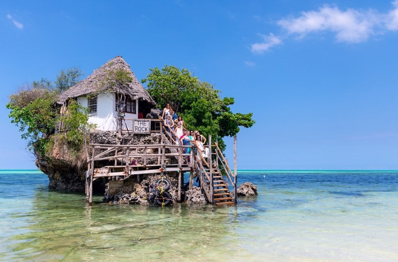

# 🦒 Tanzania

The United Republic of Tanzania is a country located on the east coast of the central part of Africa, whose capital is Dodoma. This country has incredible natural parks, dream beaches, majestic wild animals and charming people. Indeed, Tanzania has everything you could want on a trip to Africa, impressive landscapes, paradisiacal beaches bathed by crystal clear waters and impressive animals that you can see from a jeep. Safaris on the island of Zanzibar and in the Serengeti are famous, but we are also going to guide you through its most beautiful and interesting places, so that if you visit Tanzania you can discover its most precious treasures.

## Serengeti National Park

If you are a wildlife lover you should visit the Serengeti sometime. This park was established with the purpose of protecting the shocking phenomenon of the Great Migration and it is when each year more than 3 million herbivores travel up to 3000 km in search of more fertile land until they reach the Masai. Today it is the main source of tourism in the country and an impressive site to see animals in total freedom and this park extends through countless sheets, rivers and forests that are home to lions, leopards, rhinoceroses, cheetahs, hyenas , buffalo, zebra and other species.

Any day in the Seregueti begins at dawn, which is the time when the cats are most awake. Walking the paths of the park to see wildlife in first person is an experience without limits and then you can enjoy a beautiful sunset of all colors. Later you can rest in one of the camps, to start the next day with another marathon safari day. It is advisable that you plan at least 3 days to get to know its 14,763 km² area, but you will also have the opportunity to contemplate one of the most beautiful landscapes in all of Africa from the heights of a balloon, which is an experience that you should not miss.

## Zanzibar

One of the best tourist attractions in Tanzania is the Zanzibar archipelago made up of islands like Pemba and small islets located in the Indian Ocean. In these islands you will find a good dose of nature, history and idyllic beaches, which are worthy of a postcard.

The best beaches are on the island of Zanzibar, you can fall in love with the beaches of Nungwi as they are the least affected by the tides and you can see the construction of the traditional boats (the dhows) of the Swahili coast.
Stone Town is the old town of Zanzibar and was declared a World Heritage Site by UNESCO, there you can see a whole labyrinth of coral walls, as well as carved wooden doors, which will leave you breathless.

But if you prefer a backpacker and youthful atmosphere, the recommendation is to go to places like Paje or Jambiani, where there are also beautiful beaches, or dive in the Mnemba atoll where you will find an impressive marine reserve and the best paradises for diving in Tanzania.

Taste the gastronomy at The Rock, which is a restaurant known worldwide for its excellent dishes and is located on an islet a few meters from the shore. But if you prefer luxurious accommodations and more comfortable beaches, a resort in Kendwa is advisable.

In the Jonzani forest you can meet the red colobus monkey and it is the only place on the planet where you can see this primate

## Ngorongoro Conservation Area

Ngorongoro is one of the largest volcanic calderas in the world. You can enter the crater of an extinct volcano where you can see various ecosystems such as forests, sheets or swamps, where animals live in total freedom.

## Kilimanjaro National Park

If you take a flight from Kilimanjaro International Airport you should ask for a window seat to contemplate Kilimanjaro, which is definitely one of the symbols of Africa with its 5895 meters of altitude. But if you are in excellent physical condition and have a passion for the mountains, you can climb the snow-covered summit of Kilimanjaro. The tour can last between 5 and 7 days to climb the highest mountain in Africa.

## Lake Tanganyika

It is the longest lake on the planet and the second deepest. Although it is true that it belongs to four countries, Tanzania is the one with the highest proportion with 46%. You can tour the Tanganyika by boat and sleep in one of its cabins to reach Kigoma, where you can get to know Ujiji and visit the Gombe Stream National Park, which is the habitat of several chimpanzee communities.

## Tarangire national park

In this park you can also go on safari and see a large number of animals in freedom. But ultimately the beautiful baobabs are the protagonists of the park and can measure up to 30 m high. In the middle of the park by the passage of the Tarangire River you can see a large number of animals such as antelopes, zebras, elephants and giraffes in their natural environment.

## Lake Manyara National Park

In this park you will find 329 km² of African savannah, groundwater forests, plains and the beautiful Lake Manyara. Here you will be able to spot some of the 400 species of birds that live in this territory, such as flamingos, pelicans, African marabouts, among others, but also climbing lions, giraffes, rhinoceroses, leopards, zebras and elephants. Tourists usually camp around the lake to enjoy both its sunrises and sunsets and the different ecosystems.

## Dar es salaam

While it is true that the capital of Tanzania is Dodoma, its most populous city is Dar es Salaam. It is there where the largest number of international flights are received and it is located in a bay where you can see the calmest waters of the Indian Ocean. If you decide to visit the city, you will be able to appreciate an interesting architecture where the British colonial heritage is mixed with the German and Indian and Arab influences.

Among the most interesting activities in this city are walking around the center and perusing the offers in the Kariakoo market. Bathe at Cocoa Beach, which although it is not exactly the best beach in the country, it does have a quite pleasant atmosphere.

Another recommended activity is to go to the neighboring islands of Mbudya and Bongoyo where you can find beaches that have nothing to envy to those of Zandíbar.

Tanzania is a paradise of jungle, beaches and wild animals to discover, an unforgettable adventure awaits you in this African country.

## About the Author

Idais, Graduated in Mechanical Engineering, and a master’s degree in teaching component, she gave classes in several institutes of mathematics and physics, but she also dedicated several years of my life as a television producer, she did the scripts for mikes, the camera direction, editing of video and even the location. Later she was dedicated to SEO writing for a couple of years. she like poetry, chess and dominoes.
