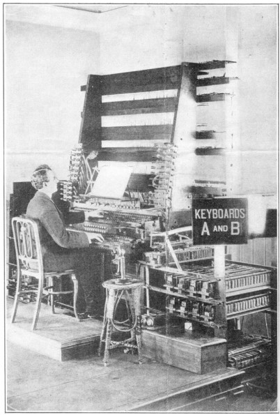
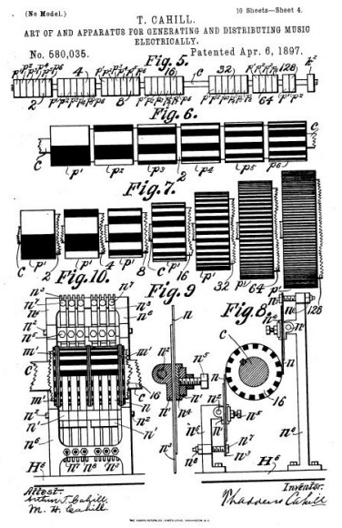

# 🎹 Telharmonium

The Telharmonium (also known as the Dynamophone) was an early electrical organ, developed by Thaddeus
Cahill c. 1896 and patented in 1897. The electrical signal from the Telharmonium was transmitted over wires;
it was heard on the receiving end by means of "horn" speakers.

_[The Keyboard of the Telharmonium]_

Like the later Hammond organ, the Telharmonium used tonewheels
to generate musical sounds as electrical signals by additive
synthesis. It is considered to be the first electromechanical
musical instrument.

In 1895 Thaddeus Cahill submitted his first patent for the
Telharmonium “The Art of and Apparatus for Generating and
Distributing Music Electrically”. The Telharmonium can be
considered the first significant electronic musical instrument and
was a method of electro-magnetically synthesising and distributing
music over the new telephone networks of victorian America.

This first patent was initially rejected by the patent office because
the “plan contained principles and practices found in other patented
devices”. Cahill, a trained lawyer, eventually succeeded in having
his patent accepted in 1897.

The first design of the instrument set out the principles of the
‘Telharmonium’ or ‘Dynamophone’ that would be developed by
Cahill over the next twenty years. Cahill’s vision was to create a
universal ’perfect instrument’; an instrument that could produce
absolutely perfect tones, mechanically controlled with scientific certainty. The Telharmonium would allow the
player to combine the sustain of a pipe organ with the expression of a piano, the musical intensity of a violin with
polyphony of a string section and the timbre and power of wind instruments with the chord ability of an organ.
Having corrected the ‘defects’ of these traditional instruments the superior
Telharmonium would render them obsolete.

_[Thaddeus Cahill’s patent documents for the first Telharmonium of 1897]_

Telharmonium tones were described as "clear and pure" — referring to the
electronic sine wave tones it was capable of producing. However, it was not
restricted to such simple sounds. Each tonewheel of the instrument
corresponded to a single note, and, to broaden its possibilities, Cahill added
several extra tonewheels to add harmonics to each note. This, combined
with organ-like stops and multiple keyboards (the Telharmonium was
polyphonic), as well as a number of foot pedals, meant that every sound
could be sculpted and reshaped — the instrument was noted for its ability
to reproduce the sounds of common orchestral woodwind instruments such
as the flute, bassoon, clarinet, and also the cello. The Telharmonium needed
671 kilowatts of power and had 153 keys that allowed it to work properly.

## About the Author

Guido F. Matis (a.k.a. widosub), a seasoned producer-composer authority with an unquenchable compassion towards the musical
expression, and many years of experience in the fields of event organizing, movie post-production, and recording with professional
musicians. His devotion to movie sounds shows in his art - widosub's music is filled with landscapes of emotions, dramatic twists and
melancholic moods. He's one of the hosts of Tilos Rádió's MustBeat show, in which he's is focusing on drum'n'bass and chillout
music. He's also one half of the duo Empty Universe.

## References

- Wikipedia / 120years.net / Sweetwater.com
