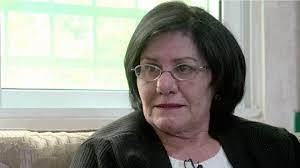

# ✈️ Teresa Halasa, a Jordanian Legend

A plane carrying 140 Israelis was hijacked. Who is Teresa Halasa, who almost
killed Netanyahu?

Little did the girl who joined the armed struggle in the ranks of the Palestine
Liberation Organization at the age of seventeen know that she would one day be
an icon of struggle and redemption against the Israelis and that she would be
the woman who one day nearly killed the Prime Minister Benjamin Netanyahu.

It is the Jordanian fighter Teresa Halasa, who passed away on March 28, 2020, at
the age of 66, in the Jordanian capital, Amman, after a struggle with a terminal
illness.

Teresa Halasa, or as some call her Teresa, was born in the old town of Akka,
northern Palestine, to a Christian Jordanian family, and she is the third among
her brothers.

Her father came to Palestine in 1946 from the city of Karak, and her mother is
Palestinian Nadia Hanna, who was born in the village of Rama (Akka) in Upper
Galilee.

Teresa completed her secondary education at the Terrassa National School in
Akka, and then completed her studies in the field of nursing at the English
Hospital in Nazareth.

Teresa Halsa's world struggle career began in 1971 when she decided to join the
armed struggle in the ranks of the Palestine Liberation Organization, one year
after the events in Akka, which was the arrest and killing of a member of what
was later known as the "Akka Group" at sea.

At his funeral, the Israeli forces prevented his family from seeing his body
before burial to prevent seeing the traces of torture he was subjected to before
he was killed, which represented a pivotal shift in Teresa's life and her
decision to join the Liberation Group.

In addition to the events in Akka, its influence on Palestinian guerrilla
operations against Israel - which increased in the early seventies - was an
additional reason for its decision.

On November 23, Teresa said goodbye to her village and left Arab lands towards
the West Bank, then to Lebanon, accompanied by a young female classmate and
without her family's knowledge.

After arriving in Lebanon, she directly joined the Fatah movement and joined the
Black September group, which had recently moved from Jordan to Lebanon, after
the clashes between it and the Jordanian army.

Teresa was known for her strong position that women had a right to resist on the
front lines.

In May 1972, she had what she wanted. She was one of the 4 militants who
participated in the hijacking of the passengers of Sabina Flight 571, a Belgian
Boeing 707 flying from Vienna, the capital of Austria, to Lod Airport in Tel
Aviv, she and Ali Taha Abu Siena. Zakaria al-Atrash, and Rima Issa.

Ali Hassan al-Salama was the main planner of this operation, and for those who
do not know who al-Salama is, he is one of the leaders of the Palestine
Liberation Army, which Israeli Prime Minister Golda Meir nicknamed the Red
Prince because he led many special operations against Israeli forces in the
world.

As for the purpose of hijacking the Sabina flight, it was certainly to exchange
the hostages with Jordanian and Palestinian prisoners held by the Israeli
occupation forces.

After she was arrested, she was brought to trial in Israel, and she was
sentenced to life imprisonment twice, and forty years, or 220 years.

But after 12 years, she was released after a prisoner exchange with the Israeli
government, and then she was exiled to Jordan.

After her release, Teresa Halasa lived in Amman with her husband and three
children, deprived of entering the Palestinian territories and seeing her family
in Akka and Haifa, and she had a statement that she never regretted her armed
action, as she said that she refused to surrender during the hijacking of the
plane. It is worth noting that Teresa treated the civilian hostages well, and
declared that her problem was primarily with the establishment and the Israeli
state.

## About the Author

Mujahid Al-Majali, a 29-year-old former air force soldier and an economic
development and business specialist, also does translation and copywriting.
Loves long drives, chill music and old school movies. A nicotine addict and a
huge fan of Jack Daniel’s whiskey. Owned multiple businesses in Amman and
southern of Jordan PRE-COVID and now focusing on translation and copywriting
part of my experience through Upwork.
