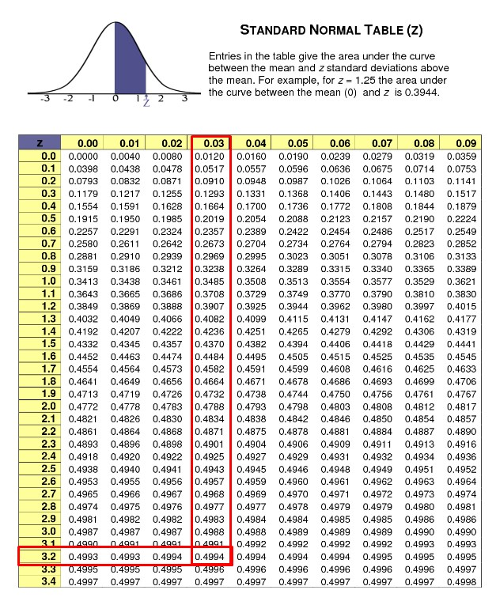
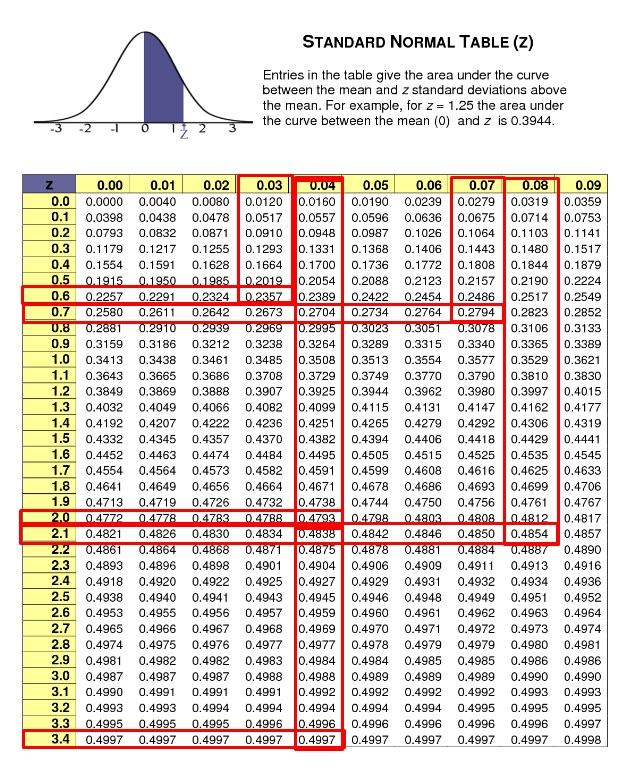
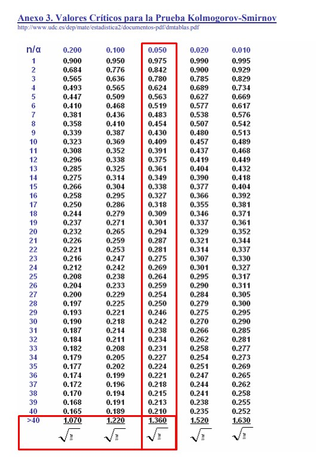

# 📊 Tests to see if the data meet a normal distribution

Parametric hypothesis tests have as a condition compliance with
normality and for this it will be necessary to test this assumption.
There are several tests to check the normal distribution, some more
powerful than others and in this article we will name the main and best
tests when it comes to checking normality. Through a simulation process,
the power of each of the tests can be estimated using samples that come
from known distributions, but yes, we can measure in each of these
samples how far they are from normality.

Experience leads us to think that a moderate deviation from normality is
not exactly of great importance in the tests of parametric hypotheses
and that they can be carried out without major problems. But there are
circumstances in which it is not possible to avoid such non-compliance
and for these cases, there are two types of alternatives. The first is
to use non-parametric statistics and the second is to use equivalent
methods, in these cases no assumptions are required regarding the
distribution of the data. But if the assumption of normality is
fulfilled even in an approximate way, the use of parametric methods is
much more recommended, since they are much more powerful than
non-parametric methods.

Many times some mathematical function is used that is capable of
transforming the data in such a way that the new values ​​can fulfill the
required assumption. After the data is transformed, the new values ​​are
checked again to see if they meet the normality assumption.

The Shapiro Wilk test for many is one of the best options, since its
power is very high, with the exception that it is used only for those
non-normal distributions that are large enough and with strong
distances. For small sample distributions and weak deviations, almost
none of the usual tests appear to be good enough. Tests based on
equivalence approaches can also be used and most likely, they may be
somewhat better than the tests mentioned above.

Most of the techniques used in statistical inference such as hypothesis
testing, regression analysis, forecasting models, etc. They are based on
parametric models and, as we know, these models are subject to the
assumption of normality. We can find in the literature several
hypothesis tests proposed in order to verify whether or not the data
come from a normal distribution, there are approximately 40 tests
developed for this purpose and in the face of this wide range of
options, the rigorous question with which we finds the researcher, is
which of these tests is the best alternative to check the assumption of
normal distribution in his data.

Multiple investigations have been developed in order to establish some
criteria for comparison, which allows the researcher to objectively
determine which is the most appropriate test. The comparison criterion
most used by researchers is based on estimating through a simulation
process the power that the different normality tests have, in order to
recognize those tests whose power is the highest for their
investigation. To estimate the power of 33 tests with different sample
sizes such as n = 25, 50, 100 whose significance levels are α = 0.05 and
0.1, different symmetric non-normal distributions were used such as:
Cauchy, Beta, Laplace, Student\'s t, Logistics and also other asymmetric
ones such as Gamma, Chi square, Weibull, Log Normal, and Gumbelt) and
others with modified normality such as mixed normal, contaminated
normal, truncated normal and normal with atypicals to ensure the
condition of non-normality . The power in all these cases does not
change too much, regardless of whether they have different levels of
significance. However, no specific test could be determined as the most
powerful, as there are many different options based on the non-normal
environment.

Another study that was even more detailed than the one previously
mentioned, Shapiro Wilk together with Jarque Bera, was also carried out,
in which the same distributions that simulated non-normal samples were
used and were determined for the case of symmetric samples, being the
most powerful tests. For these symmetric samples, Shapiro Wilk and
Anderson Darling were used, which in this case were the best option.

In another investigation, sample sizes with n = 20, 30, 40, 50 were used
and it was possible to determine that the samples generated from a Beta
distribution, the most powerful test ultimately turned out to be that of
Anderson Darling and in the case of samples generated by a Log Normal or
a Gamma, the most powerful test ended up being that of Jarque Bera.

In all these studies, in order to estimate power, samples were sought
such as the probability distribution that, being not normal, most of
them tend to normal in some way and that is why they can affect the
results found. On the other hand, in a real analysis, the available data
should not necessarily conform to some previously known non-normal
distribution, such as those we present in previous studies, since in
some cases its distribution will be totally unknown.

Although it is true that generating unknown samples is as important as
those samples that come from known distributions, however, they have not
been presented in the aforementioned investigations. Therefore, the
following study is proposed in which, through a stochastic simulation
process, the power of 7 normality tests is estimated, using the
Fleishman system to generate samples of unknown distribution, but which
in turn is known to They are found in the real data and with different
levels of contamination and away from normal.

Taking into account previous research and the most common tests of
normality established in statistical software, in most of the literature
that covers the subject, it is proposed to study the power of the
following tests capable of contrasting the following hypotheses:

Ho: The data come from a normal distribution

H1: The data do not come from a normal distribution

## Shapiro Wilk test

This test is used to contrast normality in the case that the sample size
is less than 50 observations. The idea is to order the sample from
smallest to largest and calculate both the mean and the sample variance.
If the Shapiro Wilk statistic is less than the critical value obtained
in tables, then the null hypothesis is rejected. It is important to take
into account that the table is entered with the values ​​of the level of
significance and the size of the sample.

In this normality test, it is considered that the normal probability
that comes from the adjustment of the sample data for the normal
distribution is similar to a linear regression and that is why the
diagonal line of the graph fits perfectly, with the difference that this
line is similar to the residuals of a regression.

The test statistic to use is:

W = $\frac{b^{2}}{\sum_{i = 1}^{n}{(xi - \overline{x})}^{2}}$

Being the term b =
$\sum_{i = 1}^{k}{ai\ \left\lbrack x_{(n - i + 1)} - \ x_{i} \right\rbrack}$
where ai is a coefficient that is tabulated for each sample size, being
the position \"i\" of each observation. On the other hand, the term
$\left\lbrack x_{(n - i + 1)} - \ x_{i} \right\rbrack$ is equivalent to
the differences obtained when the first from the last value is
subtracted, successively from the second from the penultimate value, the
third from the penultimate value and so on until the last value is
subtracted from the first value. We are going to suppose that we have
seven values, then we can conclude that the sequence of differences is
going to be the following:

|               |                                     |                                                          |
| ------------- | ----------------------------------- | -------------------------------------------------------- |
| Observation i | Xi values sorted in ascending order | $$\left\lbrack x_{(n - i + 1)} - \ x_{i} \right\rbrack$$ |
| 1             | X1                                  | X7 – X1                                                  |
| 2             | X2                                  | X6 – X2                                                  |
| 3             | X3                                  | X5 – X3                                                  |
| 4             | X4                                  | X4 – X4                                                  |
| 5             | X5                                  | X3 – X5                                                  |
| 6             | X6                                  | X2 – X6                                                  |
| 7             | X7                                  | X1 – X7                                                  |

The acceptance zone for the null hypothesis is made up of the values ​​of
the test statistic W, which are less than the expected value or the
value that is tabulated $W_{(1 - \alpha;\ n)}$

Acceptance zone = W calculated ≤$\ W_{(1 - \alpha;\ n)}$

Let\'s go with the first example: Suppose that a factory has an
automatic dispenser that is used to fill containers of a medicine whose
volume is 16 ml, eight bottles were selected through random sampling and
their packaging volume is measured, where the following results are
obtained:

16 ml; 15.9 ml; 15.97 ml; 16.04 ml; 16.05 ml; 15.98 ml; 15.96 ml and
16.02 ml

We want to know if the variable of the volume served follows a normal
distribution, for this the normality test of Shapiro Wilks is used and
the following hypotheses are raised:

Ho = The random variable that represents the volume served does not have
a normal distribution

Ha = The random variable represents the volume served has a normal
distribution

The steps to follow in the Shapiro Wilks normality test are as follows:

1.- A table made up of the following columns is built:

a\) 1st column: All those values ​​that make up the variable studied are
listed (i = 1, 2, 3,..., n)

b\) 2nd column: The values ​​of the variable are ordered in ascending
order (Xi)

c\) 3rd column: The values ​​of the variable are ordered in descending
order $X_{(n - i + 1)}$

d\) 4th column: the values ​​of the 3rd column are subtracted minus those
of the 2nd column

e\) 5th column: The values ​​of ai that are tabulated are searched for a
sample of size n = 8

f\) 6th column: It is made up of the product
$ai\ \left\lbrack X_{(n - i + 1)} - \ X_{i} \right\rbrack$, that is, the
values ​​of the 5th column are multiplied by the 6th column

g\) 7th column: ${(Xi - \overline{X})}^{2}$ is calculated

|                            |           |                     |                                                          |               |                                                                   |                               |
| -------------------------- | --------- | ------------------- | -------------------------------------------------------- | ------------- | ----------------------------------------------------------------- | ----------------------------- |
| 1º                         | 2º        | 3º                  | 4º                                                       | 5º            | 6º                                                                | 7º                            |
| i| $$X_{i}$$  | $$X_{(n - i + 1)}$$ | $$\left\lbrack X_{(n - i + 1)} - \ X_{i} \right\rbrack$$  | $$ai$$   | $$ai\left\lbrack X_{(n - i + 1)} - \ X_{i} \right\rbrack$$  | $${(Xi - \overline{X})}^{2}$$ |
| 1                          | 15,90     | 16,05               | 0,15                                                     | 0,6052        | 0,090780                                                          | 0,0081                        |
| 2                          | 15,96     | 16,04               | 0,08                                                     | 0,3164        | 0,025312                                                          | 0,0009                        |
| 3                          | 15,97     | 16,02               | 0,05                                                     | 0,1743        | 0,008715                                                          | 0,0004                        |
| 4                          | 15,98     | 16,00               | 0,02                                                     | 0,0561        | 0,001122                                                          | 0,0001                        |
| 5                          | 16,00     | 15,98               | \-0,02                                                   | 0             | 0                                                                 | 0,0001                        |
| 6                          | 16,02     | 15,97               | \-0,05                                                   | 0             | 0                                                                 | 0,0009                        |
| 7                          | 16,04     | 15,96               | \-0,08                                                   | 0             | 0                                                                 | 0,0025                        |
| 8                          | 16,05     | 15,90               | \-0,015                                                  | 0             | 0                                                                 | 0,0036                        |
| $\sum total$ |           |                     |                                                          |               | 0.0159                                                            | 0,0166                        |

The test statistic is obtained by dividing the square of the sum of the
values ​​in the 5th column $b^{2}\ $= $\left( \sum_{i = 1}^{k}{ai\ \left\lbrack x_{(n - i + 1)} - \ x_{i} \right\rbrack} \right)^{2}\ $ between
the sum of the 6th column $\sum_{i = 1}^{n}{(Xi - \overline{X})}^{2}$

W = $\frac{b^{2}}{\sum_{i = 1}^{n}{(Xi - \overline{X})}^{2}}$ =
$\frac{{(0,0159)}^{2}}{0,0166}$ = 0,9553

The acceptance zone for the null hypothesis is obtained by contrasting
the value of W (0.95; 8) with the critical value obtained in the tables.
To obtain the value in the tables, it must be entered with the level of
significance and the number of observations:

As we can see with a significance level of α = 0.05 and n = 8, we obtain
a critical value of 0.818. The decision rule to know if we are within
the acceptance zone is to compare both values ​​and if the Wcal ≥
Wcritical, the null hypothesis must be rejected. In this case, it is
indeed what happens, since:

0.9553 ≥ 0.818

So we can conclude that the null hypothesis is rejected with a
confidence level of 95% and therefore, the alternative hypothesis is
accepted. This implies that the variable representing the volume served
is normally distributed.

We now go with a brief introduction to the Kolmogorov Smirnov normality
test. It cannot be compared to the Shapiro Wilks test, since for
Kolmogorov Smirnov both the mean and the variance must be known and it
cannot be estimated solely from the data, on the other hand the Shapiro
Wilks test can be used in samples whose mean and variance are not
specified.

The Kolmogorov Smirnov test makes it possible to compare whether the
sample score follows a normal distribution or not. This test is part of
a group of so-called goodness-of-fit tests, the main characteristics of
which are that they pose a hypothesis regarding fit or independence, the
mean of the variables is low (ordinal), they do not have excessive
restrictions, they are robust and applicable to small samples.

The Kolmogorov Smirnov test is a test that belongs to statistics and
that aims to extract information regarding populations. It is used to
corroborate whether the scores obtained from a sample follow a normal
distribution. Thus, it allows to measure the level of agreement that
exists between the theoretical distribution and the distribution of the
data set. The objective of this test is to indicate if the data come
from a population whose theoretical distribution is specified,
therefore, it reasonably tests whether the observations could come from
this distribution. The rigorous question is: Do the observations come
from some sample with a hypothetical distribution?

The idea of ​​the proposal of the null hypothesis and the alternative
hypothesis is to demonstrate that the empirical sampling distribution
agrees with the population distribution, for this it is established that
the hypotheses are:

Ho = establishes that the empirical distribution is similar to the
theoretical one

Ha = states that the observed frequency distribution is not similar to
the theoretical distribution.

In short, in this case there is no attempt to reject the null hypothesis
and it is convenient that it has a good fit and, therefore, that it is
similar. On the contrary, the alternative hypothesis as opposed to the
null one determines a bad fit and therefore, that the distribution of
the data is not similar to the empirical one.

Conditions for using this test: The way to apply the test correctly is
by assuming a series of assumptions. The first thing is that the
parameters of the distribution have been previously specified and these
parameters are estimated from the sample. It is also necessary to assume
that the standard deviation and the mean are parameters of a normal
distribution. On the other hand, the maximum and minimum values ​​of the
sample determine the range of a uniform distribution.

When determining deviations from a hypothetical distribution, the
capacity of this test can be greatly diminished. Thus, to achieve its
contrast with a normal distribution of estimated parameters, it will be
necessary to consider the possibility of complementing the Kolmogorov
Smirnov test with the Lilliefors test.

## Advantages of Kolmogórov Smirnov:

1.- It is more powerful than other goodness-of-fit tests such as Chi
square.

2.- It does not require data grouping, so it is easier to use and
calculate.

3.- The statistic of this test only depends on the size of the sample,
since it is not dependent on the frequency distribution.

## Example of the test kolmogorov Smirnov

We are going to apply the steps to follow for this test with a specific
example, for subsequent observations simply follow the same steps that
are exposed below:

A researcher measured the height of 100 children with an age of five
years and wants to know if these observations come from a normal
distribution.

The null and alternative hypotheses are established:

Ho = There are minimal differences between the theoretical values ​​and
the observed values ​​of the normal distribution

Ha = The values ​​of the theoretical frequencies whose distribution is
normal and the observed values ​​are very different.

For probability values ​​that are less than or equal to 0.05, the null
hypothesis is rejected and the alternative hypothesis is accepted.

For all probability values ​​greater than 0.05, the alternative
hypothesis is rejected and the null hypothesis is accepted.

After the corresponding measurements, the following results were
obtained:

|      |                       |     |     |
| ---- | --------------------- | --- | --- |
| Rank | Length intervals (cm) | f   | fa  |
| 1    | 90 - 93               | 5   | 5   |
| 2    | 94 - 97               | 21  | 26  |
| 3    | 98 - 101              | 48  | 74  |
| 4    | 102 - 105             | 19  | 93  |
| 5    | 106 - 109             | 7   | 100 |
|      | Total                 | 100 |     |

Where the total average of the sample gives a value of $\overline{X\ }$=
99.2 and its standard deviation is σ = 2.85

The first step is to calculate the expected theoretical values ​​to
obtain a normal distribution. For this, it will be necessary to
determine the value of Z with the limits of each interval, for example:
in the first interval, Z must be calculated for both the lower and upper
limits, that is, a Z for 90 and another for 93, but In subsequent
intervals, Z should be calculated only for the upper limits, in this
case they are: 97, 101, 105 and 109.

To calculate the Z values, you need to use the following formula:

$Z_{90}$= $\frac{X1 - \ \overline{X}}{\sigma}$ =
$\frac{90 - 99,2}{2,85}$ = -3,23

$Z_{93}$= $\frac{X2 - \ \overline{X}}{\sigma}$ =
$\frac{93 - 99,2}{2,85}$ = -2,18

$Z_{97}$= $\frac{97 - 92,2}{2,85}$ = -0,77

In this way we continue to calculate each of the Z values ​​corresponding
to the subsequent upper limits and place them in a table:

## Interval limits Z values ​​of interval limits

|                 |                               |
| --------------- | ----------------------------- |
| Interval limits | Z values ​​of interval limits |
| 90              | \-3,23                        |
| 93              | \-2,18                        |
| 97              | \-0,77                        |
| 101             | 0.63                          |
| 105             | 2,04                          |
| 109             | 3,44                          |

Once all the Z values ​​have been obtained, we must locate the area under
the normal curve that is typified in the table. To reach the required
value, we must place the whole number with its first decimal place in
the left column, and we place the second decimal place in the upper
columns and find the value that intersects both numbers. For example,
for the first value of Z we have:

As we can see, we obtain a value of 0.4994 in the table for Z = 3.23,
but since it is negative (-3.23) we must also take the value obtained in
the table as negative. We carry out the same procedure for the rest of
the Z values ​​and obtain the following results that we will place in the
third column:

|                 |                               |                               |                      |                 |      |
| --------------- | ----------------------------- | ----------------------------- | -------------------- | --------------- | ---- |
| Interval limits | Z values ​​of interval limits | Typified area under the curve | Differences of areas | Differences x N | fa   |
| 90              | \-3,23                        | \-0,4994                      |                      |                 |      |
| 93              | \-2,18                        | \-0,4854                      | 0,014                | 1,4             | 1,4  |
| 97              | \-0,77                        | \-0,2794                      | 0,206                | 20,6            | 22   |
| 101             | 0.63                          | 0,2357                        | 0,5151               | 51,5            | 73,5 |
| 105             | 2,04                          | 0,4793                        | 0,2436               | 24,4            | 97,9 |
| 109             | 3,44                          | 0,4997                        | 0,0200               | 2,0             | 99,9 |

The fourth column is made up of the difference of the standardized
values ​​below the area of ​​the curve obtained in the table, for example
if we subtract the first two values ​​we have: -0.4854 - (-0.4994) =
0.014. In the same way, the following values ​​are subtracted, with the
value of the previous interval, thus filling in the 4th column.

The 5th column is made up of multiplying the differences in areas found
in the 4th column by the size of the sample, which in this case is n =
100. For example: 0.014 x 100 = 1.4 we repeat this procedure to the rest
of the values, while the 6th column will be made up of the accumulated
frequency (fa), that is, the value of the 5th column is added the next
value and so on.

In the following table we will show the theoretical frequencies and the
observed frequencies that are adapted as follows in the corresponding
intervals and then, it is when the Kolmogorov Smirnov method is applied.

## Calculation of the D statistic of the Kolmogorov Smirnov test

|                                       |         |         |          |          |          |
| ------------------------------------- | ------- | ------- | -------- | -------- | -------- |
| Ranks                                 | 1       | 2       | 3        | 4        | 5        |
| theoretical cumulative frequency (ft) | 1,4/100 | 22/100  | 73,5/100 | 97,9/100 | 99,9/100 |
| f cumulative observed (fo)            | 5/100   | 26/100  | 74/100   | 93/100   | 100/100  |
| D= ft - fo                            | \-0,036 | \-0,004 | \-0,005  | 0,049    | \-0,001  |

As we can see, the maximum difference in D is 0.049 and this is going to
be the value that we are going to compare with the critical value D
obtained in the table. The problem is that when we go to the table the
maximum value of the number of samples observed in the table is N = 40
in this case N = 100, so we must use the formula for a set of
observations greater than 40.

If we use a significance level of α = 0.05, the corresponding formula
for the critical value is = $\frac{1,36}{\sqrt{100}}$ = 0,136

Now we must apply the decision rule where the maximum difference of D
calculated is compared with the critical value. Given the case of the
maximum difference in D calculated is less than the critical value, the
null hypothesis is accepted and the alternative hypothesis is rejected.
In this case, the maximum difference in D actually calculated is less
than the critical value, since:

0.049 \< 0.136

Therefore, the null hypothesis is accepted and it can be concluded that
there are no significant differences between the calculated theoretical
frequencies and the observed frequencies, this implies that the
observations have a normal distribution.

## Lilliefors test

The Lilliefors test is a correction of the Kolmogorov Smirnov test,
which, as we know, is used when the parameters of its hypothetical
distribution are known. The problem is that many times it is not so easy
to know these values ​​and that is when the Lilliefors test is used with
estimates of the mean and standard deviation that are based on the
sample data. However, the critical and statistic values ​​will be the
same as the Kolmogorov Smirnov test.

Let\'s go directly with an example to know how the Lilliefors test is
used, suppose we have the following data: 6, 1, -4, 8, -2, 5, 0 and we
want to know if they follow a normal distribution considering a
significance of α = 0.05 and we can see that the sample size is N = 7

The first step is to order the data from least to greatest: -4, -2, 0,
1, 5, 6, 8

Then we must establish the intervals that exist between these data:

X \< -4

-4 ≤ X \<-2

-2 ≤ X \<0

0 ≤ X \<1

1 ≤ X \<5

5 ≤ X \<6

6 ≤ X \<8

8 ≤ X

The third step is to establish the probabilities, for example for the
first interval the probability is zero, for the second interval it will
be 1/7, for the third it will be 2/7 and thus we are increasing a number
in the numerator and dividing it by the number of data, for each of the
intervals

0 if X \<-4

1/7 if -4 ≤ X \<-2

2/7 if -2 ≤ X \<0

3/7 if 0 ≤ X \<1

4/7 if 1 ≤ X \<5

5/7 if 5 ≤ X \<6

6/7 if 6 ≤ X \<8

7/7 if 8 ≤ X

The fourth step is to calculate the arithmetic mean of the observations
in the sample:

$\overline{X}$ = $\frac{- 4 + ( - 2) + 0 + 1 + 5 + 6 + 8}{7}$ = 2

In order to later calculate the standard deviation of the observations
and for this, it will be necessary to square the subtraction of each of
the observations minus the value of the arithmetic mean and that total
is divided by the subtraction of the number of observations minus one (N
-1). The square root is extracted from the result of this calculation,
the resulting number being the standard deviation:

σ =
$\sqrt{\frac{( - 4 - 2)^{2} + {( - 2 - 2)}^{2} + {(0 - 2)}^{2} + {(1 - 2)}^{2} + {(5 - 2)}^{2} + {(6 - 2)}^{2} + {(8 - 2)}^{2}}{(7 - 1)}}$
= 4.43

Now I proceed to calculate each of the Z values ​​with the formula:

Z= $\frac{(X - \overline{X})}{\sigma}$

Z1= $\frac{- 4 - 2}{4,43}$ = -1,35

Z2= $\frac{- 2 - 2}{4,43}$ = -0,9

Z3= $\frac{0 - 2}{4,43}$ = -0,45

Z4= $\frac{1 - 2}{4,43}$ = -0,22

Z5= $\frac{5 - 2}{4,43}$ = 0,67

Z6= $\frac{6 - 2}{4,43}$ = 0,90

Z7= $\frac{8 - 2}{4,43}$ = 1,35

Later I look in the tables of cumulative probability of the standard
function in the same way as we did for the previous example, that is,
the units of the first decimal in the left column and the second decimal
in the columns that are found on top. For example, if Z = -1.35 we will
search for -1.3 in the left column and 0.05 between the columns above
and the intersection will be the value of interest of the cumulative
probability, which in this case will be of: 0.0885. In this way, we are
looking for the corresponding values ​​in the table for each value of Z
and we can place them in the following table:

||||||
|-|-|-|-|-|
| $$X_{i}$$  | $S_{7}$ (X) | $\varphi_{7}$($X_{i}$) | $$\|{S_{7}\ \left( X_{i} \right) - \varphi}_{7}(X_{i})\|$$ | $$\| {S_{7}\ \left( X_{i - 1} \right) - \varphi}_{7}(X_{i}) \|$$ |
| \-4       | 1/7 = 0,1428  | 0,0885                     | 0,0543                                                                | 0 – 0,0885 = 0,0885                                                       |
| \-2       | 2/7 = 0,2857  | 0,1841                     | 0,1016                                                                | 0,1428 - 0,1841= 0,0413                                                   |
| 0         | 3/7 = 0,4285  | 0,3264                     | 0,1021                                                                | 0,2857 - 0,3264 = 0,0407                                                  |
| 1         | 4/7 = 0,5714  | 0,4129                     | 0,1585                                                                | 0,4285 - 0,4129 = 0,0156                                                  |
| 5         | 5/7 = 0,7142  | 0,7486                     | 0,0344                                                                | 0,5714 - 0,7486 = 0,1772                                                  |
| 6         | 6/7 = 0,8571  | 0,8159                     | 0,0412                                                                | 0,7142 - 0,8159 = 0,1017                                                  |
| 8         | 7/7 = 1       | 0,9115                     | 0,0885                                                                | 0,8571 - 0,9115 = 0,0544                                                  |

As we can see, the first $X_{i}\ $ is made up of the data ordered from
least to greatest.

The second column that we call $\varphi_{7}$($X_{i}$) is made up of the
probabilities that we previously established how to calculate them, only
that we add the result of the division of the numerator by the
denominator.

The third column $\varphi_{7}$($X_{i}$) are the values ​​obtained in the
tables for each value of Z, while the fourth column is the calculation
of the absolute value of the subtraction of the values ​​obtained in the
second column minus the third column
$\left| {S_{7}\ \left( X_{i} \right) - \varphi}_{7}(X_{i}) \right|$.

The last column we obtain the first value always subtracting from zero
(0) the first value of the column $\varphi_{7}$($X_{i}$), but the
subsequent values ​​are obtained from the absolute value of the
subtraction between the value obtained in the previous column of $S_{7}$
(X) minus the value of the next row of the 3rd column
$\varphi_{7}$($X_{i}$) and so on.

The next step is to determine the test statistic to be able to contrast
the hypothesis and for this the maximum value of the last column must be
chosen, which in this case is:

Do = max
$\left| {S_{7}\ \left( X_{i - 1} \right) - \varphi}_{7}(X_{i}) \right|$
= 0.1772

Now we go to the Lilliefors Test Table and we must enter with the values
​​n = 7 for a significance of α = 0.05:

We obtain the value of tables which we will call Dt = 0.3 and it is then
that we proceed to contrast the value of the test statistic with that
obtained in the table. In case the test statistic (Do) is less than the
one obtained in the table (Dt), the null hypothesis is accepted and
otherwise, it will be rejected (Ho). We can realize that the test
statistic is less than the one obtained in the table, since:

0.1772 \<0.3

Therefore, the null hypothesis is accepted and it can be concluded that
the data have a standard normal distribution.
