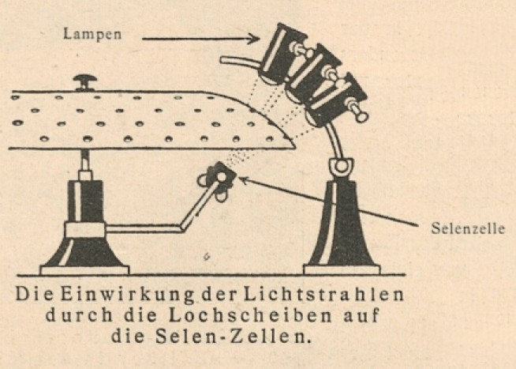

# 🔬 The Luminaphone

Harry Grindell Matthews was born on 17 March 1880 in Winterbourne, Gloucestershire. He studied at the Merchant Venturers' School in Bristol and became an electronic engineer. During the Second Boer War he served in the South African Constabulary and was twice wounded.

In 1911 Matthews said he had invented an Aerophone device, a radiotelephone, and transmitted messages between a ground station and an aeroplane from a distance of two miles. His experiments attracted government attention and on 4 July 1912 he visited Buckingham Palace.
However, when the British Admiralty requested a demonstration of the Aerophone, Matthews demanded that no experts be present at the scene. When four of the observers dismantled part of the apparatus before the demonstration began and took notes, Matthews cancelled the demonstration and drove observers away.

Newspapers rushed to Matthews' defence. The War Office denied any tampering and claimed that the demonstration was a failure. The government later stated that the affair was just a misunderstanding.

[The Luminaphone]

The Luminaphone of 1926 was one of a long line of inventions by the British inventor Harry Grindell Matthews, well known at the time for his much publicised invention of a ‘Death Ray’ in 1923 – an unsubstantiated or proven method of destroying objects and stopping electric engines through an invisible ray-gun. Matthew’s roster of inventions included a light controlled submarine (from which he received a £25,000 prize from the British admiralty), a mobile projector for projecting images onto clouds, an early method of recording sound on to film (1921), an underwater submarine detector, ground-to-plane radio-telephone, and a self-righting flying machine, amongst many others.

[Diagram showing the operation of the light beams]

The Luminaphone, patented in 1925 (Patent GB254437A ), was an early example of a photo-electric technique for creating pitched tones (originally derived from optical sound film technology); in this case a series of light beams – each light beam representing one frequency or note – were projected through a rotating perforated metal dome onto
a selenium photo-cell that generated a pitched voltage pulse. The frequency of the pitch was determined by the frequency of the perforation in the metal dome. The luminaphone’s three octave keyboard had one lamp per key (a total of 36 keys and lamps) – when a key was pressed the assigned lamp would illuminate and project through the rotating perforated dome onto the photo-cell, generating the
relevant pitch.

Next topic: Radio Harmonium

## Sources

- Wikipedia / 120years.net

## About the Author

"Guido F. Matis (a.k.a. widosub), a seasoned producer-composer authority with an unquenchable compassion towards the musical expression, and many years of experience in the fields of event organizing, movie post-production, and recording with professional musicians. His devotion to movie sounds shows in his art - widosub's music is filled with landscapes of emotions, dramatic twists and melancholic moods. He's one of the hosts of Tilos Rádió's MustBeat show, in which he's is focusing on drum'n'bass and chillout music. He's also one half of the duo Empty Universe."
