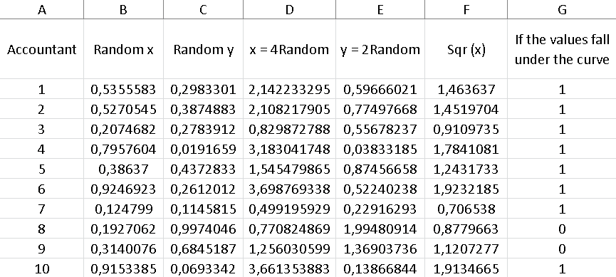
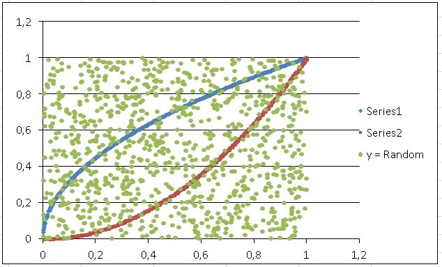

# 🎲 The Monte Carlo method

The Monte Carlo method is used to approximate certain mathematical expressions that are extremely complex or simply very difficult to evaluate accurately. Its name comes as a reference to the Monte Carlo casino in Monaco that specializes in gambling. Roulette is a random number generator and that is how the Monte Carlo method works.

The creator of the Monte Carlo method was Stanislaw Marcin Ulam when during an illness he dedicated himself to playing "solitaire" and realized that it was much easier to obtain a general result of the game, performing multiple tests and counting the proportions obtained from the results, in instead of having to calculate all the probabilities.

This great idea was implemented in his work that was "The Manhattan Project" developed by the United States government with the collaboration of Canada and the United Kingdom, during World War II. The objective of this project was nothing more and nothing less than developing the first atomic bomb Although it is true that this method was not used in the development of the first atomic bombs, once the war was over, it was applied in quantum physics and nuclear physics research.

Ulam was working with John von Neumann and convinced him of great potential that this new method had, so both mathematicians worked together to develop it. Although the greatest contribution, in addition to Ulam, was made by Nicholas Constantine Metropolis (Greek mathematician and physicist who also worked on the Manhattan project) and Enrico Fermi (Italian-born physicist with excellent contributions in nuclear, quantum and particle physics).

The first formal publication of the Monte Carlo method was made in 1949 in an article where Ulam and Metropolis participated, where the latter led the reins of a team, which achieved the first simulation carried out with this method on the first “ENIAC” computer in the University of Pennsylvania (1948). The Monte Carlo method is considered one of the top 10 most important algorithms of the 20th century.

The simulation of probabilities in hydrodynamics with respect to the diffusion of neutrons in fission, has a completely random behavior and that is where the Monte Carlo method has its place. Today this method is fundamental in the algorithms that generate 3D images, in addition to providing solutions to a large number of mathematical problems that lead to experiments with random number samples on the computer.

The Monte Carlo method can solve problems such as complex volume calculation, cost minimization, optimization, etc. the idea is to try to generate random samples that are capable of corresponding to a specific probability function.

Let's suppose that we are studying the probability function of a given that, as we know, has six heads and each of these faces has the same probability of coming out.

In this case, the probability function is 1/6 for each face and we realize that if we add each of the probabilities, the result is unity (1). In this example, the function is discrete when it only takes whole numbers and they can be counted. But we can also have continuous functions, such as the weight of each individual in a population, in this case, to calculate the probability area of this continuous function we must use integrals, although the result will always also be one (1).

When calculating integrals of continuous functions or other integrals of highly complex probability distributions, such as calculating the expected value, we find that these integrals are often very difficult to calculate analytically and that is when numerical methods of sampling to be able to approximate the result of this type of integrals. This is when it is advisable to use the Monte Carlo method, which is capable of generating random samples that are not only independent, but are also homogeneously distributed for a better approximation of the calculations.

The result of an integral is the area under the curve of a function between points a and b, to model it, we simply used a summation of successive rectangles and triangles where an area that we do not know can be found, with the sum of areas that we do know , as are the area of the rectangle and the triangle.

Then the Monte Carlo method appears, which allows solving mathematical and physical problems through the simulation of random variables.

Let's go to an example to illustrate the difference between both methods, suppose we want to find the area of the following figure:

Of course, this area is half of a square with side (1), therefore the area of a square is: l ^ 2 and its half will be: l ^ 2/2 = 1 ^ 2/2 = 0.5

Now, what the Monte Carlo method does is generate points within that frame, that is, it generates random values for me and distributes them evenly. If we count the total number of points generated and the number of points that are below the line, we realize that there are 20 points in total and below the line I have 10 points, when dividing the points under the line by the total points, it gives me 10/20 = 0.5.

Steps to use the Monte Carlo method

The first thing we must do is generate the points uniformly distributed between points 0 and 1 both on the "x" axis and on the "y" axis.

I draw the line y = x which in this case is my function

Then I count the total number of iterations or points, which in this case is 20

Later we must count the number of points that remained below the line and we realize that there are 10

Find the percentage represented by the points that are below the line, with respect to the total number of iterations, so that 10 represents 50% of 20, that is: 10/20 = 0.5

If we multiply the total area by the previous fraction, that is, the division of the points under the function by the total of scattered points, we will obtain the approximate area under the curve

l2 (0.5)= (1)2 (0.5)=0.5

On the other hand, if we calculate:

If we evaluate it between 0 and 1:

We can conclude that through the Monte Carlo method we approach the value of the integral and we say approximate, because as the points are random, we may find 9 or perhaps 11 points below the line.

We are now going to find the area under the curve of a function, but this time generating the random numbers and generally using the Excel tool.

The idea is to find the area under the curve of the function y = √x between the values x = 0 and x = 4, using the Monte Carlo method.

As we can see, we are only interested in the section of the curve when “x” goes from 0 to 4, so to find the random numbers that are within that section of the curve we must limit them as follows:

x = lower value + (upper value - lower value) x random number

In this case: the lower value = 0 and the upper value = 4, so:

x = 0 + (4 - 0) x Random = (4) * Random

y = lower value + (upper value - lower value) x random number

y = 0 + (2 - 0) *Random = 2* Random

The other thing that we must define is when the random number is below the curve and for this we must establish that if y <√x definitely the number will be below the function

The first thing we have to do in Excel is a column that tells us the number of iterations, to get an idea of how far we should drag the calculations we are making.

Once we have column "A" capable of counting our data, which in this case we are going to establish 1000 points evenly distributed within the rectangle, whose base is defined by "x" and its height by "y", in this case the base measures x = 4 and height y = 2, so the total area of our simulation square is: area = 4 x 2 = 8

Now, column "B" in Excel will be made up of the random points on the "x" axis generated by the program and for this it will be necessary to set the formula for that column as follows: = RANDOM ()

Column "C" should also have this instruction, since we must generate random points for the "y" axis.

In column "D" we are going to find the random values of "x" bounded by the limits initially established for the study of our function, that is, x = 4 *Random. To find the values of this column, we must place the formula in cell D2: = B2* 4 and drag the result until the counter that is arranged in column "A" reaches the number 1000.

In the same way as the previous step, column “E” will be destined to obtain the values of “y” limited specifically for this function, as we defined previously y = 2 *Random, so in cell E2 we must include the formula: = C2* 2 and in the same way as in the previous step, we must drag the result until the counter reaches 1000.

On the other hand, column "F" will be composed of y = √x, which will ultimately be the value that I will have to compare with the values of column "E", in order to know if the points are below the curve of my function or not.

While column "G" is made up of a condition that tells us that: if the values in column "E" are less than the values found in column "F", this implies that the random point is under the curve and therefore it should give me as a result the number 1, otherwise, if it is greater it should give me a zero as a result. To do this, the conditioner must be placed in cell G2 as follows:

= IF(The condition to check; the value if it is true; the value if it is false), in this case it will be as: = IF(E2 <F2; 1; 0)

To find out the number of random points that are below the curve, it is enough to add all the values that are in column “G”, since only those points that are actually below the value have the value one (1). function and those points that are above the function are represented by zeros, so they will not affect the sum in any way.

We can realize that we have 666 points under the curve and as we know the total points or iterations are 1000, so that we can know the percentage of points under the curve if we divide both values:

(number of points under the function) / (number of points in total) = 666/1000 = 0.666

This calculation indicates that 66.60% of the points are below the function

y= √x

Now, if we multiply this factor by the total area of the sample, we will have an approximate value of the area formed under this curve, that is:

0.666 x 8 = 5.328

If we choose columns D and F to graph them in Excel, we only have to choose the entire column D, but since they are not adjacent columns, to choose column F we must hold down the control button on our keyboard. Later, we are going to "Insert", we look for the "Dispersion" diagram and we open the menu of possibilities, to choose the first one that appears in the display, from there we obtain the following image:

As the line of the function is a bit thick, we right click on it and a menu is displayed, we choose the last option which is "format data series", a box opens and click on "options marker ", then we choose the type of marker as" integrated "and where" size "appears we position ourselves on the down arrow until we reach number 3, then we close and the line is somewhat thinner and more presentable.

On the other hand, if we theoretically calculate this function we are left with:

When evaluating "x" between limits 4 and 0 we have:

As we can see, the result we obtained when applying the Monte Carlo method is very close to the theoretical one.
Exercise 2:

We are now going to simulate the area of intersection between two known functions between the interval of x = 0 and x = 1, these functions being:

y= x2  and  y= √x

As in the previous exercise, column A will be configured by random values of "x", but this time we are not going to multiply these values by some number, since the interval that interests us goes from 0 to 1 and the values Random data generated by Excel assume precisely numbers between 0 and 1, so the formula for the first column will be: = RANDOM ().

Column b representing the function y=√x is made up of the square root of the random values found in column A.

In the same way, column B is made up of the values of column A squared in representation of the function y=x2, while column “D” are random values for “y”, which are the points green that are scattered throughout the total area box equal to (1) and are also precisely the points that we are going to buy with both functions to know if they are inside the intersection area or outside.

Column "E" is made up of two conditionals, which are to compare if the random values in column "D" are greater than y= x2  and less than y=√x, if so, we will know that those points random are within the intersection between both functions.

Cell D2 so that instead of throwing me "true" or "false" they give me some (1) or zeros (0), which are ultimately easier to count, for Excel purposes, I must express it as:

= - -Y(D2>C2;D2<B2)

The important thing here are those two signs (- -) that are in front of the "Y".

Once our comparative column is converted to ones (1) for those points that fall within the two curves, we simply have to add the elements of column D, to know the number of points of interest.

The last cell in column “D” represents that sum, so again we must divide that number by the total points or the number of iterations of our sample, which as we already know is 1000 (because we established it that way) and this time instead After placing a counter, we only drag the values up to row 1001, since the first row is occupied by the indicators (in letters), which give an idea at a glance what that column contains.

Let's then find the fraction that will indicate the percentage of points that remain within the intersection:

336/1000 = 0.336

To find the area between the two functions, we simply have to multiply this number by the total area of the sample, which in this case is one (1).

Intersection area = 0.336 x 1 = 0.336

It is important to take into account that every time we open Excel or manipulate any of the random columns, the values change, that is, it is almost certain that that value of 336 points that is at the intersection of the two functions, changes continuously, but always within a very acceptable range when calculating the area.

On the other hand, if we shade any of the columns with random values and press the F9 key, we can change those values at will.

The Monte Carlo method can be used to calculate the multiple integrals that are presented to us in probabilities and statistics, for example, the denominator of Bayes' theorem becomes an integral when our sample values are too many, to calculate them easily and also, that integral can become complicated to calculate by the traditional method.

But it is not the only case, in the universe of probabilities we find endless integrals that can be difficult to calculate.

Exercise 3:

We now go to other types of statistical examples, in which we can use the Monte Carlo method and not precisely to calculate integrals.

The table below shows the probability distribution of the number of consultations a dentist has per working day, we are going to calculate the average of daily consultations using the Monte Carlo method.

This means that for a total of 200 days, 10 of them the dentist did not have anyone in his office, while 20 days of the total, he had only one patient and so on.

We are going to calculate the average by conventional methods:

Average = (0 x 10 + 1 x 20 + 2 x 40 + 3 x 60 + 4 x 40 + 5 x 30) / 200 = 2.95

Although this exercise can be calculated very easily in the traditional way, we want to illustrate how the Monte Carlo method is used in a simple exercise, to get a better idea of how to implement it for these types of problems.

The first two columns are data provided by the empirical count, but already in column “C” we will have to find the relative frequency of the days and for this, it will be necessary to divide the absolute frequency by the total
number of days, which in this case is 200.

Now, in Excel I must freeze the data of the total of days, since it is common for all the relative frequencies. This is achieved by placing the “$” symbol between “B” that indicates the column where this data is located and the “7” that indicates the row. So cell C2 will be as follows: = B2 / B $ 8, in this way we can drag the formula, without changing the data for the total number of days found in cell “B8”.

The next column contains the cumulative relative frequency, so the first cell will be equal to the first cell in the previous column. However, D3 will already be equal to the initial relative frequency D2 added to the relative frequency C3 and it is then, when we can drag the result to the last cell, which will always be given by the unit (1).

Now we are going with the intervals, it is important to take into account that the last column of intervals "F" will exactly coincide with the column of the accumulated frequency "D", so we equalize both columns.

While the initial column of the interval "E", begins with zero (0) and the next lower limit of the interval will be given by the upper limit of the previous interval "D", that is, C3 = D2 and I drag the result.

In the next column "G" we are going to generate the random values or iterations corresponding to the number of days for which we want to calculate the average, in this case we are going to establish the average for 500 days.

Now, the next column "H" is destined to find where the random value that we have in column "G" is located between the intervals that are in columns "E" and "F", to give us as a result the value of the number of dental visits corresponding to that interval. To do this, it will be necessary to enter the command in cell H2: = LOOKUP (G2; E2: F7; A2: A7), which is achieved by writing: = LOOKUP (G2; here both column E and F are chosen or shaded; choose all column A)

It is important to note that each of the instructions given is separated by a semicolon (;) and also the "$" symbol must be placed between all the rows and columns of the command to freeze the common data, except the first G " which corresponds to the random value, which of course must change cell by cell.

So cell H2 will end up looking like this: = LOOKUP (G2; E $ 2: F $ 7; A $ 2: A $ 7).

If we take any cell in column G and look between what interval is found in those established in columns E and F, we will realize that the result of the cell will be the number of dental consultations that is in that same row, but in column A.

For example, if column G gives us a number 0.7003354, we will realize that it is between the interval 0.65 - 0.85 and its number of corresponding queries is 4 and that is the value reflected in column H

Finally, to find the average, we place ourselves in the cell after the last cell of our column “H” and write the following: = AVERAGE (here we must choose the entire column H), in this way we will obtain a number that is equivalent to average of all queries, with our sample of 500 iterations.

In this case the result was 2,952, but in the same way as in the previous examples, when manipulating our Excel in some way, the random data will change and therefore our final result will also vary.

As we can see, this result is very close to the one calculated theoretically.

Exercise 4:

We now go to the fourth exercise applying the Monte Carlo method. Suppose that we roll 2 dice 1000 times, we want to know the probability that the sum of the points of both sides, give as a result each of its possibilities.

If I roll two dice, what are the chances that I can get by adding the points of both? The minimum result is 2, then 3, 4, 5, 6, 7, 8, 9,10,11 and 12 as the maximum result.

We also want to answer some questions such as:

1) What is the probability that we get the numbers 3 or 6?

2) What is the probability that we get an odd number?

3) What is the probability that we obtain a multiple of 3?

4) What is the probability that we obtain a number greater than 9?

5) What is the probability that we obtain a number divisible by 5?

Now, when we roll two dice and the first falls with the number 1, the second dice can fall with numbers from 1 to 6 and we are going to reflect that in the first cells of our Excel, that is, A2 = A3 = A4 = A5 = A6 = A7 = 1, while the cells that go from B2 to B7, will vary with the possibilities of the second die of obtaining as a result number from 1 to 6.

But from cell A8 the first die changes to the possibility of landing on its face 2, so in A8 the cell will be: = A2 + 1, while the numbers from 1 to 6 are repeated for the second die , that is: The instruction in cell B8 is: = B2, it is there when I can drag both formulas to the last of their possibilities, which is when both dice fall with face 6, therefore, there are 36 possibilities that give me the sum of the roll of two dice up to cell 37 (remember that we subtract the first row because it is intended for words that help us to recognize at first glance what that column is about).

Note that in column C (which represents the sum of both dice) there are numbers that are repeated, because the sum of the combinations of the dice can be equal, for example: (1 + 6) = (2 + 5) = (3 + 4) = (4 + 3) = (5 + 2) = (6 + 1) = 7, while there is only one possibility for numbers like 2 and 12.

To know how many times a possibility is repeated in the sum of the possible combinations of both dice, it is enough to place a column with all the possibilities from 2 to 12 and another column next to it where we will give the following instruction: = COUNTIF (we choose the entire column of sum "C", we choose the cell to compare which in this case is E2).

In this way, the result will give me the number of times that each number is repeated, once I drag it to 12. As we deduced previously, the "7" is repeated 6 times and is the number with the highest number of repetitions, so when roll two dice, we have a greater probability that the sum of its two faces gives us "7" as a result.

We can calculate the probability of obtaining each result if we divide the number of possibilities by the total number, which as we know is 36, of course, when adding column G, we obtain as a result the unit (1), which represents 100%.

We are now going to simulate 1000 random throws, for them it will be necessary to limit the random value between 1 and 6 for both dice, so in Excel the instruction is: RANDBETWEEN(1; 6) that we will repeat for both column J and column column K.

Column L is the sum of the 1000 random values of die 1 and die 2, while in column M we will simply repeat the possible results of the sum of both dice. Now, column N is a counter that tells us the number of times a possibility between 2 and 12 is repeated, but this time using 1000 iterations. The command for column N will be: = COUNTERIF (I choose the 1000 data found in column N; the first value in column M) = COUNTIF (L $ 2: L $ 1001; M2).

It is important to take into account that we must freeze the values between the first and last cells of column L with the symbol of "$", of course, the values of column M need to vary when I drag them until they reach their last value. of possibilities in M (I don't put "$" there). This is how I get the number of times that one of my possibilities is repeated in 1000 iterations. If we realize it, when adding the number of times a value is repeated in the last column of M, we get the number 1000.

Again to find the probability that we have of obtaining a specific result, we must divide the number of times that it is repeated (which we have in column N) by the total number of iterations, which in this case is 1000, thus we obtain the values that They are in column O and if we pass it to percentages, we will have the values found in column P.

As we can see, the highest probability that a number will appear is, as we saw previously, the number "7" with a 16% probability, while the lowest probabilities are the numbers 2 with a 2% probability and 12 with a 3% probability. .

Of course, random numbers are sensitive every time we manipulate Excel and as we said, these results are going to constantly vary if we open, close or somehow touch the file in Excel.

Let's answer the rest of the questions:

1) To obtain the probability of obtaining the numbers 3 or 6, we are simply going to add the percentage cells corresponding to those numbers, that is:  5% + 14% = 19%

2) To obtain the probabilities of obtaining an odd number, we simply add each of the probability percentages of the numbers 3, 5, 7, 9 and 11 = 5% + 12% + 16% + 12% + 5% = 50 %

3) The multiples of three are: 3, 6, 9 and 12, we add the percentages of their probabilities: 5% + 14% + 12% + 3% = 34%

4) To obtain the probability of a number greater than 9, we add the percentages corresponding to the numbers 10,11 and 12 = 11% + 5% + 3% = 19%

5) The probability of obtaining a number divisible by 5 is obtained by adding the percentages corresponding to 5 and 10 = 12% + 11% = 23%

## About The Author

 Idais, Graduated in Mechanical Engineering, and a master’s degree in teaching component, she gave classes in several institutes of mathematics and physics, but she also dedicated several years of my life as a television producer, she did the scripts for mikes, the camera direction, editing of video and even the location. Later she was dedicated to SEO writing for a couple of years. she like poetry, chess and dominoes.
