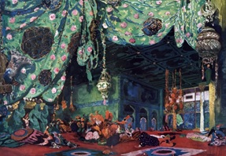
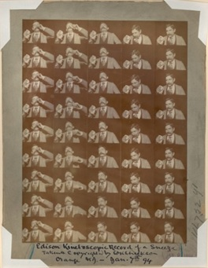
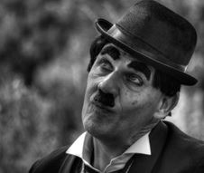

# 🎦 The origin of cinema

The beginnings of the history of cinema go back to the Greeks, Egyptians and Romans, where these civilizations were able to show the idea of movement through successive drawings. However, in Asia they began to play with light and shadow on the surface of a white cloth. This event was able to inspire what was known in the 17th century as the "magic lantern", which consisted of a box capable of capturing images from the outside, projecting them inside the box and later working in reverse to project them again.

New inventions such as the steam engine arrived in Great Britain already in the 19th century, and along with the industrial revolution, new forms of transport were also invented, the light bulb and the most important of all for the subject that concerns us, which was photography. At this time Charles Louis Chevalier son of Vincent Jacques Louis Chevaler were French opticians by profession and in 1823 they associated with the Quai de l'horloge store to market their objectives created for microscopes, which prevented chromatic aberration.

Then they dedicated themselves to perfecting the lenses for the "camera lucida" that had its applications in painting. In 1825 Niepce used the services of Charles Chevaliere to perfect his experimental cameras and by 1831 Charles became independent from his father and created his own company where he had Louis Daguerre as a client, where this painter and theatrical decorator managed to go down in history for invent the diorama.

The diorama was a complete visual spectacle in which images of natural landscapes or other iconographies were shown through elaborate scenographic techniques, where movements were applied to the clouds or a sun that, when moving, changed the tonalities of the scene. By means of transparencies, play of lights, relief elements and sound effects, he could recreate different types of environments with magical realism. Louise Daguerre patented her diorama in 1823 and turned the Paris stages into a spectacle, where images of up to 21 by 14 meters could be displayed that were only 12 meters from the viewer. In this way he achieved success for around 20 years for a box with more than 300 people, where the public area was made up of seats that were on a rotating platform and once the first stage was shown, the spectators turned to watch the second scene. Daguerre was able to move the public of the time and got them used to seeing shows like that.

As if that were not enough, Louise Daguerre became interested in photography, which she called "The eyes of the academy" and continued her advances in this field, she followed all the discoveries in this regard with great interest and began to use the camera obscura when make the models of his great compositions, he also dedicated himself to reproducing his works. She carried out multiple tests with phosphorescent substances but only achieved a fleeting image that was only visible in the dark. When he began to work together with Charles Chevalier, he put him in contact with Joseph Niepce, who was conducting experiments to fix images from the camera obscura, and on December 5, 1829, Daguerre signed a partnership contract, where he recognized that Niepce managed to find a novel procedure to fix the image and without the need for drawing. Both worked hard with sensitive plates of copper, silver and glass, in addition to making use of vapors in order to blacken the image.

Niepce dies in 1833, but Daguerre continues to investigate and a couple of years later (1835) she makes a very important accidental discovery. She placed a plate inside her chemical cabinet and realized after a few days that a latent image had taken shape, thanks to the evaporation effects of the mercury that came to act as a developer. It was not until 1838 that she managed to perfect the daguerreotype, because the exposure times had to be very long and the effects of mercury vapor were very toxic to health. However, Ella Daguerre managed to perfect the procedure with copper plates previously sensitized in iodine vapors, to later reveal them by means of mercury vapors. To fix the images, she used salt water at high temperatures and after all these innovations, she managed to obtain extremely sharp, quality and permanent images.

Later Thomas Alva Edison invented the Kinetoscope which was the forerunner of the movie projector, although it is true that it was not exactly a movie projector, it did introduce the fundamental approach that would later become the standard device for cinematographic projections before the appearance of the video. It carried a strip of film with sequential images that were over a light source and a high-speed shutter.

The Kinetoscope inspired the Lumiere brothers to create their own cinematographic device based on a record where a tape rotated at 16 frames per second and managed to project the movement of people in December 1895. The success spread not only in France but throughout Europe and North America.

The Lumière brothers made more than 10 films lacking natural sets and actors. Of course, the lack of editing, the haste and the fixed camera were part of the faults committed by the beginners of cinema.

The first person to make a film was Alice Guy, considered the founder of narrative cinema and who came to surpass the demonstration made by the Lumiere brothers. Alice managed to lay the foundations for fiction and she was also the first person to achieve her financial support through this profession. Therefore, the first film that was generated in the history of cinema was La Fée aux Choux in 1896, which translates as "The Cabbage Fairy" and later made other films such as Sage Femme de Premiere Classe in 1902 and in 1905 made the Emerald.

After the success of Guy, director Georges Meliés entered this magical profession, whose fantastic sets and fascinating stories captivated the viewer. Films such as "Bluebeard" and "Faust" created in 1901 generated new cinematographic techniques, especially with "Journey to the Moon" (1902) and also with "Journey through the impossible" made in 1904, managed to implement the technique of the theater before the cameras and made the first special effects, thus achieving science fiction films. Since then the cinema has evolved by leaps and bounds to the present day. Important directors such as Erich Von Stroheim, Murnau and Charles Chaplin emerged. Adventure films in the United States were not long in coming, such as those made by Douglas Fairbanks or the romantic dramas of Valentino. Then the American comic school that was born from the comedy made by Mack Sennet and these films were cataloged as the most beautiful and were based on stereotyping social characters such as the fat man, the policeman, the mustachioed bourgeois and the miser.

We cannot forget the cinema made by Charles Chaplin and Buster Keaton, but it was not until 1927 when the first sound film called "The Jazz Singer" was released and since then, the cinema ceased to exist as it was known, a greater plot fluidity and continuity of the story, for that same year the dubbing appeared and by 1935 with the film "The vanity fair" is that the cinema appears in Technicolor, but it really reaches color perfection in 1939 with "What the wind took away

## About the Author

Idais, Graduated in Mechanical Engineering, and a master’s degree in teaching component, she gave classes in several institutes of mathematics and physics, but she also dedicated several years of my life as a television producer, she did the scripts for mikes, the camera direction, editing of video and even the location. Later she was dedicated to SEO writing for a couple of years. she like poetry, chess and dominoes.
