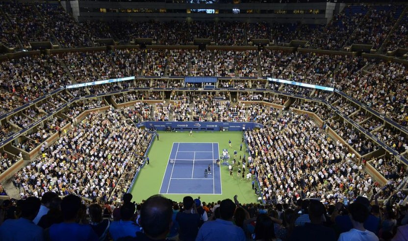
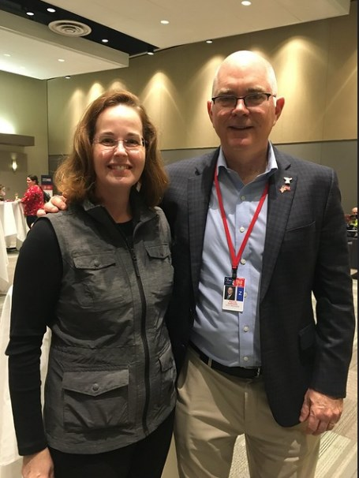
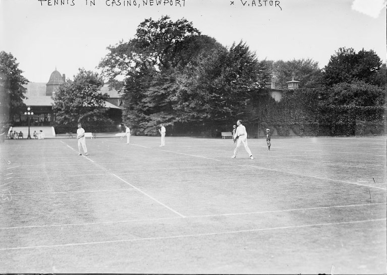
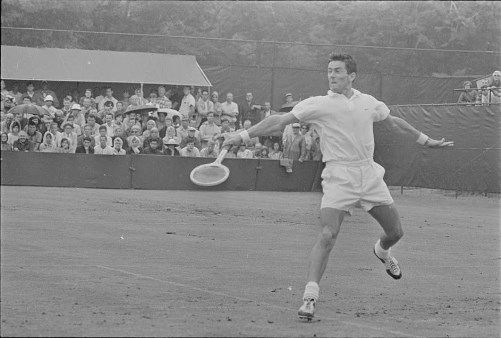
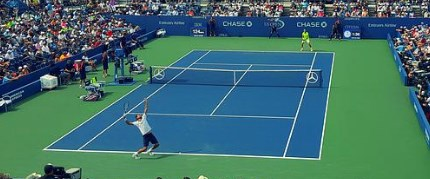
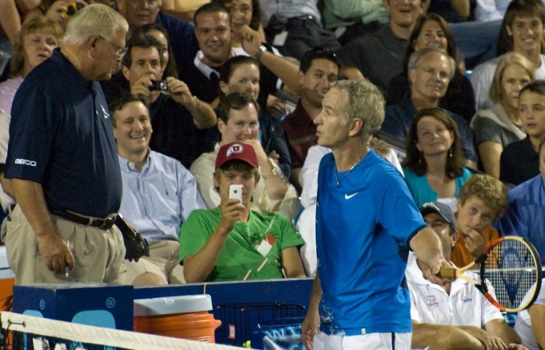
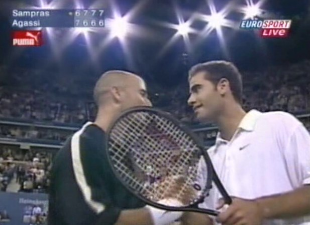

# 🎾 The US Open

The US Open Tennis Championships since 1987 is chronologically the last
and fourth Grand Slam tournament. The year starts with the Australian
Open, then comes the French Open, then Wimbledon and this would be the
last of the big four.

 

 The US Open begins on the last Monday of August and lasts for two weeks,
with the middle weekend coinciding with Labor Day, which is a public
holiday in the United States. This tournament is one of the oldest in
the world and was originally known as the US National Championship,
where the men\'s singles and men\'s doubles categories were initially
played for the first time in August 1881.

 Currently the tournament comprises 5 main championships which are the
men\'s and women\'s singles tournaments, the men\'s and women\'s doubles
modality, the mixed doubles category, but it also includes events for
junior and senior players, in addition to the wheelchair players
category. . Since 1978, the tournament has been played at Flushing
Meadows--Corona Park, located in Queens, New York City, specifically at
the USTA Billie Jean King National Tennis Center, and the courts are
hard acrylic.

 The United States Open is organized and owned by the United States
Tennis Association (USTA), being its president Patrick Galbraith and it
should be noted that it is a non-profit organization where the income
received from the sale of tickets, television contracts and
sponsorships, are used for the purpose of developing tennis in the
United States.

 

Photo of Patrick Galbraith taken by chezsmith taken from flickr

 The US Open counts within its rules with standard tiebreaks, being the
first to 7 and won by 2 in the sets of each singles match, while for the
rest of the Grand Slam events, there are other methods of scoring for
the matches that arrive tied at 6-6 in the possible last set, being the
third for the women\'s category and the fifth set for the men\'s
category. In the French Open when the deciding set is presented, it
continues until either player manages to take a two-game lead, but in
the Australian Open the tie-break is played extended to 10 points, while
in Wimbledon it is used the standard tiebreaker only when the game score
reaches 12-12. In the same way as the US Open, all Grand Slam events use
standard tiebreaks when deciding the other sets.

## History

In August 1881 this tournament was held for the first time at the
Newport Casino in Newport located in Rhode Island. In this first
edition, only those members who belonged to the United States National
Lawn Tennis Association (USNLTA) will be allowed to enter, with the
first male singles winner being the player Richard Sears, obtaining the
first of his seven consecutive individual titles.

 

Newport Casino

 Between 1884 and 1911, the tournament used a system whereby the
defending champion automatically qualified for the following year\'s
final, where he would play against the winner of that next year\'s
tournament.

 For the first few years of the championship only men competed and was
called the United States Men\'s National Singles Championship. However,
six years after the first men\'s national elections were held, in
September 1887 the first United States Women\'s National Singles
Championship was held at the Philadelphia Cricket Club. The player who
won the title was Ellen Hansell from Philadelphia, who was only 17 years
old at the time and that same year, the men\'s doubles event was held at
the Orange Lawn Tennis Club located in South Orange, New Jersey. The
semifinal of the United States Tennis Championship was held in Newport
in the year 1890 and the match was between Oliver Campbell and Bob
Huntington.

 

Philadelphia Cricket Club

 Between the years 1888 and 1918 a challenge system was used in the
women\'s tournament with the exception of the year 1917 and between the
years 1890 and 1906 sectional tournaments were held both in the east and
in the west of the country, to establish the best doubles teams. at
which point, they competed in a playoff for the right to compete against
the defending champions who were determined in the challenge round.

 Between the years 1888 and 1989 the men\'s doubles events were played at
the Staten Island Cricket Club located in Livingston, Staten Island, New
York. While the 1893 championship was played at the Chicago-based St.
George Cricket Club, the men\'s doubles event. For the year of 1892 the
US Mixed Doubles Championship was included, while the National Women\'s
Doubles Championship was introduced in 1899.

 The national championship was moved in 1915 to the West Side Tennis Club
in Forest Hills located in Queens New York. To move the championship to
New York City, a group of tennis players led by New Yorker Karl Behr
were the ones who dedicated themselves to this mission.

## West side tennis club

A group of approximately 100 tennis players signed a petition to move
the tournament in early 1915, arguing that most of the players, fans and
tennis clubs were located within the vicinity of New York City and
therefore, this move to New York would be of great benefit to the
development of the sport. However, another group of players, including
eight former individual national champions, opposed this decision. So it
had to be put to a vote on February 5, 1915 at the USNLTA\'s annual
meeting, with 128 votes in favor compared to 119 votes against
relocation. The men\'s singles tournament held in August 1915, took
place at the West Side Tennis Club for the first time located in Forest
Hills in New York, while the women\'s tournament took place at the
Philadelphia Cricket Club in Chestnut Hill in Philadelphia, it should be
noted that the women\'s tournament was not moved until 1921. Between
1917 and 1933 the men\'s doubles event took place at the Longwood
Cricket Club in Chestnut Hill in Massachusetts and in 1934 both men\'s
and women\'s doubles events were held at the Longwood Cricket Club.

 
Pancho Gonzales playing in the Longwood Cricket Club

 Between 1921 and 1923 the men\'s singles tournament was held at the
Germantown Cricket Club located in Philadelphia, however in 1924 it
returned to the West Side Tennis Club after the completion of the Forest
Hills Stadium with a capacity of 14,000 seats. Although it is true that
many considered it a great championship, it was not until 1924 that the
International Lawn Tennis Federation officially designated it as one of
the main tournaments in the world. The 1922 United States National
Championship was when the draw seeded players for the first time, thus
preventing the leading players from playing each other for the first few
rounds. From 1935 to 1941 and from 1946 to 1967, both the men\'s and
women\'s doubles took place at the Longwood Cricket Club.

## Open Era

The open era was when professional tennis players were first allowed to
compete in a Grand Slam tournament held at the West Side Tennis Club in
1968, in previous years the tournament was limited to amateur players.
With the exception of mixed doubles, the tournament events were open to
professionals and that year a total of 96 men and 63 women participated,
in addition to a prize pool of \$100,000.

The US Open became the first Grand Slam tournament in 1970 to use a tie
break, to decide those sets that reached a score of 6-6. Between the
years 1970 and 1974 the US Open used a best of 9 sudden death
tiebreaker, this was before starting with the points system where the
best of 12 points wins, proposed by the International Tennis Federation
(ITF) .

The US Open in 1973 was the first Grand Slam tournament to award the
same prize money for both men and women. For example, that year\'s
individual champions Margaret Court and John Newcombe each received
\$25,000. After 1975, after several complaints regarding the surface and
the impact on the ball\'s bounce, the tournament began to be played on
clay surfaces instead of on grass courts. That same year, in order to
make the tournament a little more friendly with television, it was
decided to experiment with adding spotlights and this allowed the
matches to be played at night.

 

Margaret Court

 The tournament moved from the West Side Tennis Club to the USTA National
Tennis Center in 1978, as it was newly built at Flushing Meadows three
miles north in Queens, as well as being larger. The court surface was
also changed to hard clay, with Jimmy Connors being the only person to
have managed to win US Open singles titles on three different surfaces
(grass, clay and hard clay), while the only woman capable of winning US
Open singles titles on two surfaces (hard clay and clay) was Chris
Evert.

 The only Grand Slam tournament that has been played every year since its
inception is the US Open. In the 2006 edition, the complex began to be
called the USTA Billie Jean King National Tennis Center, to honor Billie
Jean King, who was a four-time champion in the women\'s singles category
of the United States Open, in addition to being a pioneer of women\'s
tennis.

 

Billie Jean King

 The US Open changed the traditional practices regarding the programming
of tennis tournaments between the years 1984 and 2015 with the concept
of \"Super Saturday\". This meant that the women\'s finals were played
on the last Saturday of the tournament, while the men\'s finals were
played on the last Sunday, with the respective semifinals being held a
day earlier. Originally the women\'s final was held between the two
matches of the men\'s semifinals, but in 2001 the women\'s final was
moved to the night to be able to present it on prime time television, in
this way a great growth was achieved between viewers of the popularity
of women\'s tennis. This scheduling pattern was very helpful in building
TV viewership, but it somehow caused divisions among players as they
were given less than a day.

 Between 2008 and 2012 the men\'s final was postponed for five
consecutive tournaments due to weather, while for 2013 and 2014 the USTA
intentionally scheduled the men\'s final for Monday, this move was
praised for allowing players to an extra day to rest after the
semi-finals, but this caused some anger from the ATP for deviating from
the structure of the other Grand Slams. The concept of Super Saturday
was eliminated in 2015 and the US Open returned to a format similar to
that of the other Grand Slams, with the women\'s finals on Saturday and
the men\'s on Sunday. However, both sets of semi-finals due to weather
delays were forced to be held on Friday of that year.

 The US Open was the first Grand Slam tournament that in 2018 began to
control the time of the players between points, since it introduced the
shot clock and in this way the rhythm of the game is increased, the
clock is placed in a place Visible to both the players, the chair umpire
and the fans, now in all Grand Slams, WTA and ATP tournaments they apply
this technology since 2020.

 In view of the COVID-19 pandemic, the 2020 event was held without
spectators and it was announced that the wheelchair tennis competition
would not take place, this caused excessive controversy as the USTA took
the measure without consulting the disabled athletes, as it had done
with non-disabled competition organizations. She was later accused of
discrimination and the USTA had to reverse this measure, in addition to
admitting that it should have discussed this decision with the disabled
competitors and offered them \$150,000 to divide among themselves, as
opposed to the \$3.3 million they were given. Affected players were
offered to split among themselves for the cancellation of the women\'s
qualifying competition, men\'s qualifying competition and reductions in
mixed doubles pools, as part of the Open a competition with 95% of the
2019 prize funds or a competition that would take place at the USTA in
Florida.

## Arthur Ashe Stadium in 2010

The field of play of the US Open is developed with 22 outdoor courts and
outside the East Gate there are 12 more practice courts, they consist of
four exhibition courts that are the Arthur Ashe Stadium, the Grandstand,
the Louis Armstrong Stadium and Court 17, 13 are field courts and five
of them are practice courts.

 The Arthur Ashe Stadium on the main court opened in 1997 and has a
capacity of 23,771 seats, in addition to a retractable roof that cost
180 million dollars and where its construction was completed in 2016.
The stadium is called Arthur Ashe in honor the tennis player who won the
men\'s singles at the inaugural US Open in 1968, but also won the
Australian Open in 1970, the Wimbledon championship in 1975 and is a
character who was inducted into the Tennis Hall of Fame in 1985
International.

 

Arthur Ashe Stadium photo taken by slgckgc taken from flickr

 The Louis Armstrong Stadium is the next largest field in the complex and
has a capacity to hold 14,061 people, it was inaugurated in 2008 and its
construction cost 200 million dollars; this court is divided into a
lower level consisting of 6,400 seats and its tickets are sold
separately as they are reserved seats, while admission seats for the
general public is located on the upper level and has 7,661 seats. On the
other hand, in the southwest corner of the complex, the third largest
court was inaugurated in 2016, it is a grandstand with a capacity of
8,125 seats. Also in the southeast corner of the complex is court 17,
which is the fourth largest stadium, it was inaugurated in 2011 with
temporary seats, however, the following year it received its permanent
seats and has a capacity of 2,800 seats where all they are of general
admission and it is called by all as \"The Pit\", since the playing
surface is sunk eight feet into the ground. For the practice courts that
go from P1 to P5 they have a total capacity of 672 seats, while the
competition fields that go from 4 to 16 have 12,656 seats, broken down
as follows:

 

\- Courts 11 and 12 have a capacity of 1,704 seats each.

\- Court 5 with 1148 seats

\- Court 7 has 1494 seats

\- Courts 10 and 13 have 1,104 seats each

\- Court 4 with 1,066 seats

\- Court 6 has 1,032

\- Court 9 has 624

\- Courts 14 and 15 have 502 seats each

\- Courts 8 and 16 have 336 seats each

 What allows television coverage and matches to extend into prime time is
that all the courts used by the US Open are fully lit. The women\'s
singles final was intentionally scheduled in prime time for the first
time in 2001. This happened because Sean McManus, the president of CBS
Sports, was interested in the great interest of the viewers in the
players Serena Williams and Venus Williams, in addition to of the
increased ratings performance seen in the 1999 women\'s singles finals,
which due to rain delays had to be held in prime time.

## Area

The US Open was played between 1978 and 2019 on a surface called Pro
DecoTurf hard court, being a multi-layer padded surface that was
classified as medium fast by the International Tennis Federation. It is
important to note that the courts are resurfaced every August just
before the start of the tournament. However, the USTA decided that
Laykold would be the new supplier of court surfaces, beginning in March 2020. Every single US Open tennis court since 2005 is painted blue
within the lines, so that it is easier for players, spectators and
viewers to see the ball, to the point that it is already a registered
trademark as \"US Open Blue\", while the area outside the lines It is
still green, to increase visibility due to the difference in colors.

 

## Challenges in the player line

Instant replay checks made on the so-called line were introduced by the
US Open in 2006 using a computer system called Hawk-Eye, the first Grand
Slam tournament to use this system. The organization felt the need to
use the system due to the controversy that arose between Serena Williams
and Jennifer Capriati in the quarterfinals of the 2004 edition, given
that important line calls against Serena Williams occurred in that game
and instant replay were only available on the Arthur Ashe and Louis
Armstrong stadium courts until the 2008 tournament. However, on the
Grandstand court the system was installed for 2009. It should be noted
that all competition courts are already equipped with the Hawk-Eye as of
2018 and in all matches of the main draws, both singles, men\'s doubles
and women\'s, the same procedure is followed: each player is allowed
three incorrect challenges per set and one more in a tiebreaker.

 In the year 2021 the player challenges were removed and it was then the
second Grand Slam to use the Hawk-Eye Live in an absolute way, that is,
from then on all line calls are executed electronically. In the previous
year\'s edition, Hawk-Eye Live had already been incorporated for all
fields, except in the main Arthur Ashe and Louis Armstrong stadiums, in
order to reduce personnel during the pandemic.

 JP Morgan Chase renewed its sponsorship of the US Open in 2007 and part
of the deal was that the replay system should be called \"Chase Review\"
on both video and television in the stadium.

## The best games of the US Open

## Manuel Orantes vs. Guillermo Vilas in the 1975 Semifinals

Manuel Orantes had an amazing comeback in his win over Guillermo Vilas,
when he won the 1975 semi-finals with a score of 4-6, 1-6, 6-2, 7-5,
6-4. Very few people watched the match because it took place without
television coverage and late at night, in fact it is extremely difficult
to find a video of this match online. Both players were the best on clay
in the world at the time, and yet it was a match that didn\'t get the
attention it needed. It was even the first time that a Grand Slam
tournament had night sessions, Vilas was the number 2 seed, while
Orantes was the number 3 seed. While it is true that the match featured
long exchanges between both players, everything indicated that the match
would end at a reasonable time since Vilas won the first two sets, later
maintaining a 5-0 lead in the fourth, however Orantes impacted the
Argentine when playing that point with a serve and volley , thus
achieving his first volley in order to stay alive. Then Vilas with his
serve had two more match points reaching 5-1, but again Orantes not only
saved both points but also in the fourth set he managed to save five
match points and then won seven straight games to win the set with a
score of 7-5.

 By the time the Spaniard managed to finish the fifth set which was when
he was able to get to his room, it was already two in the morning and
after his grueling semi-final match, Manuel Orantes returned to the
court approximately 18 hours later to play Jimmy Connors. However,
Orantes showed no signs of emotional or physical fatigue, to the point
that he outscored Connors 6-4, 6-3, 6-4 to claim his first and only
Grand Slam title.

 

Photo of Manuel Orantes taken by Tennis Buzz and extracted from flickr

## Novak Djokovic beat Roger Federer in the 2011 Semifinals\*\*

Novak Djokovic in beating Roger Federer 6-7, 4-6, 6-3, 6-2, 7-5,
produced one of the greatest shots in history in the 2011 US Open
semifinals.

 Djokovic saved two match points in the US Open semifinals by beating
Federer for two years in a row. In the 2010 fifth set he had battled
back two match points while trailing 5-4, but the 2011 effort was much
more dramatic.

 After losing the first two sets Djokovic recovered to force a fifth set.
However Federer managed to break Djokovic in the 8th game, the score was
5-3 and Federer was serving having a double match point at 40-15. At
that point, Djokovic hit a forehand crosscourt return, saving the first
match point, to such an extent that John McEnroe said, according to The
Guardian, that it was \"one of the greatest shots of all time.\" Later
he managed to save the second match point and also managed to win four
consecutive games, thus being able to win the match with a flourish.

## Martina Navratilova vs. Steffi Graf in the 1991 Semifinals

When Martina Navratilova faced Steffi Graf in the semifinals of the 1991
US Open, she had lost four straight matches against her opponent and was
34 years old at the time, while Steffi Graf was only 22 years old and
had she had beaten Navratilova in the 1988 and 1989 Wimbledon finals,
but also in the 1989 US Open final, she had also been the number 1 seed
that year 1991, when Martina Navratilova was the number 6 seed.

 In this match Navratilova scored important points and was in the lead
with a score of 7-6 (7-2), 6-7 (6-8), 6-4. In the second set she battled
back four points, before Steffi Graf managed to win the tie break on the
fifth point of the set and level the match.

 Martina Navratilova managed to rally in the third set and took a 4-1
lead, but in the sixth game she double-faulted and lost serve, bringing
Graf to within 4-3 and subsequently earning two break points while With
Navratilova serving for the match at 5-4, Navratilova outlasted Graf by
saving the first break point to then respond to the second point with 3
excellent big serves, with which she ultimately managed to win the
match.

 

Photo of Stefanie Graf and Martina Navratilova taken by Elton John AIDS
Foundy from flickr

## Bjorn Borg vs. Jimmy Connors in the 1976 Final

Although Jimmy Connors was ranked No. 1, he hadn\'t won a single Grand
Slam event since his triumph in the 1974 US Open final, when he beat Ken
Rosewall. The 1976 US Open was played on a gray-green clay court
(Har-Tru) and Borg had already won the French Open in 1974 and 1975 on
clay, and had also won the first of five consecutive titles two months
earlier. would get at Wimbledon. But Connors before the 1976 final had
managed to beat Borg five times in a row. Connors\' aggressive drives
towards the net, flat and hard groundstrokes seemed to wear the Swede
down.

  The turning point turned out to be the third set that made the match
really special, this happened after each player managed to win one of
the first two sets. Connors began leading the third set 4-2 and found
himself serving at 40-0, just one point away from a commanding 5-2 lead.
However, Borg managed to win five straight points to win the game and
subsequently earned a double set point in the tie break. Connors then
hit two game winners to equalize the tie break but let a set point slip
away at 7-6, subsequently saving two points when the score was against
him at 8-7 and 9-8. The game was too exciting when the last point
managed to tie the tiebreaker at 9-9. At that moment Borg was ready to
serve when a ball boy informed the referee that the players had to
change sides again, since in the midst of the intensity of the match
both the referee and the players had forgotten that they had to change
sides. .

  The next two points were won by Connors after he battled through four
set points to put the score in his favor at 11-9 and win the set. In the
fourth set while serving at 5-4 he had his first match point, when Borg
managed to save the situation with a difficult forehand and subsequently
saved another point, before Connors ended up winning the title with a
score of 6-4. , 3-6, 7-6 (11-9), 6-4.

 Connors expressed in his book The Outsider that some of the shots they
both played that day, Borg with his little wooden racket and him with
his Wilson T-2000, were just plain crazy.

## Jimmy Connors vs. John McEnroe in the 1980 Semifinals

Both players were American stars with a lot of attitude and they didn\'t
like each other. The day of the match saw several tirades between
McEnroe and the chair umpire, which somewhat added flavor to that 1980
semi-final. McEnroe won the match 6-4, 5-7, 0-6, 6. -3, 7-6 (7-3), but
not before putting on a very entertaining show.

 McEnroe took the lead 6-4, 5-4 and it was when Connors took control
winning 11 consecutive games, to lead 2 sets to 1 winning the third set
to love, it was precisely in that set that McEnroe argued with the judge
of chair calling him among other things "Mr. Incompetent\". Connors for
his part, placed himself on the wall during the outburst to avoid the
argument.

 In the fourth set McEnroe recovered and led 5-4 in the fifth set,
however Connors hit two great winners breaking his opponent\'s serve and
managing to tie the match. At that point McEnroe lost control of his
racket which traveled the length of the court where he just barely
missed Connors, which cost McEnroe a \$250 fine.

 They eventually reached a tie break in the fifth set and Connors
committed two serious fouls giving McEnroe an insurmountable 4-1 lead
and winning the match.

 

Photo of John McEnroe taken by Rob Rudloff Foundy from flickr

## Venus Williams vs. Serena Williams, 2008 quarterfinals

Sisters Venus and Serena Williams had had 16 meetings, each winning
eight of them before meeting in the 2008 US Open quarterfinals, this
match being the most compelling of all their 24 meetings.

  Serena reached the semifinals with a 7-6 (8-6), 7-6 (9-7) victory and
according to the Associated Press it was very hard to imagine that any
of those encounters could be even close to the quality of the
competition run in 2008 by sisters who grew up together perfecting their
shots on the same court in Compton, California. Venus hit serves up to
125 miles per hour, while Serena hit up to 115 miles per hour, landing
groundstrokes and volleys that were ultimately the envy of all the women
on tour.

 Venus led the first set 5-3, but Serena forced the tie break and then
earned a double set point while trailing 6-4 and won the first set. In
the second set Venus had the advantage at 5-3, but saved three points
and another one at 6-5. Venus with another triple set point led the
tiebreaker 6-3, however, Serena not only saved all three set points but
she won the tiebreaker 9-7, winning the match.

 

Photo of Serena and Venus Williams taken by Universal Tennis taken from
flickr

## Steffi Graf vs. Monica Seles in the 1995 Finals

Both players had major mishaps while preparing for the 1995 US Open
final. After an absence of two years and several months, as Monica
Seles, who had been out of the game since April 1993, was stabbed by a
Steffi Graf fan in Hamburg, by a German who wanted Graf to regain
supremacy over Seles.

 Steffi Graf, for her part, spent much of the competition dodging the
German press, since her father Peter was in jail in Germany at the time,
for failing to pay income tax on his daughter\'s earnings for more than
of 1.5 million dollars. The night before the final, Graf even had an MRI
for a sore foot.

 In the first set Monica Seles thought she had won it with an ace at 6-5,
however the ball was disallowed and Graf managed to save set point,
later winning the tiebreak. The second set was completely dominated by
Seles, winning it to love and in just 27 minutes.

 Steffi Graf was serving up a 5-3 lead at 40-15 in the third set, when
Seles landed a smashing forehand to stay alive, however, she erred on
the second match point and Steffi Graf achieved victory.

## Andre Agassi vs. Pete Sampras in the 2001 quarterfinals

Although it is true that this match between Andre Agassi and Pete
Sampras was not exactly a final, in these quarterfinals of the US Open
in 2001 it was a sample of what any tennis fan could wish for.

 These two American stars, who already owned 21 Grand Slam singles titles
between them, met for the 32nd time in their careers having developed a
great rivalry between them, each with their contrasting styles and
personalities.

 Sampras held a slim 17-14 advantage in match wins, including wins in the
1990 and 1995 US Open finals. The excessive crowd that attended the
night session of the US Open, in addition the audience was openly known
for its raucous participation in the matches. The crowd in New York had
their sentimental favorites and every one of them, both 30-year-old
Sampras and 31-year-old Agassi, had his fan base.

The match was characterized by being a close contest at all times, to
the point that there was not even a single break of service during the
entire match. The atmosphere created by the crowd of fans was simply
phenomenal.

 Sampras conquered the victory with a score of 6-7 (7-9), 7-6 (7-2), 7-6
(7-2), 7-6 (7-5), but the curious thing was that they were 12:14 a.m.
and almost all of the 23,033 spectators who attended Arthur Ashe Stadium
that night were still present.

Agassi had to fight off a triple match point when they were in the first
set tie-break and came back from a score down 6-3 to reach a score of
9-7. In the second set, Sampras volleyed skillfully to win the tiebreak,
before finishing off with back-to-back aces in the third set tiebreak.

 In the fourth set Sampras hit two more aces and had a triple match point
to leave the score at 6-3. But the suspense increased when Sampras
double faulted, missing a volley to make the score 6-5, however Agassi
on the third match point missed a forehand, which Sampras knew how to
take advantage of very well to take the victory match victory.

 

Photo of Pete Sampras and Andre Agassi taken by Tennis Buzz from flickr

## About the Author

Idais, Graduated in Mechanical Engineering, and a master’s degree in teaching component, she gave classes in several institutes of mathematics and physics, but she also dedicated several years of my life as a television producer, she did the scripts for mikes, the camera direction, editing of video and even the location. Later she was dedicated to SEO writing for a couple of years. she like poetry, chess and dominoes.
