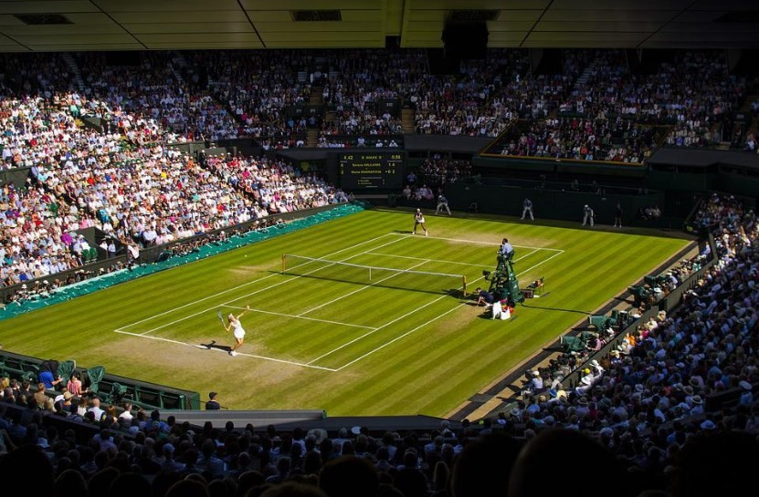
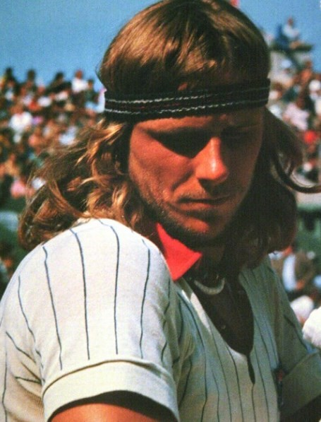
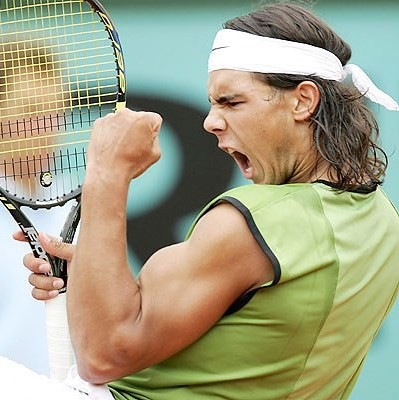
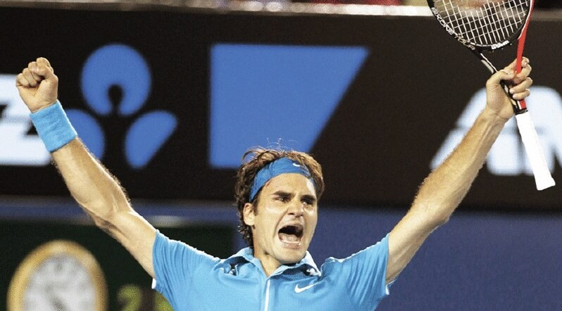
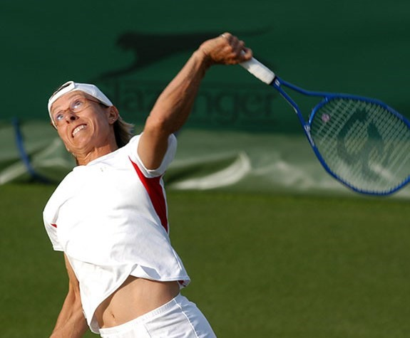
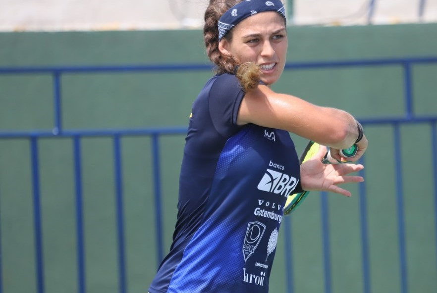

# 🎾 The Wimbledon Championships

The Wimbledon Championship is the oldest and most prestigious tennis event in the world, it takes place between the months of June and July, being the third tournament of the four Grand Slam tournaments. The first is the Australian Open which is played on a cement court, the second is the Roland Garros whose court is clay or brick dust, while the Wimbledon is on grass or grass and the last of these is the Open of United States where the players once again compete on the cement court.

At Wimbledon all the players wear white going back to their roots and it is the only one of the Grand Slam tournaments that is played on grass. Wimbledon was traditionally held in late June and early July for two weeks, beginning on the last Monday in June and ending with the men's and women's singles finals, which were scheduled for Saturday and Sunday of the second week. But in the year 2015 there were changes in the tennis calendar and the event was moved by a week, starting in early July. Although it is true that the tournament lasts two weeks, it can be extended in case of rain. Both men's and women's singles tournaments, men's and women's doubles tournaments, as well as doubles are played simultaneously. But the individual and double youth tournaments are also played, for women and men. There are even special invitational tournaments for retired players, which are men's doubles for players over 35 and 45 and women's doubles for players over 35. In 2021 the champions in the individual category were Ashleigh Barty and Novak Djokovic.

The first Wimbledon tournament was organized by the "All England Lawn Tennis and Croquet Club" and was held in 1877 where only the men's singles category was played, the women's singles entered in 1884 and it was not until 1913 that it was implemented the doubles category.

The tournament rapidly gained international relevance, especially when the American May Sutton won the singles championship in 1905 and was the first foreign woman to do so, while the first foreign victory for the men's singles was won by the Australian Norman Brookes in 1907.

In 1922 the championship venue was moved to a track near Church Road and remains Wimbledon today. German forces bombarded the complex with five bombs during World War II in October 1940, one of the bombs destroying the equipment room, while another fell on the roof of the Central Court.

While it is true that the British take great pride in the tournament, for a long time it was part of the national mourning and humor, since 1936 when Fred Perry won the men's singles championship, no Briton won it again until Andy Murray She achieved this feat again in 2013. It should be noted that since 1977 when Virginia Wade won this award, no other British woman has managed to win this championship again.

## The biggest finals in Wimbledon history

The greatest tennis matches have been held on this stage, among which the match between Björn Borg and John McEnroe on July 6, 1980 stands out. All the spectators thought that the match was a masterpiece, John McEnroe He came out with great force from the first moment passing over the Swede winning the first set with a 6-1 advantage, but from one moment to another Borg began to come back and cut the way on the scoreboard, winning the next two sets. Many thought that everything was already decided, without knowing what would happen in the fourth set, today what happened is still remembered as one of the best games ever seen on a tennis court. Both players reached the tiebreak and in that tiebreaker the spectators were delighted with the following 34 points, 22 minutes of history of the most exciting for this sport.

McEnroe saved five match points and managed to take the match to the fifth set while the fans vibrated at each point and despite the missed opportunity Borg was not intimidated and continued to control the North American's thrusts, his concentration reached such a point that he only lost three points with his serve for this set.
Both defending their games until reaching 7-6 and it was then that Borg managed to break McEnroe's serve by means of a crossover passing, which was recorded for history. Borg dropped to his knees on the grass, clenched his fists and raised them in victory.

Borg photo taken by Stylecouncil1 taken from flickr

## Wimbledom final in 2001

Another match to be remembered was the 2001 final between Goran Ivanisevic and Patrick Rafter. Croatian Ivanisevic was recorded in the record books as the only player who, being a special guest of the organization, won the Wimbledon championship.

Ivanisevic was ranked No. 125 in the FedEx ATP Rankings and due to rain, the final with Rafter was postponed until Monday. It was when 10,000 fans crowded for tickets the night before that the day began to be called "the Monday of the people".

The Croatian had been in virtual darkness for a year and a half, going 10-11 on the year due to a shoulder injury, so expectations weren't good and he was expected to advance just in case, a couple of rounds. However, from the start he dispatched five rivals to reach the final, three of them (Roddick, Rusedski and Henman) being grass specialists. Ivanisevic faced Patrick Rafter, double champion of the United States Open and finalist of the previous year.

That Monday the Croatian won 2 sets to one, but had to receive medical attention for his left shoulder injury.
In the fourth set it was thought that his temperament was going to play against him when they were 4-4, at the break point against the Croatian he hit an ace, but at that moment he was called a foot fault, in the second serve the ball was called bad and then the Croatian kicked the net, threw the racket and had an off-key argument with the chair umpire, later Rafter secured the fourth set. However, Ivanisevic was able to keep his cool and in the fifth set, the Croatian broke Rafter's resistance in the fifteenth game and that's when he got the chance of a lifetime from him, making the most of it.

In an emotional three-hour final, the Croatian won the match with the following score 6-3, 3-6, 6-3, 2-6, 9-7, Ivanisevic's feat remains as one of the best in all the story, to the point that it inspired the making of a movie.

Rarely in life has a game been seen with so much nerve and so much emotion. Ivanisevic is the lowest-ranked tennis player in history to win Wimbledon and the only one to arrive as a special guest, as if that were not enough, the feat was performed in his 48th Grand Slam appearance and he is still the tennis player who it has taken longer to win his first “major” trophy.

The most moving moments were when the Croatian sat on the court with his eyes to the sky, screaming and shedding a few tears before winning the match. On his fourth championship ball, Ivanisevic fell to the grass and cried after winning his first Grand Slam title.

Photo of Ivanisevic taken by Carine 06 taken from flickr

## Federer and Nadal in the 2008 final

Continuing with the best matches we cannot forget the 2008 Wimbledon Championship. The men's singles final was played between Roger Federer and Rafael Nadal, who at that time were the number 1 and 2 players in the world respectively. After a heated confrontation of 4 hours and 48 minutes, Rafael Nadal defeated Federer with the score 6–4, 6–4, 6–7, 6–7, 9-7.

The two players had a rivalry that many believed was the greatest in tennis history. By the time they reached the championship in 2008, both players had managed to win 14 of the last 16 Grand Slam titles. At that time it was the third year in a row where Federer and Nadal met in the Wimbledon final, and Federer had also been the Wimbledon champion for the fifth time in a row and therefore had beaten Nadal in the previous two matches, this time trying to become the tournament champion for the sixth consecutive year.

For his part, Nadal had just been the Roland Garros champion for the fourth time in a row and was trying to achieve the Roland Garros-Wimbledon double, for connoisseurs of the sport, it is known that this feat is extremely difficult, because it requires that the player went from winning on a clay surface to a grass one, in just the span of a month.

Although it is true that the players had to be on the field at two in the afternoon, the game was delayed 35 minutes due to rain. Once the match started Rafael Nadal won the first two sets with a score of 6–4, 6–4, it was when the rain again stopped the game while Federer was winning the third set 5-4. After an 80-minute break as the weather settled, Federer managed to win the next two sets, both by scores of 7-6, thus saving 2 championship points for the fourth set of the tiebreak. It should be noted that this tiebreaker is considered by many to be one of the greatest in tennis history.

Federer later put the score in his favor at 5-2 and Nadal was able to win the title on his next two serves, but he committed two faults, as well as a backhand miss at the net, thus giving Federer the game back with the score. 4-5 against, but with his service. The score was positioned 7-7 when Nadal managed a passing shot and stayed in the match, Federer for his part responded with another passing shot to stay in the match. Federer subsequently won the tiebreak 10-8 sparking off a fifth set and then at 19:53, play was again rained out for another 30 minutes.

When they returned to the field it was already getting dark and they discussed delaying the match for the following day, but it did not happen. During the deciding set Federer was up 7-6, however Nadal held his serve and at some point he broke Federer's serve and in the next game, he had the serve in his hands winning the fifth set 9-7 and of course, the match. John McEnroe expressed on July 5, 2008 "It's the best game in history."

The match ended at 9:15 p.m. and it was the last Wimbledon final to be affected by rain, since the 2009 Wimbledon championships, the Central Court already had a retractable roof.

Photo of Rafael Nadal taken by Massura taken from flickr

## 2009 Championship Final

The 2009 Wimbledon final was an event that everyone wanted to witness. Roger Federer and Pete Sampras were tied at 14 for the number of Grand Slams won in the Open Era, so much so that Pete Sampras flew all the way to London to watch the tournament.

The final was between Roger Federer and Andy Roddick, the first duel between the two occurred at Wimbledon 2004 and in this final, Roddick was chasing his first Wimbledon trophy.

The match was not what everyone expected with a devastating Federer, Roddick won the first set and the Swiss the next two in the tiebreak. The fourth set was won again by Roddick. The game lasted four hours and 16 minutes in which the American played the best tennis of his career, which was what allowed him to reach an epic fifth set, in which Federer required nothing less than 30 games to win the tournament. Federer had to suffer through these five sets against a punishing Roddick in an exciting match to proclaim himself Wimbledon champion for the sixth time. The Swiss managed to make history to become the first player capable of winning 15 Grand Slam titles, surpassing the mark that he had shared with Pete Sampras until then. The result was 5-7, 7-6 (6), 7-6 (5), 3-6 and 16-14, adding his 20th final of a "big" and beating the American Iván Lendl to beat another mark and snatching Rafael Nadal the number 1 in the world.

Photo of Roger Federer taken by Yaseen Khawar taken from flickr

## Djokovic vs Federer in the 2019 final

In the first set, Djokovic's colossal defenses, heroic points and Federer's entire repertoire were already present, which led to a well-deserved tiebreak. While it is true that the Swiss began this tiebreak with greater strength, then he had a small downturn and ended up delivering the first set. Then Federer in the second set got two breaks out and leveled the competition with a resounding 6-1.

Djokovic returned renewed in the third game and had to give the best of his service to save a ball when the score was 5-4 against. Once they got to another tiebreak there wasn't much difference between the level of one player and another. Djokovic, however, took the lead again by winning the third set. The Swiss reacted and scored two consecutive breaks which led to the fifth and final set, at that time the final was an ode to tennis.

In the fourth game of the fifth set Djokovic managed to have three breaks, the first two being with Federer's second serve and in the Swiss's next service it was when the Serb would give a blow to get the score in his favor 4- two. However, Federer's response was not long in coming, placing the score 6-6, at that time they had already passed the four hours of battle and Federer broke the Serb's serve, but inexplicably wasted two balls with his serve and the match was revived contest. The unexpected 12-12 came and the final went down in history for becoming the first Wimbledon match to feature this tiebreaker. It was then that Novak Djokovic once again crowned Wimbledon in one of the finals that has been considered one of the most legendary in tennis history, where both players displayed all their magic.

Novak Djokovic photo taken by Carine 06 taken from flickr

## Wimbledon's longest match

The longest match in history was played in 2010 between the American John Isner and the Frenchman Nicolas Mahut in the first round of the championship, it was played on June 22, 23 and 24 for a total of 11 hours and five minutes, the scoreboard was in favor of the winner Isner by 6-4, 3-6, 6-7(7), 7-6(3) and 70-68, with 183 games played. The match took place on court 18 starting on June 22, 2010, but due to lack of light it had to be suspended until the following day. Once resumed on the 23rd it would become the longest match in tennis history where four groups of 28 ball boys and two groups of 14 line judges were moved to help the match. But due to bad weather, the game was postponed again at 9:13 p.m., resuming the next day and leaving the score at 70-68.

Photo of John Isner taken by Christofer Levy taken from flickr

Numerous records in tennis history were broken in this match:

• The longest game with 11 hours and 5 minutes

• The longest set, the fifth set lasted 8 hours and 11 minutes

• The most games in a set, with a total of 138 in the fifth set.

• Highest number of aces made by a single player in a match, Isner hit 113 aces and Mahut had the second most aces hit by a player in a single match.

• Most aces made in a single match (216)

• Number of consecutive serves held in a match for a total of 168, Isner held 84 serves and likewise, Mahut also held 84 serves.

• Greater number of games won by a player in the same match, which was Isner with 92 and Mahut second with 91 games won.

• Highest number of points won in a single match, this record was held by Mahut with 502 points.

• Greater number of points (980) obtained in a single game.

As we stated before, the time played was 11 hours and five minutes, breaking the record, but what we want to highlight is the abysmal difference that exists with respect to the previous record, which was in the match between Fabrice Santoro and Arnaud Clément at Roland Garros of the year 2004, where they played for 6 hours and 33 minutes.

Regarding the games played in a match, they broke the record with 183, the previous records were established by Andy Roddinck who required 83 games to beat Younes El Aynaoui at the 2003 Australian Open and Pancho Gonzales who needed 112 games to defeat Charlie Pasarell in 1969, but this was all before the tiebreak was introduced in 1969.

The 8 hours and 11 minutes that the fifth set lasted is longer than the previous record for the longest complete tennis match in history.

The record for the number of aces was set by Isner with 113, but the previous record was held by Croatian Ivo Karlovic with 78 aces in the 2009 Davis Cup. Even the number of total aces (216) far exceeded the previous record Karlovic and Štěpánek had it with 96 aces in total, in the 2009 Davis Cup.

Even Queen Elizabeth II was present at the final points of the match, in fact, it was the first time in more than three decades that she had attended a Wimbledon match.

## Wimbledon traditions

The traditional colors of the turner are dark green and purple. On the other hand, it is the only tournament where the clothing for both sexes is required to be 100% white.

The tennis players are named as "Miss" or "Mrs" when the referee professes the scores during the game, while the men are called by their last name.

Each year the tournament begins six weeks before the first Monday of August arrives and ends 15 days later. It is not usually played on Middle Sunday, only four times in Wimbledon history has rain caused it to be played on "Middle Sunday".

The first week is when the preliminary rounds are played, while the second week is where the Round of 16, Quarterfinals, Semifinals, and Final take place.

In the individual games the men's champions receive a silver trophy, while the women's champion receives a silver platter called the "Rosewater Dish" or "Venus Rosewater Dish". In addition, the trophies are awarded in separate events.

## Historical facts

• In 1877, the first Wimbledon championship was played, where 200 spectators attended the entire tournament, the ticket cost one shilling per person, only 22 people attended the final and the winner was Spencer Gore.

• The official ball of the tournament has been Slazenger since 1902.

• Wimbledon is held at "The All England Lawn Tennis & Croquet Club" and prior to its relocation to Church Road in 1922, the championships were located at Worple Road. Including the honorary members, who are those champions in Singles in the past, it has only 375 active members. But John McEnroe was the exception, as after winning the tournament in 1981 he was not given access to such an honor in view of his misconduct, however, after two years he was accepted.

• Sweden's Borg was Wimbledon champion for five consecutive years between 1976 and 1980, while Britain's Renshaw won the championship for six successive years from 1881 to 1886, a feat of consecutive championships equaled by Martina Navratilova between 1982 and 1987 .

• Princess Stephanie of Austria was the first royal to attend Wimbledon on Sunday, July 15, 1895.

• In the year 1987 the German Steffi Graf was the first woman who came from the open era and reached the final, in addition she had not lost a single match throughout the year, she had seven titles and 45 wins, however, lost against Martina Navratilova.

• Martina Navratilova not only managed to win the championship for six consecutive years, but she also took the title 9 times.

Photo of Martina Navratilova taken by Richard Thorpe taken from flickr

• Pete Sampras also won Wimbledon 7 times, but not consecutively, from 1993 to 1995 and then from 1997 to 2000.

Photo of Pete Sampras taken by Popeyee taken from flickr

• William Renshaw had also performed the same feat as Sampras but between 1881 and 1886 and then won again in 1889.

• The chair umpires who participate in the tournament usually officiate 2 matches a day, although not necessarily on the same court.

• Steffi Graf managed to win the competition in 1988 and what was interesting was that she won the Grand Slam (Australian Open, Roland Garros, Wimbledon and US Open) all in the same year.

• The first singles champion to publicly present the trophy on court was American Ted Schroeder in 1946.

• The 100th Anniversary was celebrated in 1977, although it is true that the 100 championships played were actually completed in 1986 (in view of the two world wars), the Dukes of Kent awarded medals to a large number of the former champions, In addition, the public was able to enjoy a local victory, since the British Virginia Wade won.

• In 1974 Jimmy Connors won the male single title and Chris Evert won the female single for that same year, the funny thing is that both were dating at the time.

• The only married couple who both held the title were Leslie Godfree and Kitty McKane Godfree from Great Britain in 1926.

• In 1884 it was the first time that the women's tournament was held, where 13 players participated and Maud Watson was the winner.

• The first black man to win the men's singles championship was Arthur Ashe in 1975.

• The first Wimbledon prize money was awarded in 1968 in the amount of 25,150 pounds sterling ($ 158,106), while for the year 2021 the prize between all prizes was 35 million pounds sterling ($ 49.4 millions of dollars).

• Maggie, Manuela and Katerina Maleeva were sisters and ranked 10th, 11th and 12th in the main draw at the 1993 singles competition.

• Jimmy Connors held the record for most appearances in the singles chart ranking, he appeared 17 times between 1973 and 1989.

• England's Virginia Wade holds the record for having competed in 26 consecutive editions of Wimbledon.

Photo of Virginia Wade taken by John Scott taken from flickr

• The youngest champions of the tournament have been Martina Hingis who won the in 1996 at just 15 years and 282 days old and Germany's Boris Becker who won the singles championship at 17 years and 227 days in 1985, while the North American Ralston won in the year 1932 with 17 years and 341 days. Britain's Dod won the ladies' singles in 1887 at the age of 15 years and 285 days and Australia's Rob Laver won the mixed championship in 1959 at the age of 20 years and 328 days, while the American Serena Williams won this category in 1998 at the age of 16 and 282 days.

• The Yugoslav Tennis Federation suspended the player Nikki Pilic for a year in 1973, since he refused to play in the Davis Cup, reasons why 80 ATP professionals began to boycott the tournament where the Czechoslovakian Jan Kodes won and in the women's category, it was won by the North American Billie Jean King.

• The oldest champions to win the tournament were the American Dupont at 44 years and 125 days old in 1962 who won the Doubles title. The British Gore won the men's singles championship at 41 years and 182 days in 1909. While the American Mulloy won the title in 1957 at 43 years and 226 days. Britain's Sterry won the ladies' singles title in 1908 at 37 years and 282 days, while American Ryan won the title in 1934 at 42 years and 152 days. Lastly, the oldest gentleman to win the doubles title was the North American Stewart at 42 years and 28 days old in 1988.

• The oldest competitor in the entire history of the tournament was Frenchman Jean Borotra, who was able to participate in the men's doubles event at the age of 65 years and 317 days in 1964. It should be noted that this same player participated in 223 matches between singles and doubles between the years 1922 and 1964.

• Wimbledon took 28 years to become an international tournament capable of opening up to players from all over the world. The victory in ladies was in 1905 for the American May Sutton, while the first "non-English" victory for the gentlemen was obtained by the Australian Norman Brooks in the year 1907.

• Jennifer Capriati was the youngest player to qualify in the ladies' singles draw at 14 years and 89 days in 1990. Sweden's Bjorn Borg set the same record for men in 1973 at 17 years and 19 days of age .

• In case of rain, which as we know is very frequent during Wimbledon, the 18 courts can be covered in 5 minutes, since the organization has 120 people designated for this purpose.

• The first time the tournament was televised was in 1937.

• The last time a competitor won all three titles in the same year was the player Billie Jean King who was able to win the ladies' single, together with Casals she won the and together with Davidson she won the mixed double in 1973.

• The record of 41 consecutive tournament wins was held by Bjorn Borg between 1975 and 1981.

• Three brothers like David, John and Tony Lloyd competed in the year 1977 in the same box singles.

• Some curious statistical data is that more than 650 matches are played refereed by 330 umpires, there are 132 ball boys and ball girls; the courtesy cars are driven by 150 people, there are 220 security employees, 10 psychotherapists work, 16 people in the press and balls are changed for the first time in each game after 7 games and subsequently every 9 games, so they are used throughout the tournament some 31,200 balls, to then sell them to clubs affiliated with the Lawn Tennis Association.

• Since 1922 when the club moved to Church Road, the Gentlemen's Singles Final has been played on Central Court.

• The first official website of the tournament (www.wimbledon.org) was uploaded to the network in 1995, however, the traffic record was recorded in 2001 during the 15 days that the event lasted. The company that designed the web was IBM and provided the metrics for that time, where 3.2 million people visited the website at least once. On the other hand, that Monday Goran Ivanisevic and Patrick Rafter played the men's singles final and 230,457 people followed the instances of the match through the “instant scores” section.

• The oldest competitor in the entire history of the tournament was Frenchman Jean Borotra, who was able to participate in the men's doubles event at the age of 65 years and 317 days in 1964. It should be noted that this same player participated in 223 matches between singles and doubles between the years 1922 and 1964.

• Wimbledon took 28 years to become an international tournament capable of opening up to players from all over the world. The victory in ladies was in 1905 for the American May Sutton, while the first "non-English" victory for the gentlemen was obtained by the Australian Norman Brooks in the year 1907.

• Jennifer Capriati was the youngest player to qualify in the ladies' singles draw at 14 years and 89 days in 1990. Sweden's Bjorn Borg set the same record for men in 1973 at 17 years and 19 days of age.

• In case of rain, which as we know is very frequent during Wimbledon, the 18 courts can be covered in 5 minutes, since the organization has 120 people designated for this purpose.

• The first time the tournament was televised was in 1937.

• The last time a competitor won all three titles in the same year was the player Billie Jean King who was able to win the ladies single, together with Casals she won the and together with Davidson she won the mixed double in 1973.

Photo of Billie Jean King taken by Lucas Balduino (CBT) taken from flickr

• The record of 41 consecutive tournament wins was held by Bjorn Borg between 1975 and 1981.

• Three brothers like David, John and Tony Lloyd competed in the year 1977 in the same box singles.

• Some curious statistical data is that more than 650 matches are played refereed by 330 umpires, there are 132 ball boys and ball girls; the courtesy cars are driven by 150 people, there are 220 security employees, 10 psychotherapists work, 16 people in the press and balls are changed for the first time in each game after 7 games and subsequently every 9 games, so they are used throughout the tournament some 31,200 balls, to then sell them to clubs affiliated with the Lawn Tennis Association.

• Since 1922 when the club moved to Church Road, the Gentlemen's Singles Final has been played on Central Court.

• The first official website of the tournament (www.wimbledon.org) was uploaded to the network in 1995, however, the traffic record was recorded in 2001 during the 15 days that the event lasted. The company that designed the web was IBM and provided the metrics for that time, where 3.2 million people visited the website at least once. On the other hand, that Monday Goran Ivanisevic and Patrick Rafter played the men's singles final and 230,457 people followed the instances of the match through the “instant scores” section.

## About the Author

Idais, Graduated in Mechanical Engineering, and a master’s degree in teaching component, she gave classes in several institutes of mathematics and physics, but she also dedicated several years of my life as a television producer, she did the scripts for mikes, the camera direction, editing of video and even the location. Later she was dedicated to SEO writing for a couple of years. she like poetry, chess and dominoes.
