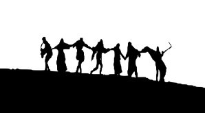

# 🎬 The seventh seal

This film is director Ingmar Bergman's masterpiece, with a highly significant philosophical value since it portrays human dilemmas regarding the meaning of life. One of the dilemmas to which the Swedish director dedicated himself was "The Silence of God" since he seems to observe the world without intervening and as a spectator.

The film is about a boy accompanied by his father after contemplating the pictorial works that he observed in the churches near Stockholm. Gothic images such as the work of Albertus Pictor where death appears playing chess, but it also recalls paintings on the dance of death.

The Black Death is present in a decadent Europe and the film takes place in Sweden in the fourteenth century, with the voice of a narrator pronouncing verses from the Apocalypse.

Antonius Block is masterfully played by Max Von Sydow and represents a knight who has just returned from the Crusades and finds himself confused by so much misery. The protagonist speaks with death and asks for a little more life, because he wants to clear up some doubts that have assailed him for many years.
Death, who is played by Bengkt Ekerot, is playing chess with Antonius and grants him an extension to continue on his path of doubts. Antonius is always accompanied by a squire named Jons who is played by Gunnar Bjornstrand who is a very practical man and far from metaphysical quest.

Antonius and Jons meet different characters that imprint a notorious force on the plot. A girl convicted of witchcraft, a thief of goods taken from the dead, a professor of theology, a family of puppeteers minstrels, a woman saved by Jons from being raped, a group of flagellants and a blacksmith with his unfaithful wife.
Almost everyone the protagonists meet is in one way or another shaken by the Black Death. Only the group of comedians breaks this rule, they are minstrels who guide their lives in a simple way and Antonius wants to save them from death, although he knows that he himself cannot escape his fate.

The encounter of the protagonists with the flagellants who whip themselves, are accompanied by monks who carry a crucifix and sing, where people pay them a ceremonial tribute to appease the wrath of God. However, Antonius, his squire and the minstrels do not kneel and resist against a blind faith that is trapped in superstition, while one of the monks refers to death in apocalyptic terms and the procession continues on its way until disappears.

On the other hand, the scenes of the girl accused of witchcraft and her execution are shocking. Antonius is interested in the woman accused of having relations with the devil and sentenced to the stake, he talks to the young woman to tell him about her experience with the devil and thinks that he can convince her to dissipate her anguish thanks to his skills with other dimensions. He also said that he could give her an answer about God, in this way the young woman could clear up questions about life after death. However, the girl finds no answers and the knight can only glimpse a deep emptiness that terrifies him.

The journey of the knights and their companions ends when, almost at the end of the film, they arrive at Antonius's castle, where they are received by his wife and begin to read the Apocalypse. At that moment, the knight who had lost the chess game feels deeply intimidated by the requirements of his squire, who rebukes him for the way he feels trapped by destiny. It is then that death takes the lives of Antonius and some of his companions, dancing with them and making its way in a macabre way. However, the family of minstrels made up of Mia, Joy and her son are saved from death, thus ending the film.

Bergman shows us in the middle of the medieval era a legitimate resource to think about issues concerning contemporary man. The agnostic void and doubt are important issues even for those people who have fled the reference to God for other beliefs.

The seventh seal is of the fantastic dramatic genre and this Swedish film was shown to the public in 1957. It is considered one of the great classics of universal cinema and helped Ingmar Bergman establish himself as a renowned director. This classic contains iconic scenes that have been honored through time. America magazine credits this film with starting a series of films capable of exploring faith in a post-Holocaust era.
It has been awarded multiple prizes such as:

1- The special prize of the Cannes film festival of the year 1957

2- The Golden Labrum of 1960 in the fifth week of Religious Cinema in Valladolid

3- The prize for the best foreign film director awarded by SNGCI in 1961

4- The Fotogramas de plata award, to the best foreign film performer awarded to Max Von Sydow in 1962.

5- Prize for the best film of the year awarded by Sant Jordi de cine and also for the best foreign director, both in 1962.

6- Prize for the best foreign film awarded by Medals of the Circle of Cinematographic Writers and also to the best foreign director in 1961.

The seventh seal is characterized by not being governed historically, since the problems it raises are mainly current. This film has the dichotomy of belonging to an atomic age literature, but it also has a lot to do with judgment day. Being its central characters, both the knight and his squire figures that are clearly contemporary. This film shows the fears in which man is submerged, but not only in medieval times, but also belong to his fears today.

It is a film that forces us to reflect and therefore should be included in the list of films to see.

## About The Author

 Idais, Graduated in Mechanical Engineering, and a master’s degree in teaching component, she gave classes in several institutes of mathematics and physics, but she also dedicated several years of my life as a television producer, she did the scripts for mikes, the camera direction, editing of video and even the location. Later she was dedicated to SEO writing for a couple of years. she like poetry, chess and dominoes