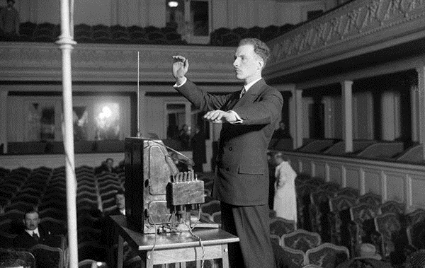

# ♬ Theremin

The theremin (/ˈθɛrəmɪn/; originally known as the ætherphone/etherphone, thereminophone or termenvox/thereminvox) is an electronic musical instrument controlled without physical contact by the thereminist (performer). It is named after its inventor, Leon Theremin, who patented the device in 1928.

Leon Theremin (born Lev Sergeyevich Termen; 27 August [O.S. 15 August] 1896 – 3 November 1993) was a Russian and Soviet inventor, most famous for his invention of the theremin, one of the first electronic musical instruments and the first to be mass-produced. He also worked on early television research. His listening device, "The Thing", hung for seven years in plain view in the United States Ambassador's Moscow office and enabled Soviet agents to eavesdrop on secret conversations.

The principles of beat frequency or heterodyning oscillators were discovered by chance during the first decades of the twentieth century by radio engineers experimenting with radio vacuum tubes. Heterodyning effect is created by two high radio frequency sound waves of similar but varying frequency combining and creating a lower audible frequency, equal to the difference between the two radio frequencies (approximately 20 Hz to 20,000 Hz). The musical potential of the effect was noted by several engineers and designers including Maurice Martenot, Nikolay Obukhov, Armand Givelet and the Russian Cellist and electronic engineer, Leon (or Lev) Sergeivitch Termen.

[Leon Termen plays the ‘Theremin’ or ‘Thereminvox’.Paris, 1927]

One problem with utilising the heterodyning effect (heterodyning is the effect where two high frequency signals are added producing a third audible tone which is the difference of the two high frequencies. This effect was the basis of many "vacuum tube based electronic instruments”.) for musical purposes was that as the body came near the vacuum tubes the capacitance of the body caused variations in frequency.

Leon Termen realised that rather than being a problem, body capacitance could be used as a control mechanism for an instrument and finally freeing the performer from the keyboard and fixed intonation. Termen’s first machine, built in the USSR in 1917 was christened the “Theremin” (after himself) or the “Aetherophone” (sound from the ‘ether’) and was the first instrument to exploit the heterodyning principle.

The original Theremin used a foot pedal to control the volume and a switch mechanism to alter the pitch. This prototype evolved into a production model Theremin in 1920, this was a unique design, resembling a gramophone cabinet on 4 legs with a protruding metal antennae and a metal loop. The instrument was played by moving the hands around the metal loop for volume and around the antennae for pitch. The output was a monophonic continuous tone modulated by the performer. The timbre of the instrument was fixed and resembled a violin string sound. The sound was produced directly by the heterodyning combination of two radio-frequency oscillators: one operating at a fixed frequency of 170,000 Hz, the other with a variable frequency between 168,000 and 170,000 Hz. The frequency of the second oscillator being determined by the proximity of the musician’s hand to the pitch antenna. The difference of the fixed and variable radio frequencies results in an audible beat frequency between 0 and 2,000 Hz. The audible sound came from the oscillators, later models adding an amplifier and large triangular loudspeaker.

Here you can see the Teremin in action: <https://youtu.be/VJ4dfYUlW1w>, or <https://youtu.be/ajM4vYCZMZk>

Next topic: Staccatone

## Sources

- Wikipedia / 120years.net

## About the author

"Guido F. Matis (a.k.a. widosub), a seasoned producer-composer authority with an unquenchable compassion towards the musical expression, and many years of experience in the fields of event organizing, movie post-production, and recording with professional musicians. His devotion to movie sounds shows in his art - widosub's music is filled with landscapes of emotions, dramatic twists and melancholic moods. He's one of the hosts of Tilos Rádió's MustBeat show, in which he's is focusing on drum'n'bass and chillout music. He's also one half of the duo Empty Universe."
