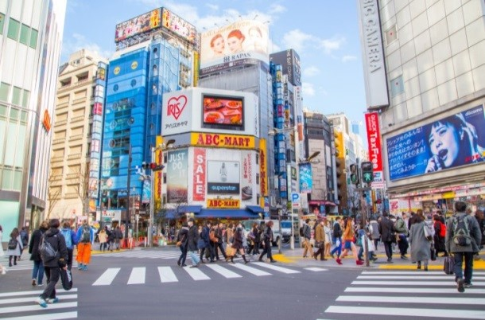

# 🗼Tokyo

Tokyo is an impressive city that is able to combine all the luxuries with traditional elements. This makes it one of the most visited and attractive sites in both Japan and the Asian continent.

This city has ancient temples, palaces, gardens and an entire ancient culture that makes it special among other cities in the world.

We are going to name the 14 best tourist sites in the Japanese capital:

## 1. The Imperial Palace
It is the residence of the Emperor and his family, among its greatest attractions are the beautiful parks of the seventeenth century, which in turn are surrounded by moats and walls. This imperial palace is built on a site where Chiyoda Castle is, which was the first fortress where the city began to grow.

The famous Nijubashi bridge, also called the double bridge, reflects the water and is where you get to the interior of the palace. You will be able to see a 2 m thick wall that surrounds the palace and one of its gates takes you to the Higashi-Gyoen Garden which is one of the few places that the public has access to.

Some of the palace gardens are open only two days a year, on January 2 the Emperor appears to greet the people and the same happens on April 29.

## 2. The Ginza District

The most important business in Tokyo is located in this district and it is as relevant as New York's Times Square.

The main cities of ancient times were linked by five roads that meet in Ginza, today it is a place full of impressive venues and exclusive shops, where the famous Kabuki-za Theater is also located.

## 3. National Museum of Natural Sciences
This museum is one of the oldest in Japan (1871) and is located inside the Ueno Park, inside you can see a large number of elements of history and natural sciences with interactive displays of scientific advances, nuclear energy, space and other aspects related to the development of the country.

In Nihonkan the Gallery of Japan you can see some samples of the Japanese people and prehistoric beings, including traditions, typical costumes and customs. But if what you want to see is robotics, old cars, science and technology, you'd better go to the Global Ckikyukan Gallery.

## 4. Ueno Park, Zoo
This park represents the largest green area in Tokyo with colorful and beautiful gardens, an aquarium, zoo, museums and temples. You can tour the Shinobazu Pond in small boats and visit the Toshogu Shrine built during the 17th century.

The zoo is the oldest in Japan, founded in 1882, where you can see the beautiful pandas from China, and its aquarium is one of the largest on the continent.

## 5. The Temple of Senso-Ji
This is the most notorious shrine in Tokyo and was built in the year 645, it is dedicated to Kannon the Buddhist goddess of compassion and although it has undergone several renovations, it still retains its original appearance. It is located in the Asakusa district and the Kaminarimon gate stands out, which is 3.3 m high. There you can receive the benefits of Vat incense that, according to legend, is capable of alleviating discomfort or ailments.

## 6. Tokyo National Museum
In this museum there are more than 100,000 works of art from Japan, India and China, including 100 of them that are considered national treasures. You'll find 6th-century Buddhist works, period weapons, military equipment, historical Japanese clothing, ceramics, and pottery.

The Tokyo National Museum was opened in 1931, it has Chinese works of art and Japanese paintings dating back several hundred years.

## 7. National Museum of Western Art
This museum called Kokuritsu SEIYO Bijutsukan is located in Ueno Park and was built by Le Corbusier, a Swiss architect in 1959. The samples found there are mostly works by French artists, you can find sculptures by Rodin, works by Paul Cézanne, Edgar Degas, Eduard Manet and Claude Monet.

## 8. Meiji Shrine
One of the most touristic sites in Tokyo is a beautiful sanctuary whose construction was completed in 1926, it has a forest of approximately 120,000 trees where the tree species of Japan are found. In its interior enclosure you can see a large number of royal treasures.

## 9.- Miraikan Museum
This museum is designed to showcase Japan's technological leadership and was created by the Science and Technology Agency.

The Museum is designed to showcase and highlight Japan's technological leadership. In its innovative relationships you will find interactive robotic displays, earthquakes, renewable energies and means of transportation such as the magnetically levitated train.

## 10. Tokyo Skytree

It is the tallest building in Japan at 364 meters, it has an observation deck with one of the most impressive views you will see and the tower has different cylindrical levels, including a spiral glass walkway that will take you to the highest area.

## 11. National Art Center

It is one of the best museums in the world and with a collection of more than 600 paintings (almost all from the 20th century), it is located in the Roppongi district and in a curved glass building.

## 12. Kabuki-za Theater

It is the most outstanding theater that dates back to medieval times and traditional Kabuki performances are held there and even if you don't speak the language, you will always be able to understand the performance.

## 13. Mori Art Museum

This museum is on the top floors of the Roppongi Hills Mori tower and there is also the National Art Center, where you can see works from around the world related to contemporary art and has constant exhibitions.

## 14. Tokyo Disney Sea

Disney comes to the Asian continent with this wonderful park, where you can find a resort, an incredible water park, a large shopping center and a fun entertainment center where they offer you classic Disney movies.

Tokyo is a pioneer city in technology and entertainment, but also in history. So it is a compendium between modernism and culture, so it is a place worth visiting if you want to have a beautiful tourist experience.
