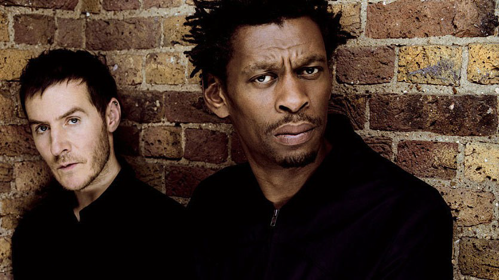

# 🎼 Trip Hop

Trip hop (sometimes used synonymously with "downtempo") is a musical genre that originated in the early 1990s in the United Kingdom, especially Bristol. It has been described as "a fusion of hip hop and electronica until neither genre is recognizable", and may incorporate a range of styles, including funk, dub, soul, psychedelia, R&B, and house, as well as other forms of electronic music. Trip hop can be highly experimental and its also known for its melancholic sound..

Deriving from later idioms of acid house, the term was first used by the British music media to describe the more experimental variant of breakbeat emerging from the Bristol sound scene in the early 1990s, which contained influences of soul, funk, and jazz. It was pioneered by acts like Massive Attack, Tricky, and Portishead. Trip hop achieved commercial success in the 1990s, and has been described as "Europe's alternative choice in the second half of the '90s".

Naturally, the British rags were quick in declaring this Fresh Sound Of British Urban Soul as the New Hotness, though the chap credited with first associating the name Trip Hop with the sound is Mixmag scribe Andy Pemberton. Remember that factoid for the Trivial Pursuit version of this Guide.

Labels that made Acid Jazz their go-to sound for inner city cred switched over. Thanks to some savvy signings one print did it so completely that most think of them as the ones who nurtured Trip Hop right from the start. No, not Ninja Tune though they certainly had their fingers in the pot.

Rather, it was Mo Wax, run by James Lavelle (ie: UNKLE).

Common musical aesthetics include a bass-heavy drumbeat, often providing the slowed down breakbeat samples similar to standard 1990s hip hop beats, giving the genre a more psychedelic and mainstream feel. Vocals in trip hop are oftentimes female and feature characteristics of various singing styles including R&B, jazz and rock. The female-dominant vocals of trip hop may be partially attributable to the influence of genres such as jazz and early R&B, in which female vocalists were more common. However, there are notable exceptions: Massive Attack and Groove Armada collaborated with male and female vocalists, Tricky often features vocally in his own productions along with Martina Topley-Bird, and Chris Corner provided vocals for later albums with Sneaker Pimps.

Trip hop tracks often incorporate Rhodes pianos, saxophones, trumpets, flutes, and may employ unconventional instruments such as the theremin and Mellotron. Trip hop differs from hip hop in theme and overall tone. Contrasting with gangsta rap and its hard-hitting lyrics, trip hop offers a more aural atmospherics influenced by experimental folk and rock acts of the seventies, such as John Martyn,combined with instrumental hip hop, turntable scratching, and breakbeat rhythms. Regarded in some ways as a 1990s update of fusion, trip hop may be said to "transcend" the hardcore rap styles and lyrics with atmospheric overtones to create a more mellow tempo.

You can find more details about its formation and development on Ishkur's Guide to Electronic Music, and you can listen to trip hop music right away.

<https://music.ishkur.com/?query=TripHop>

The Every Noise at Once platform provides an opportunity for people to get to know better the names of the creators who have ever been in the genre and thus the peculiarities of it.

## Sources

- MENNYEK KAPUI - Az elektroniks zene évtizede (The decade of electronic music)
- Wikipedia
- Ishkur's Guide to Electronic Music
- Every Noise at Once

## About the Author

"Guido F. Matis (a.k.a. widosub), a seasoned producer-composer authority with an unquenchable compassion towards the musical expression, and many years of experience in the fields of event organizing, movie post-production, and recording with professional musicians. His devotion to movie sounds shows in his art - widosub's music is filled with landscapes of emotions, dramatic twists and melancholic moods. He's one of the hosts of Tilos Rádió's MustBeat show, in which he's is focusing on drum'n'bass and chillout music. He's also one half of the duo Empty Universe."
