# 📊 Types of probability distributions

The primary objective of statistics is to access quantitative knowledge of a certain fraction of reality and that is why it is necessary to build a model of this plot of reality that we want to study. Of course, it is no secret to anyone that reality is always more complex than any model that tries to represent it. However, most of the model formulations that are acceptable to both institutions and users, make it possible to obviate the distance that exists between the model and reality or possible errors.

When a theoretical model is carried out that includes in its formulation, as in most cases, they are reduced to probability functions. As we well know, that probability comes from games of chance and that the impulse of the first investigations regarding the calculation of probabilities (16th century) started from there. 

 

But it was not until the eighteenth century when probabilities were really implemented from a mathematical perspective, with what was called the "weak law of large numbers", which states that by increasing the amount of evidence it can be concluded that the frequency of an event always tends to a fixed number, which is precisely what is called probability.

When we measure any characteristic that takes different values and whose probabilities are determined, it is what we call a random variable, that is, in every variable the theory has a probability distribution capable of describing its behavior.

In the case that the variable takes values within an interval that are isolated, we can say that the variable is discrete and that its probability distribution is capable of specifying all the possible values of the variable, in addition to the probability that each of them occurs. the values. Whereas when the variable can take on any type of value within an interval, we are dealing with a continuous variable whose probability distribution can determine the corresponding probabilities in the sub-intervals of values.

The density function is a way of describing the probability distribution in the case of continuous variables and in the case of discrete variables, it can be very useful to use the mass function and it is the distribution function that represents the cumulative probabilities.

Researchers are concerned with building probability distribution models that are capable of representing the theoretical behavior of those random phenomena that arise in the real world. For the empirical scientist, modeling probability distributions of what is observable is a basic need, since it is through these models or theoretical constructions that it can be experienced in circumstances where reality does not allow it. Models are extremely useful as long as they reflect the reality they are intended to represent or rather predict. The important thing is to exacerbate the most important properties of everything that surrounds us, even if it is through the simplification that every model brings with it.

Different types of probability distribution

The probability distributions will depend on the type of variable, so we will begin by explaining the different types of distribution for a discrete variable, that is, whose values are integers. But in turn, the different types of probabilistic distribution for a discrete variable are subdivided into: Variables defined in a finite domain or in an infinite domain.

Probability distributions for discrete variables in a finite domain:

1- The binomial distribution: it is that distribution that is capable of describing the number of hits in independent experiments whose possible results are binary, this implies that there are only two possibilities "yes" or "no", where the probability of success we call it p and qa the probability of failure and both sum to the unit, therefore: q = 1 - p.

2- The Bernoulli distribution is the classical binomial distribution and takes values of 1 or zero (0).

3- The Rademacher distribution: In this distribution values of 1 and -1 are taken, where each of both values has a probability of ½.

4- The binomial beta distribution: This type of distribution describes the number of hits in independent experiments and whose results are yes or no, but in this case each probability of hit is defined by a beta variable.

5- The degenerate distribution in Xo: In this distribution X acquires the value of Xo and although it does not resemble a random variable, this distribution manages to satisfy each and every one of the requirements for it to be considered as such and the probability will be 1.

6- Discrete uniform distribution: This distribution is made up of a set of finite values where all have the same probability. For example, when we throw a coin or a dice into the air, also when we play in a casino roulette, the probability of obtaining each result is the same for each value, that is, they are balanced and without bias.

7- Hypergeometric distribution: This distribution is capable of measuring the probability of X amount of elements of a certain characteristic that is made up of d elements and that belong to a population that in turn is made up of N elements, where a sample of n number of elements.

8- The hypergeometric Wallenius distribution

9- Fisher's hypergeometric distribution.

10- The Benford distribution: In this distribution you can see the frequency of the first digit of a set or group of numbers, which are found in decimal notation.

In later articles we will dedicate ourselves to the distributions for continuous variables, but now we will go on to explain in detail with a worked example, the main probability distributions that are used in discrete variables.

The Binomial distribution:

Many of the phenomena that occur in real life can be studied as a discrete random variable with binomial distribution, so that this study can be of good practical use.

We now go with a solved exercise of binomial distribution: A study carried out by the association of motorway drivers shows us that 60% of drivers wear seat belts. 

 

To check if this statement is true, a sample made up of 10 drivers who circulate on the main highway is selected. But in addition, it is required to know the probability that exactly seven of these drivers wear a seat belt and it is necessary to know the probability that at least 7 of these drivers wear a seat belt.

We can realize that there are only two possible results, since the seat belt is worn or the drivers simply do not wear the seat belt. If the driver wears a seat belt this is a result that we will call "success", otherwise we will call it "failure".

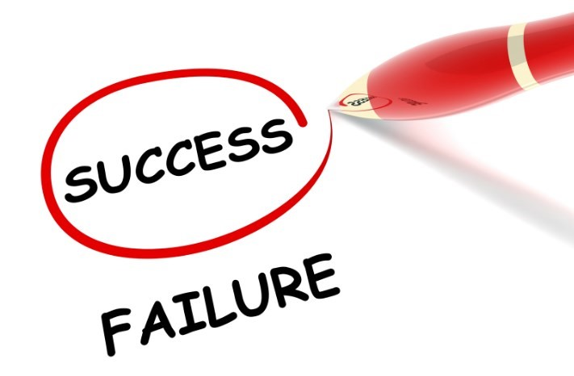 

According to the information provided by the association of motorway drivers, the probability of success is 60% and as we know the tests are independent, so that if the fifth driver is not wearing a seat belt, this does not mean that the sixth driver is not wearing a seat belt. is using you. Therefore, our random variable is "the number of drivers wearing seatbelts", that is, the number of successes where the number of drivers in the sample is n = 10 and the probability is p = 0, 6.

In order to calculate the probability of seven drivers wearing a seatbelt, use the following formula:

Now we must calculate the probability of a maximum of seven drivers using the seat belt and this will be the distribution function for the sum of probabilities of xi = 7. But it is important to take into account that the distribution function has an expression that It can make the numerical calculations difficult for each of these terms from 1 to 7, so it is best to use another expression that facilitates the calculations and then we prefer to use:

P (x ≤7) = 1 - [P (x = 8) + P (x = 9) + P (x = 10)]

Where each of these terms is what we calculate with the formula we used in the previous item so that:

Of course, we can always go the long way and calculate:

P (x ≤7) = P (x = 1) + P (x = 2) + P (x = 3) + P (x = 4) + P (x = 5) + P (x = 6) + P (x = 7)

But we know this way is much longer

## Bernoulli's distribution

In the Bernoulli distribution we can define the random variable as follows:

The random variable X takes the value of 1 if we obtain a success, but if the trial ends in failure, the value of the random variable X will be equal to zero (0)

As we already know, the probability of success is denoted by p and the probability of failure by q, but we also know that q = 1 - p, so we can establish the probability function as follows:

Summarizing, we can calculate it as follows:

F(x) = P(X = x) = px (1-p)1-x

The notation to indicate that the variable (X) follows a Bernoulli distribution is:

X ~ Be (p)

Let's go as an example of the Bernoulli distribution: Suppose we want to play to roll a dice only once, the game is won if the number 3 is obtained on the dice, in which case another value is obtained, the game is lost. In this case X = the number of times a 3 is rolled and the probability distribution of this variable X must be determined.

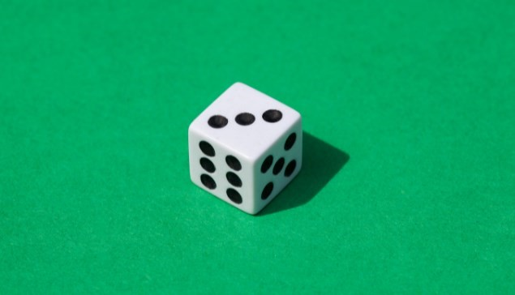

We will consider a success when rolling the grade is obtained a 3 and a failure if any other result is obtained. Since we determine that X is the number of times a 3 is rolled, we know that it can take two values:

-	X = 0 when rolling the die does not get a 3
-	X = 1 If we roll the dice and we get a 3
We are now going to assign the probabilities of obtaining a 3:

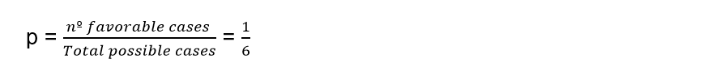

The probabilities of failure will be:

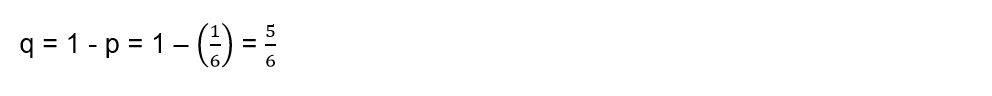

The probability function is expressed by:

We can also express it as:

As we can see, we are in the presence of a Bernoulli probability function and we have a probability of success where p = 1/6, that is, the random variable X has a Bernoulli distribution, whose probability of success is 1 / 6:

X ~ Be (1/6)

## Discrete Uniform Distribution

This probability distribution has the characteristic of being equiprobable, this means that in those situations with n different results, all the possibilities have the same probability of occurring. For example, when we roll a die, the probability that each of its faces will come out is 1/6 and they all have the same probability. But if two dice are rolled, the sum of their values is no longer uniform since not all sums have the same probability.

Since X is a discrete random variable made up of {x1, x2,…, xn} and has a uniform discrete distribution, the nomenclature to use will be:

X ~ Uniform (x1, x2,…, xn)

Where the probability function will be defined by:

P (X = x) = 1 / n

For x = x1, x2,…, xn

If we are in the presence of X ~ Uniform (x1, x2, ..., xn) then we can say that the random variable satisfies certain properties such as:

The measure of the variable in this case will be equal to:

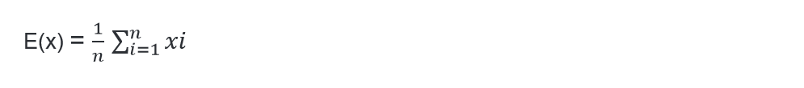

On the other hand, the variance of the random variable in this case would be equal to:

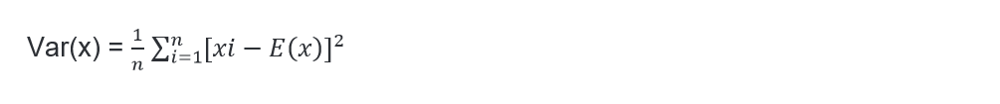

If we make a graph of the uniform distribution we can visualize:

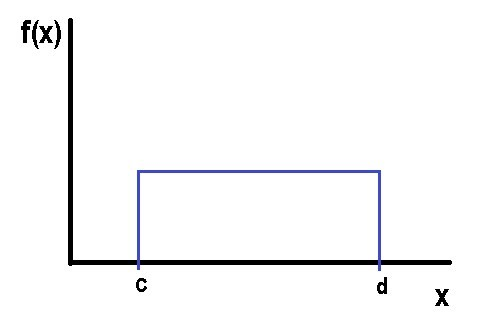

Being the mean:

And the variance:

The parameter in this type of discrete uniform probability distribution will be given by the inverse of the number of values that the random variable can take. On the other hand, the mean of this type of uniform discrete random variable will always coincide with some of the values observed in the investigation and finally, the variance of this uniform discrete random variable will not depend on the number of values that can get to take the variable.

The probability density function between two points c and d is given by:

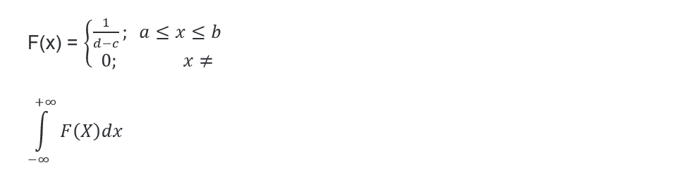

The distribution function in the uniform case between c and d is:

Let's go with an example: Suppose that a certain pollutant is distributed in a range of 0 to 10 parts per million in a uniform way and this pollutant is considered to be toxic, when it has a concentration of eight or more parts per million. With this information we ask ourselves several questions:

1- What is the probability of taking a sample and that it has a toxic concentration?

2- Calculate the concentration of the mean and its variance

3- What is the probability that the concentration has an exact value of 10 parts per million?

Being X a discrete random variable whose distribution is uniform then:

X ~ Uniform (0, 20) it is true that:

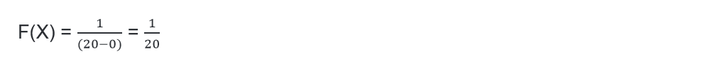

Answer to question 1:

Answer to question 2:

The mean concentration is given by:

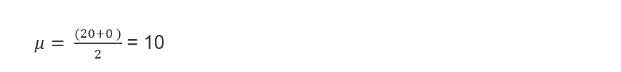

The variance is:

Answer to question 3:

The probability that the concentration is exactly equal to 10 is:

Hypergeometric distribution

Until now we have analyzed those distributions that model situations where the tests respond to a dichotomy, so that the probability in each experience was to obtain one of two possible outcomes. When an element is extracted in the process, this implied its replacement or the consideration of a sufficiently large population. But for small populations, in the case of an extraction that is not replaced, this immediately implies that the probability does not remain constant and in this case, the previous distributions do not help us to model the situation and that is when it comes to play an important role. the hypergeometric distribution, since it can cover this need when modeling Bernoulli distributions whose probabilities are not constant and without replacement.

This type of hypergeometric distribution is very useful in those cases where samples are extracted without the subsequent return of the extracted element or specifically, when the initial experimental situation is not returned. In fact, it is capable of modeling that situation in which a dichotomous test is repeated a certain number of times and that with each successive result, we do not see altered the probability of being able to obtain one or the other result in the next test.

This type of distribution ends up being fundamental when we study small samples of populations, but also when we calculate probabilities of random games. Even the hypergeometric distribution has great applications in those experimental processes where it is not possible to return to the initial situation. This type of distribution can be derived from a Bernoulli process, when it meets the following characteristics:

1- When the process consists of n tests that can be separable or separated from a set of N possible tests.

2- Each of these tests can give only two results that are mutually exclusive.

3- The probabilities in the first test are: P (A) = p or P (A) = q; where q = 1 - p and the probabilities of obtaining one or the other result vary in subsequent tests.

4- What is derived from the distribution: If we obtain a number of results “A” that come from n tests, the distribution of the random variable X will be a hypergeometric one whose parameters will be N, n, p and therefore: 

X ~ H (N, n, p)

A very typical case of the application of this model will be the following: We are going to suppose that we randomly extract n samples from a set that is made up of N elements, of which there are Np that are of type A and also other Nq that are of type A ̅ where q = 1 - p. Suppose also that we carry out the extractions without replacing the extracted elements and we call "x" the amount of elements of type A that are within those n extractions, this implies that "x" will follow a hypergeometric distribution whose parameters are N, n and p.

Quantity function: In a hypergeometric distribution the quantity function will match the probability of the event with the value of each variable x = 0, 1, 2, ..., n to obtain x amount of results of type A and also results of the type that they are not A, that is, (nx) in the n tests performed that are among the N possibilities.

Let's establish this mathematically:

There is a total of 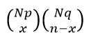 Different ways to get x amount of results of type A and also (nx) results of type A ̅, When we start from a population that is made up of Np amount of elements of type A together with Nq quantity of elements of type A ̅.

On the other hand, when we carry out n quantity of extractions or tests there are a total of 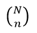  groups of n elements of possible samples and if we apply Laplace's rule we will have:

Explaining this in a mathematical way we can say that:

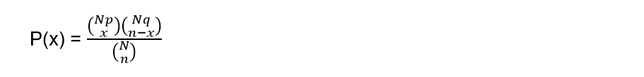

This is true for the values of "x" that are included within the set of integers 0, 1, 2, ..., n and this will be the quantity function for a hypergeometric distribution whose parameters are N, n and p.

The mean and variance

When we consider a hypergeometric variable whose parameters are N, n and p, we can also consider that it was generated by a repetitive n dichotomous process, where these n dichotomies are not independent. Furthermore, a hypergeometric variable can be considered to be nothing more than the sum of the n non-independent dichotomous variables.

As we know from previous articles, the mean of the sum of our random variables, which can be both independent and dependent, is nothing more than the sum of the means and that is why the mean in any hypergeometric distribution as well as in the binomial distribution, it will be: μ = np. On the contrary, when the variables are not independent we cannot say that the variance of the variable will be the sum of the variances. In this case, the variance of a hypergeometric distribution whose parameters are N, n and p will be given by:

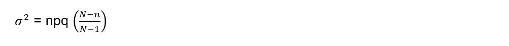

We can see that this way ends up being the variance of a binomial distribution (n, p) but that it is affected by a correction coefficient that is: 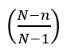 This coefficient is called exhaustiveness, also known as the correction factor for finite populations and comes from the effect produced by the non-replacement of the sample elements that were extracted.

This coefficient becomes smaller as the sample size is larger and it can be seen that it tends to 1 while the population size N is large enough. This implies how irrelevant replenishment can be in those experiments where successive extractions are made but on a fairly large population, that is, in a very large population regardless of the size of n, thanks to the correction factor that is capable of to convert a hypergeometric distribution to a binomial distribution.

When we calculate the limit of a hypergeometric distribution in the case that N tends to infinity, we can say that just as we have seen that the mean of this type of hypergeometric distribution takes the same value as the mean calculated in a binomial distribution. We can also say that if the parameter N approaches infinity, the so-called exhaustiveness coefficient tends to 1 and that is why the hypergeometric variance approaches the binomial. In the same way, it can be proved that the quantum function in this case (N → ∞) of the hypergeometric distribution also tends to approximate the quantum function of the binomial distribution.

 The mode of a hypergeometric distribution

In the same way as the mode is obtained in a binomial distribution, we can obtain the mode for a hypergeometric distribution. So the values or the integer value that is verified for the following expression Xo will give us the expected calculation:

Let's do the first hypergeometric distribution exercise: A certain dealer has had 10 refrigerators returned because they make a high-pitched, oscillating noise while the refrigerator is running. We know in advance that of these 10 refrigerators 4 have faulty compressors, while the rest have milder problems. Suppose that of these 10 refrigerators 5 of them are examined at random and the random variable X is determined to be = "The number of refrigerators among the 5 examined that has a defective compressor." It is required to know:

1- Determine the distribution of this random variable X

2- What is the probability that not all refrigerators have minor failures?

3- What is the probability that at most 4 refrigerators have compressor failures?

Answer to question 1:

How can we figure out the population size N = 10 and if we set the faulty compressors as successes and those compressors as milder problems as failures, then: M = 4. On the other hand, the sample size n = 5. It can be said that the variable x that we remember is the number of refrigerators of the 5 analyzed that have defective compressors, it is a hypergeometric distribution:

X ~ H (N = 10, M = 4, n = 5)

Answer to question 2:

For convenience we can express the variable X as: "not all the refrigerators have minor failures", this implies that if this occurs, it is because at least some of the refrigerators have a defective compressor which, as we know, is a serious failure and by expressing this mathematically we obtain that: X ≥ 1

Answer to question 3

When we think that at most four refrigerators have compressor failures, it is the same as asserting “At most four refrigerators have compressor failures” and we can express it mathematically as: X ≥4. We are aware then that the path of the variable is

R (X) = {0,1, 2, 3, 4} We can then say that:

P (X ≤ 4) = 1

Hypergeometric distribution exercise 2: Suppose that a group of friends from the University are planning to meet at Mary's house to make a grill. We know that in this group there are 6 men and 8 women, of the women 5 of them study letters and the other exact sciences. We also know that only one of the men studies letters and the other exact sciences.

We want to know:

1- If the first to arrive at the house are three women, what is the probability that they will study the same thing?

2- If among all the students who go to Mary's house, only three of them cook the grill, what probability is there that among these three they all study the same thing?

To better understand this problem, we are going to make a scheme that determines the composition of the group with respect to studies and gender:

The first students to arrive are three girls and of course Mary is at her house, so we know that there are 4 women, the 3 who arrive and Mary. On the other hand, the only way is for them to study letters, because the condition is that they study the same thing and there are not four women in the group who study science. This implies that Mary studies letters.

Answer to question 1:

Of the eight girls, 7 of them are the ones who can get to Mary's house, we know that 4 study letters and 3 exact sciences. If we consider these 7 women as the population, from which we randomly extract 3 individuals. Then N = 7, M (which are the ones that study letters) = 4 and from the sample n = 3 we also know that these 3 study letters X = 3.

We are going to define the variable with hypergeometric distribution:

X It is the number of women who study letters of the first 3 who arrive at Mary's house (they are chosen among the 7 women in total)

X∼H (N = 7, M = 4, n = 3)

To answer question 1 we must calculate the probability that X = 3

Answer to question 2:

In this answer we are not interested in the gender of each one of them, but rather what they study and for this, we are going to specify it in the following composition:

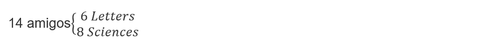

We can also define the number of letters students of three friends chosen randomly from the total of 14 students. The hypergeometric distribution values will be: N = 14, M = 6 and n = 3

Given the case that Y = 3 this would imply that the three friends study letters, however, in the case that Y = 0 this would not indicate that the three friends study science. 

The required probability is:

P (study the same) = P (Y = 3) + P (Y = 0) ≅ 0.05495 + 0.15385 ≅ 0.2088

## About The Author

 Idais, Graduated in Mechanical Engineering, and a master’s degree in teaching component, she gave classes in several institutes of mathematics and physics, but she also dedicated several years of my life as a television producer, she did the scripts for mikes, the camera direction, editing of video and even the location. Later she was dedicated to SEO writing for a couple of years. she like poetry, chess and dominoes