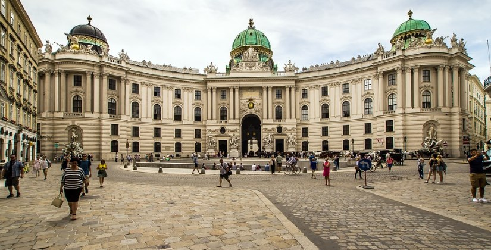
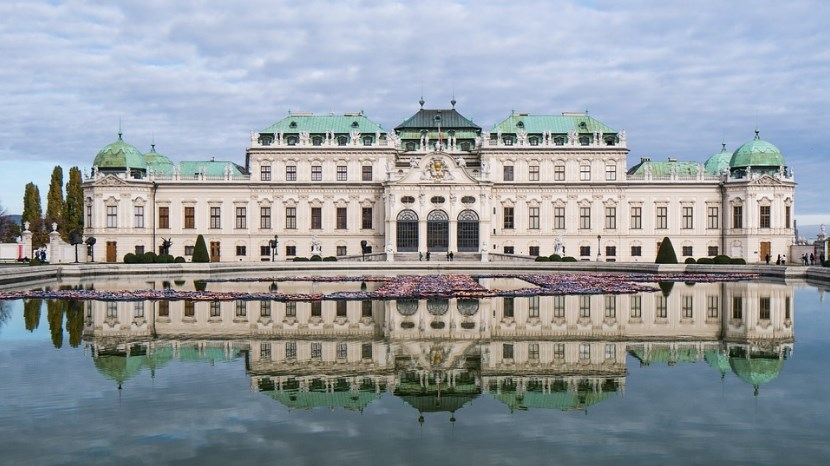

# 🇦🇹 Vienna

Vienna is the capital of Austria and of classical music, located on the
banks of the Danube, it is one of the most beautiful cities in Europe
and the birthplace of great composers such as Beethoven, Mozart or
Strauss. This city amazes for its extensive architectural and cultural
heritage, as well as being one of the cities with the highest quality of
life in the world.

If you go to Vienna it is important that you visit its most important
places, so we will give you a guide to the places that you should not
miss.

## Schonbrunn Palace

This huge palace was the summer residence of the imperial family, built
in the 17th century, it really impresses with its well-cared and
extensive gardens, as well as its luxuriously decorated rooms such as
the Great Gallery, the Breakfast Room and the Circular Chinese Room. You
can visit more than 40 rooms, stroll through its beautiful gardens and
visit the impressive Museum of Imperial Carriages.

## Naschmarkt Market

Another of the most important activities is to visit the Naschmarkt
street market, which has been in operation since the 16th century and is
the oldest in the city. It houses a large number of stalls with fresh
products and numerous restaurants, where you can try everything from
Asian food to traditional Austrian cuisine such as apple pie, typical
sausages or schnitzel.

## Hofburg Palace

The Hofburg Palace is located in the historic center and was the
residence of the Habsburg royal family for more than six centuries. You
will be able to know the perfectly furnished and decorated imperial
rooms. In this castle, a large part of the history of Vienna is
concentrated in its many rooms, including the Imperial Chapel, the
Church, the Treasure Chamber and the Sisi Museum, where you will learn a
little about the history of this controversial character.

## Austrian National Library

The Austrian National Library is located in the Hofburg Palace complex,
it was built in the 18th century in the Baroque style and houses more
than 8 million documents, including papyri, old books and maps, on its
tall wooden shelves. Its great Imperial Hall is really amazing, since in
addition to countless old books there are beautiful frescoes in its
dome, several marble statues and a couple of fantastic globes, one
terrestrial and one celestial.

## Spanish Riding School

In the Hofburg Palace there is also the Spanish Riding School, which is
more than 400 years old, being emblematic worldwide and the oldest in
Europe. There you will be able to see magnificent specimens of the
Lipizzaner breed and see the morning training sessions or the gala
performances that take place on Sunday mornings. UNESCO declared this
school as Intangible Cultural Heritage of Humanity.

## The Vienna Opera

The Vienna State Opera is internationally famous and operates in a
Renaissance building, where great works are performed in an auditorium
that can hold up to 2,800 spectators. Inside you can see a beautiful
marble staircase, the Tea Room, the lobby, a large stage and the Marble
Room.

## Capuchin Crypt

The Capuchin Church was built between 1622 and 1632, under this church
lies the Imperial Crypt where 149 members of the Hapsburg royal family
have been buried, including 18 empresses and 12 emperors. The
magnificent sarcophagus of Emperor Francis and his wife Maria Teresa
stands out, as well as that of the famous Empress Elizabeth of Bavaria
(Sisi).

## St. Stephen\'s Cathedral

This cathedral is the most important religious center in Vienna and it
was there that Mozart\'s wedding and funeral were held, it was built in
the 12th century and is located in St. Stephen\'s Square. It stands out
for its high spire-shaped tower where you can go up by elevator and from
the top, you will be able to see its charming tilework and wonderful
views of the center of Vienna.

Inside you can see that the Gothic and Baroque styles intermingle, with
the most interesting works being the image of the crucified Christ, the
Pummerin Bell, the Pilgram Pulpit, the Catacombs and the tombs of
various royal figures including that of Emperor Frederick III.

## Stadtpark

A quiet walk through nature through the Stadtpark that is located in the
center of Vienna, where you can see beautiful sculptures, among which is
the monument in honor of Johann Strauss. But also the architectural
complex of the Wienflussportal and the Kursalon building, both worth
seeing. This park stands out for its English style and was inaugurated
in 1862. The Kursalon was where Strauss performed his first concert and
there you can see presentations with the best works of Strauss and
Mozart.

## Ringstrasse

The Ringstrasse is a circular avenue with more than 5 km where most of
the main historic buildings in the center are concentrated. In addition
to the Opera and the Hofburg Palace there are important buildings such
as the Votive Church, with a pair of twin spire-shaped towers and its
colorful stained glass windows, the impressive façade of the Town Hall,
the Austrian Parliament which houses the Chamber of the Federal Assembly
and the Hall of Pillars.

## Church of San Carlos Borromeo

This church was built after the plague by Emperor Charles VI, the temple
impresses with its two columns that were inspired by Trajan\'s Column in
Rome and you can go up by elevator to admire the magnificent frescoes of
its dome inside.

## Belvedere Palace

The Belvedere Palace was the summer residence of Prince Eugene of Savoy,
it is a Baroque-style palace with three-tiered gardens and large
fountains. It is made up of two emblematic buildings: the Upper and
Lower Belvedere. In the Upper Belvedere is the famous work of Gustav
Klimt \"The Kiss\" and the Marble Hall, among his most outstanding works
and in the Lower Belvedere you can marvel at the Hall of Mirrors, the
Hall of Grotesques, the Gallery de Mármol and La Orangery (a beautiful
greenhouse).

## Prater

This is the oldest amusement park in the world and dates back to 1895,
preserving some of the attractions of that time such as the Giant Ferris
Wheel, where you can enjoy beautiful views of Vienna and the park from
its 60 meters. It also has other typical attractions such as a ghost
train and a roller coaster, among others.

## Mozart\'s House

The famous composer composed \"The Marriage of Figaro\" (one of his best
works) in this house, and you can learn about his life story, as well as
see Mozart\'s personal belongings and musical instruments.

Vienna, a true paradise to meet

## About the Author

Idais, Graduated in Mechanical Engineering, and a master’s degree in teaching component, she gave classes in several institutes of mathematics and physics, but she also dedicated several years of my life as a television producer, she did the scripts for mikes, the camera direction, editing of video and even the location. Later she was dedicated to SEO writing for a couple of years. She likes poetry, chess and dominoes.
