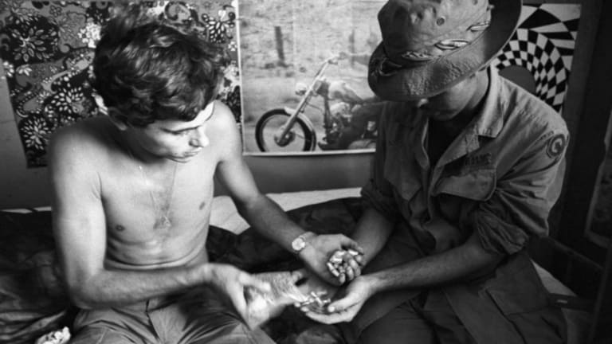
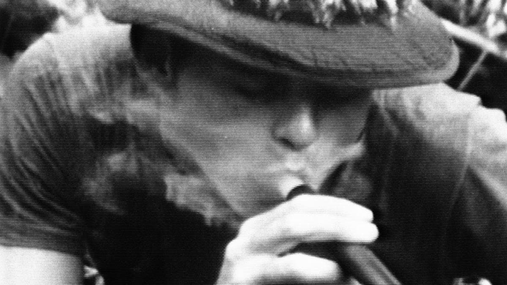

# 🇻🇳 The Vietnam War and Drugs, A deadly combination

The Vietnam War was a long, costly and divisive conflict that pitted the communist government of North Vietnam against South Vietnam and its principal ally, the United States.

The conflict was intensified by the ongoing Cold War between the United States and the Soviet Union. More than 3 million people (including over 58,000 Americans) were killed in the Vietnam War, and more than half of the dead were Vietnamese civilians.

the Vietnam War from 1955 to 1973, though it was now combined with rampant non-sanctioned drug use.

Speed continued to be the approved drug of choice, but now soldiers gained access to illicit drugs like heroin. Desperate soldiers would combine these two powerful drugs to create their homemade injectable speedballs. This potent combination creates a push-pull effect, both boosting energy and helping them relax.

The high from these speedballs were stronger and more long-lasting than the high they could get from using either drug on its own, and it helped the soldiers to deal with the brutal conditions of war, as well as cope with the horrible atrocities that they witnessed – and even committed - during these wars.

Drug use during the Vietnam war reached epidemic levels - according to the Pentagon, by the time the U.S. withdrew from the war in 1973, some 70 percent of all-American soldiers in Vietnam had taken drugs. Shockingly, the authorized use of drugs by soldiers in combat continues around the world to this day.

The research was conducted on the history of drug use pre-post and during the Vietnam War found that overall there was heavy use of drugs from the majority of soldiers, some cases found the government would give the soldiers drugs to help them cope with the anxiety and stress caused by the war.

The soldiers were self-medicating with the main choice being heroin the availability of the drug was staggering according to one veteran you could just buy it by the roadside.

There was every kind of drug and alcohol for sale, American beer, and hard alcohol but also cannabis, pills of every kind, and harder drugs. in several provinces, you could buy pure liquid opium in a large vial for about ten dollars!

The soldiers used to dip cigarettes and joints in the opium, a large vial was more than you could use in a month even if you had a serious habit which I eventually did “said one soldier”, there was an incredibly high number of drugs in Vietnam because there was a local demand for the drugs and also a new large international soldier demand.

The soldiers would pick up when they went into larger cities and towns and then bring it back with them to the remote outposts deep in the jungles of Vietnam.

They found that ninety percent of people who left for combat with traces of drugs in their system reported heavy drug use while in Vietnam. forty-five percent of people who were negative for drug use before departing also reported heavy drug use while in Vietnam.

The easy access ability led to massive numbers of soldiers who were addicted as heroin is the most addictive drug on the market. long term use of heroin can lead users to develop a tolerance to the drug they need larger and larger doses to feel the same effects and end up addicted. almost half of all soldiers tried heroin while in Vietnam surprisingly the soldiers were able to recover from the addictions fairly quickly once they returned home.

Turns out the only 5% of soldiers continued their addiction once they returned home, the reason this is because they were using heroin to get away from the reality of life for the American soldier in Vietnam.

A soldier says “I went to Vietnam in September of 1969 and during the time that I was there, I went through certain experiences that led me into using drugs. One of the experiences as I recall is during a night ambush, I killed a 12-year-old kid, you know it was something that I couldn’t handle at that time, you know. Seeing him dead lying in the ground the next morning. It stayed on my mind so, I started using drugs and I kept that up until I came back to the states.”

## About the Author

Mujahid Al-Majali, a 29-year-old former air force soldier and an economic development and business specialist, also does translation and copywriting. Loves long drives, chill music and old school movies. A nicotine addict and a huge fan of Jack Daniel’s whiskey. Owned multiple businesses in Amman and southern of Jordan PRE-COVID and now focusing on translation and copywriting part of my experience through Upwork.
