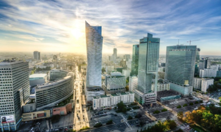
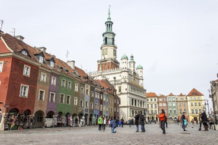
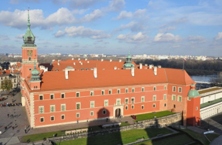

# 🇵🇱 Warsaw

Warsaw is the capital of Poland, a city that was badly destroyed during World War II, but has been able to rise from its ashes, recovering all its splendor and becoming a city that harmoniously combines modern architecture with historic buildings. Warsaw has a large number of tourist attractions such as palaces, museums, churches, parks and milk bars, where you can taste Polish cuisine at the best price.

We have made a list of the essential places you should visit if you go to Warsaw.

## Old City

One of the best activities you can do in Warsaw is to walk the streets of the Old Town, which is the oldest neighborhood and was completely in ruins during the Nazi occupation, but it was rebuilt so similar to the original that it was declared a World Heritage Site by the Unesco in 1980.
In the heart of the city is located in the beautiful Old Town square where tourists and locals converge, in the surroundings you can see its cobbled streets with houses of medieval architecture and their colorful facades. You can have a drink in the restaurants with terraces that surround the square and see the street artists or painters that are usually in this area.

The most interesting sites in the Old City are El Castillo Real, the Cathedral of San Juan, the picturesque Piwna street and the statue of the Little Insurrectionist, which was built in honor of the child soldiers who fought and died during the uprising.

## Royal Castle

The Royal Castle located at the entrance to the Old City is an impressive palace in the neoclassical baroque style, built in the 14th century and destroyed by the Nazis, but later rebuilt with such detail that it remained the same as the old palace. Inside you can see the royal rooms with their period furniture and two important works by Rembrandt which are The Father of the Jewish Bride and The Girl in a Frame. At the front of the palace is the beautiful Castle Square where the Corinthian column erected in 1644 in honor of King Sigismund III, the most important and beloved in Polish history, stands.

## Palace of Culture and Science

The Palace of Culture and Science was built during the Russian occupation by order of Stalin between 1952 and 1955, being one of the tallest buildings in the country with 234 meters high from where you will have the best panoramic views of the city. The building houses from institutional departments, offices, libraries, to two concert halls.

## New City

The New City has numerous points of interest, founded at the end of the 14th century, it developed around the New City square and is separated from the Old City by a fortress that surrounded the city in medieval times. In the square is the church of San Casimir characterized by its white facade and there is a statue of Marie Curie, born in this city and the first woman to receive two Nobel Prizes (physics and chemistry). If you are interested in knowing more about his life and work, you can visit his old home located on Freta Street, currently it is one of the most beautiful House-Museums to see in the city.
The recommendation is to observe the most beautiful buildings that are on the banks of the Vistula River and then visit the most important churches such as San Jacek, the Holy Spirit and the Visitation of the Virgin Mary.

## Warsaw Royal Route

The Royal Route was the path followed by kings to get from the Royal Castle to the impressive summer palaces Lazienki and Wilanów. Following this route is an excellent recommendation, leaving the Castle Square and then going through Krakowskie Przedmieście Street where some of the most important buildings are located, such as the University, the Churches of Santa Cruz and Santa Anna, the Presidential Palace, the Potocki Palace and the luxurious Hotel Bristol, among others. Upon reaching the monument in honor of Nicolaus Copernicus, the street changes its name to Nowy Świat where art galleries, the most luxurious shops and the famous Church of Saint Alexander, located in Trzech Krzyży square and shaped like a Pantheon, are located. Roman. From this square begins Ujazdowskie Avenue where you will find the beautiful Ujazdowski Park with its castle built in the 17th century, ending the tour at the Lazienki Palace.

The route of the entire path is about 4 km and to get to the Wilanów Palace it is advisable to take a bus, since walking can take you two more hours.

## Warsaw Ghetto

The Warsaw Ghetto was the largest in Europe established by the Nazis during the Holocaust. More than 400,000 Jews from both the city and other occupied countries were confined in the ghetto, after subjecting them to extreme conditions, deportations to concentration camps, hunger and disease, reduced the population to 50,000 people inside the compound and before After closing it, the first revolt against Nazism took place, which was the Warsaw Ghetto Uprising and in honor of this heroic act the Monument to the Heroes of the Ghetto was raised, you can also see the Jewish Museum of Warsaw and the Museum of the Uprising, where both offer you the sad history of the Polish Jews and their terrible consequences.

## Prague neighborhood

The Prague neighborhood is the bohemian area of the city, where you can find numerous art galleries, cultural centers, urban art shows, design shops and original cafes. Also of note are the Church of Our Lady of Loreto, the Różyckiego Bazaar, the cobblestone streets of Brzeska, Mala, Ząbkowska, and the Cathedral of St. Michael the Archangel.

## Chopin in Warsaw

The pianist and composer Frédéric Chopin lived more than half his life in Warsaw. To learn about his history, the best thing is to visit the Chopin Museum where you will find the manuscripts of his works, all kinds of personal objects and the composer's notes that are found in his 15 rooms. Then you can go to Lazienik Park where there is the monument dedicated to Chopin and the church of Santa Cruz that houses his heart.

## Lazienki Park

On the Royal Route you will find the extensive Lazienki Park founded in the 16th century in the Baroque style. Several palaces are scattered throughout the park, among which the beautiful Palacio de la Isla stands out, located on an artificial island in the middle of a lake. Other sites worth seeing are Belvedere Palace, the White House, Myślewicki Palace, as well as numerous pavilions, gardens and monuments.

## Wilanów Palace

Wilanów Palace is known as the Polish Versailles, it is a marvel of Baroque art and built in the 17th century. Inside you can tour the royal halls and visit the Polish Portrait Gallery and the Museum of Interiors. The palace that surrounds it has gardens full of charm such as the Baroque Garden and in the oldest area of the park you will find two levels of terraces, in addition to the Chinese English garden that has a beautiful pond.

Warsaw is an impressive city full of beautiful tourist sites to visit!

## About the Author

Idais, Graduated in Mechanical Engineering, and a master’s degree in teaching component, she gave classes in several institutes of mathematics and physics, but she also dedicated several years of my life as a television producer, she did the scripts for mikes, the camera direction, editing of video and even the location. Later she was dedicated to SEO writing for a couple of years. She likes poetry, chess and dominoes.
