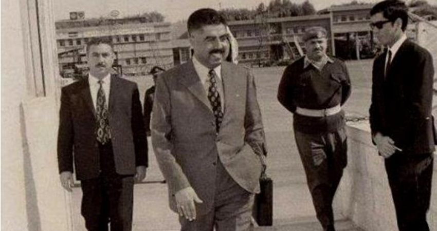

# 🎖️ Wasfi Al-Tal

The twenty-eighth of November of each year is a painful memory in the hearts of Jordanians of the loss of the master of men, the former Prime Minister, the martyr Wasfi Al-Tal, whose name has always been associated in the hearts of Jordanians with sincerity, dedication and the achievement of civilizational achievements that are respected and appreciated by all Jordanians without exception.

We remember the late Wasfi al-Tal, who had the white hands in accomplishing dozens of civilized projects. In his first government in 1962, the establishment of the University of Jordan came as the first scientific edifice in Jordan, followed by the King Talal Dam project, which resulted in the reclamation of thousands of acres in the central Jordan Valley, which was later formed Jordan’s food basket, and one of the tributaries supporting the Jordanian economy in the field of exporting vegetables and fruits to neighboring countries, as well as the eastern Ghor Canal project, which took over the transfer of the waters of the Jordan River and Yarmouk River for drinking purposes to the residents of the central region through the Zay water station, as well as irrigating agricultural projects in the northern Jordan Valley.

One of the vital projects that took place during the era of Wasfi al-Tal’s first government was the establishment of the desert highway, which formed the main nerve connecting northern and central Jordan with the governorates of the south, passing through the governorates of Karak, Tafileh, and Ma’an, all the way to the city of Aqaba, where this road contributed to an increase in the volume of Jordan’s exports of phosphate and the increase in the volume of Jordan’s imports Through the port of Aqaba to the local Jordanian markets, in addition to the reclamation of agricultural lands in many areas of the central Jordanian desert, especially in the Al-Dhalil area, where Al-Tal was the first to initiate the reclamation of lands in the mentioned area for agricultural purposes.

Wasfi al-Tal also had the honor of initiating the establishment of the Phosphate Company and the Potash Company to exploit the vast wealth of the Dead Sea and expand the Jordanian coast on the Gulf of Aqaba to a distance of 100 km to the south.

In Wasfi al-Tal’s second government, the Jordanian television and satellite station were established, which became Jordan’s point of contact with the outside world, the Jordan University Hospital, and the development of Al-Bashir Hospital to be the most important medical edifice in the capital, Amman.

And when we recall Wasfi al-Tal, we remember his devotion to the Palestinian cause, as he rushed in his early youth as a fighter in the ranks of the Palestinian Salvation Army led by the leader Fawzi al-Qawuqji, after which he moved as an officer in the ranks of the Syrian army to rise to the rank of lieutenant colonel as a combat officer and then returned to Palestine, which he loved to work with the Palestinian businessman Musa al-Alami to establish The largest agricultural project in Jericho Governorate, which is still generating good for its neighbors and works in it.

He also decided to establish Al-Ra’i newspaper to be a spokesperson for the Jordanian state, and also decided to establish the National Union Party to be a motive for political and partisan life in the country, and I also experienced many humanitarian situations for that man who devoted a day from Every week to receive citizens in the presidential house, offering help and assistance to those who seek it from among the sons of the country, without discrimination or favoritism to anyone.

On a summer day, a delegation from the people of Al-Hussein camp came to him at the presidential house, complaining about the lack of water in their homes. He immediately contacted the Director of Civil Defense, asking him to drive a water tank himself into the camp to encourage the rest of his colleagues to accomplish the task of delivering water to the camp’s homes through tanks in the camp. Over three hours.

One day, he recalled the occurrence of a crisis represented by the lack of sugar in shops all over the country, where the Minister of National Economy at the time came to him complaining about the refusal of the sugar agent in Jordan to provide sugar to the citizens. The late Wasfi contacted the agent and informed him of the need to provide a verbal warning. Sugar in three hours as it was provided in all shops urgently.

Among the well-known positions of Wasfi Al-Tal is his frequent visits to all cities, villages, and camps in the Kingdom, where he would visit every week a Jordanian city and several villages to see the conditions of citizens and work to solve the problems they face on the ground without referring to the so-called work committees.

Among his achievements, may God have mercy on him, is that he instructed the cancellation of the security records of many politicians and partisans, and ordered the transfer of their files to the “House of Fire” in the cement factory in Fuheis, and allowed the return of many politicians who had sought refuge with Jordanian pain to Egypt, Syria, and Lebanon, and returned them to Jordan, and appointed a number of them in Leadership positions, and I mention among them Nazir Rashid, Ali Abu Nawar, Ali Al-Hiyari, Abdullah Al-Rimawi, and many others.

Wasfi al-Tal was a liberal nationalist and participated in all seminars and conferences held in many countries of the world in support of the Palestinian cause, and he always used to say that the best way to fight the Israeli enemy is popular resistance because of what Israel obtained from advanced weapons and military equipment from Western countries that exceeded them. In its size and influence, all Arab countries combined.

Events have proven that the popular resistance is the most effective and most successful means of combating the Israeli enemy, and this is what everyone saw in the first and second Intifadas of stones in the West Bank and Gaza Strip, which was confirmed recently, as the Islamic resistance achieved clear and clear victories over the Israeli enemy, especially in the Gaza Strip.

Israeli Prime Minister Yitzhak Shamir said when he was asked about the Arab figure who was threatening the Israeli entity. Adoption of popular resistance against Israel. Where he said: "Wasfi al-Tal was the most dangerous Arab figure for Israel because he always called for the adoption of popular resistance against Israel."

Wasfi Al-Tal was a pioneering Jordanian tale and today Wadha is an example of a good biography that does not fade with time... Features of Wasfi’s biography He exchanged the homeland and leadership in loyalty.

Wasfi al-Tal was a jewel in the forehead of the homeland and one of his brave soldiers who served him honorably with the late leader King Hussein bin Talal and the rest of the honorable like Hazaa Al-Majali, Mustafa Khalifa, Habis Al-Majali, Qasim Al-Maaytah, Ibrahim Hashem, Melhem Al-Tal, Abdul-Wahhab Al-Majali, Imran Al-Maaytah, Kasib Al-Safouq, Ahmed Toukan, Anwar Al-Khatib, and other men.

The honorable homelanders who gave their lives to serve the country and its people.

## About the Author

Mujahid Al-Majali, a 29-year-old former air force soldier and an economic development and business specialist, also does translation and copywriting. Loves long drives, chill music and old school movies. A nicotine addict and a huge fan of Jack Daniel’s whiskey. Owned multiple businesses in Amman and southern of Jordan PRE-COVID and now focusing on translation and copywriting part of my experience through Upwork.
