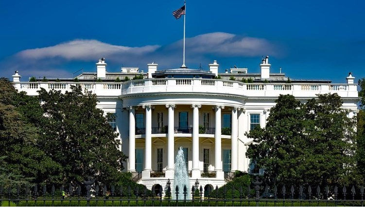
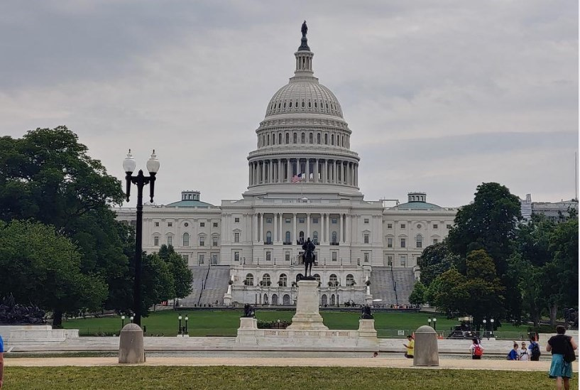
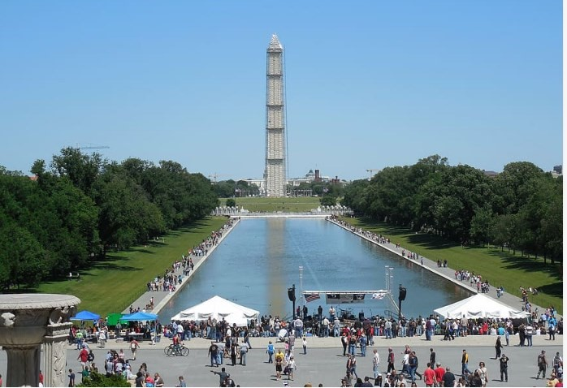

# 🏢 Washington

Washington is the capital of the United States and unlike other capitals in the world, it is not exactly the largest city in the country, nor is it even one of the most touristic. This does not imply that there are few things to see in Washington DC, but the contrast is very strong when comparing this city with its neighbor New York, since it is much quieter and full of history.

Most of the monuments are located within the National Mall that runs from the Abraham Lincoln Memorial to the Capitol. Although it is true that the distance of this esplanade is only 4 km, it will take some time to get to know the large number of monuments, interesting museums and gardens that you can visit.

In this article we will guide you through the most important sites in Washington. The most recommended route through the National Mall begins at the White House and the idea is to visit the emblematic sites of this area, in a clockwise direction.

## White House

The White House is without a doubt the most mythical place to visit in Washington, it is filled with euphoric tourists as if they were about to meet the President, when the reality is that the building can only be seen from far away. They're putting up more and more security fences and increasing the number of armed secret service guys, it's not exactly a place where you feel comfortable, even the White House is a lot smaller than you see in the movies, maybe they show it from certain angles where they make it appear larger. In general, you will find a demonstration in front of the building, either against wars or racism.

## George Washington Monument

The Washington Monument is one of the best known in the world, this great obelisk is surrounded by 50 American flags representing each of its states, it was inaugurated in 1885 and had the honor (even with the construction of the Eiffel Tower) of to be the tallest building in the world.

## Capitol

The Capitol is a majestic white building in the neoclassical style with a large dome, which is definitely one of the most emblematic symbols of the United States. It is the place where the deputies of both chambers of Congress meet and it is there where most of the most important state events are organized. You can enjoy this architectural jewel and its beautiful reflection, in a small artificial lake adjacent to the Capitol.

## Library of Congress

From the Capitol there is a tunnel that connects with the Library of Congress, it is one of the most spectacular in the world and houses approximately 160,000 documents, including a copy of Gutenberg's Bible and the Declaration of Independence. However, you can only visit the lobby and see the main room from outside through a glass panel.

## Most interesting museums in the city

In the same National Mall there are several important museums, among which is the National Air and Space Museum, where you can see several of the most famous planes in history. There you can see the Wright brothers' plane and in the space travel section you can see an Apollo 11 module, as well as many other interesting things.

Another recommended museum to visit is the National Gallery, where you can see a very complete collection of works of art by great masters such as Rembrandt, Raffaello, Monet and some from the 20th century such as Joan Miró or Picasso. Also noteworthy are the National Museum of American Indians, which has a lot of information about the settlers before colonization, the National Museum of American History, the Holocaust Museum or the National Museum of Natural History.

## Smithsonian Castle Garden

This garden is one of the best kept secrets on the National Mall, if you are coming from the Capitol it is located just after the National Air and Space Museum. The castle built in sandstone houses several administrative offices, but behind it is the picturesque garden that will leave you pleasantly surprised and under the shade of the trees, you can rest away from the hustle and bustle of tourists.

## Tidal Basin and the Thomas Jefferson Memorial

The Tidal Basin is a beautiful, quite large lake that is located south of the National Mall, walking around the lake is a beautiful experience and if you travel in the spring you will be able to see the cherry blossoms. In this area there is also the monument dedicated to Thomas Jefferson with its impressive dome and it is one of the most beautiful to visit in the city. On the walk through the Tidal Basin you will also find other interesting monuments such as the one dedicated to Franklin D. Roosevelt and his wife Eleanor Roosevelt, surrounded by a series of waterfalls, at the end of the walk you will find the monument of the activist and pastor Martin Luther king jr.

## Reflecting Pool

After the Tidal Basin you will find the Reflecting Pool area, it is a pool where the image of the George Washington Monument is reflected.

## Abraham Lincoln Memorial

The National Mall ends with the Abraham Lincoln Memorial which is a monument similar to the Greek temples. Inside is the immense sculpture of Abraham Lincoln and on its walls, you can read different fragments of the important speeches of this president, who was the one who promoted the abolition of slavery in this country.

## The night lights of the National Mall

If you stand at night next to the Reflecting Pool you can see the reflection of the lights of the Washington Monument with the dome of the Capitol in the background. From this same point, looking to the opposite side, you will be able to observe the impressive lighting of the Lincoln Memorial, both scenes are a spectacle.

## The Georgetown neighborhood

The Georgetown neighborhood is undoubtedly the most picturesque in the city, full of cobblestone streets and mansions, the most important streets are Wisconsin Avenue and M Street where you can find a large number of alternatives to eat. Georgetown University, considered one of the most prestigious universities in the country, and the Old Stone House, which is one of the oldest mansions in Washington, stand out.

## Arlington cemetery

The Arlington Cemetery is located relatively close to the National Mall, it is made up of a large number of white tombs where American soldiers who fought in different wars are found, ranging from the War of Independence to the military interventions incurred in Afghanistan or Iraq. .

John F. Kennedy is the most famous person who rests in Arlington and there are also his wife, his children and in the vicinity is the grave of his brother Robert Kennedy. Finally, the recommendation is to go to the hill where the Tomb of the Unknown Soldier is and it is worth seeing the changing of the guard with all its solemnity.

## Chinatown and Ford's Theater

Chinatown is a world apart full of shops with all the signs in Chinese, it is an excellent place to eat and very cheap. Nearby you can visit Ford's Theater, known for being the place where Abraham Lincoln was assassinated, where you can see a museum dedicated to this historical character.

Washington is a small city full of history and interesting places to visit.

## About the Author

Idais, Graduated in Mechanical Engineering, and a master’s degree in teaching component, she gave classes in several institutes of mathematics and physics, but she also dedicated several years of my life as a television producer, she did the scripts for mikes, the camera direction, editing of video and even the location. Later she was dedicated to SEO writing for a couple of years. she like poetry, chess and dominoes.
