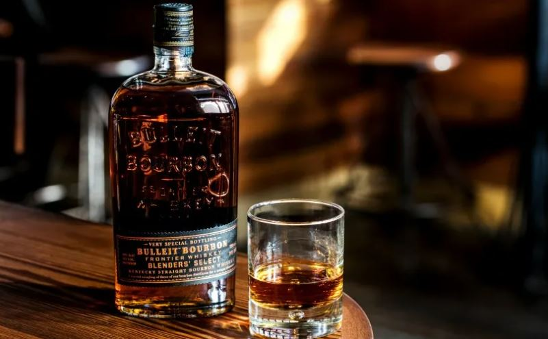
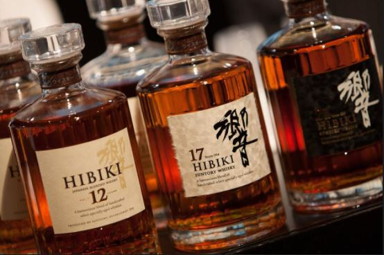

# 🥃 Whiskey


Whisky, or Whiskey, doesn’t matter really, as long as it leads to the strong,
kickass taste of the most prestigious “in my opinion” drink.

```text
“Whiskey, like a beautiful woman, demands appreciation.
You gaze first, then it’s time to drink.”
-Haruki Murakami
```

Kegs are for college students and vodka is for ladies. When you want a man's
drink, you need a tumbler full of something sophisticated AND rugged. Dig deep
with us on the ultimate drink, the drink of all drinks and the holder of the
throne. Whiskey.

Whether served neat or with one hard cube, a splash of water, or diluted with
sweet vermouth and bitters, there is no better time to tipple whisky…

Or whiskey. To whichever you prescribe, but only after realizing the subtle and
dramatic differences between the two, although it can be clearly identified that
the same result is waged.

So aside from location, how do these various whiskeys and whiskies differ? Let's
begin where Henry II began…


By the 13th century, the Irish were producing distillates from grains such as
corn and barley and aging them in oak for prolonged periods. The result was a
yellow to dark orange alcohol that embodied flavors of earth and dried fruit.
Hence whiskey was born.

The recipe for whiskey production, generally speaking, involves the three steps
of fermentation, distillation, and aging. It begins with the fermentation of
grain – it is always grain, whether barely, corn, or rye – then the distillation
of the liquid in a pot still or column still, followed by prolonged aging in
oak.

But if the Irish were the originators, how come Scotch is more prevalent? Like
anything else, economics and politics play as much a hand in success as quality.
Unfortunately for the Irish, economic and political turmoil dating back to the
beginning of the 19th century has left much ground to recover.

## 🏴󠁧󠁢󠁳󠁣󠁴󠁿 Scotland


So, they weren't first, but how have they revolutionized the whisky trade. What
makes Scotch unique aside from its styles (single malts, blended malts, blended
grains) is how it varies from region to region. Whether it's notes of iodine and
smoke from Islay or rich and floral nuances from The Highlands, there is a
Scotch to be enjoyed by all types of whisky drinkers.

## 🇨🇦 Canada


Although Canadian whisky, notice no “e”, has lost support from American drinkers
over the years – especially after Prohibition was repealed – it still sells
volumes at home and internationally. Remarkably smooth, Canadian labeling laws
tend to be somewhat lax when compared to its U.S. neighbor. Apart from having to
be distilled in Canada with cereal grains and aged for 3 years, there is no
legal bearing as to what qualifies as a Canadian whisky, Canadian rye whisky or
rye whisky, although rye is the grain.

## 🇺🇸 United States



Talk about pride and something distinctly American. Bourbon… wait, I meant rye
whiskey… no we're talking Tennessee whiskey, benefiting from the Lincoln County
Process a.k.a. Jack Daniels… alright all of those products fit the
aforementioned statement but let's break down what's what.

Though it bears the name of the eponymous Bourbon County, bourbon whiskey can be
produced legally anywhere in the United States. The fact is, despite owning 95%
of production, there are several states that distill bourbon outside of
Kentucky, including Tennessee, Pennsylvania, Virginia, Colorado, even as far
north as New York.

## 🇯🇵 Japan



Who can forget Bob Harris (Bill Murray) struggling through his photo shoot in
2003's Lost in Translation: `“For relaxing times… make it Suntory time?”`

That was probably the best international marketing the Japanese whisky industry
could have hoped for. Producing their own style of whisky since the late 1800's
only recently has the industry achieved recognition globally, and it's about
time, the Japanese love their whisky.

More comparable to the Scotch style, Japanese whiskies are produced throughout
the country as single malts and blended varieties. Flavors range from salty and
peaty to oily and fruity depending on the distiller.

## About the Author

Mujahid Al-Majali, a 29-year-old former air force soldier and an economic
development and business specialist, also does translation and copywriting.
Loves long drives, chill music and old school movies. A nicotine addict and a
huge fan of Jack Daniel’s whiskey. Owned multiple businesses in Amman and
southern of Jordan PRE-COVID and now focusing on translation and copywriting
part of my experience through Upwork.

### Important Links

- <https://www.iowalegendaryrye.com/the-history-of-whiskey-and-prohibition/>
