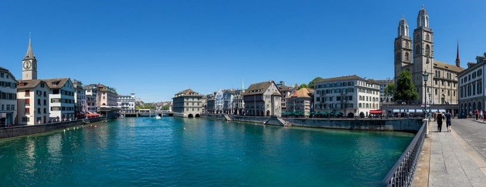

# 🏰 Zürich

Zurich is the most populous city in Switzerland, filled with museums, shopping districts and a lively nightlife, for which it is considered by many to be the "Center of Switzerland". Located at the Confluence between Lake Zurich and the Limmat River, very close to the Alps. This city is the cultural and financial heart of the country, as well as being one of the most expensive cities with the highest quality of life in the world.

Zurich has a rich cultural heritage within its old town and a large number of tourist attractions such as art galleries, museums, viewpoints, churches, parks, which are really worth knowing.

In this article we will make a list of the most important sites that you should not miss if you visit Zurich.

## The historic center

Altstadt is the historic center of the city, it is made up of four neighborhoods and surrounded by some ruins that still remain of the old medieval wall. The most interesting area is around the Town Hall and near the Limmat River, it is there where the most charming squares and alleys are concentrated, you can see medieval houses and Renaissance buildings with their traditional style and colorful facades, as well as hundreds of restaurants and shops.

In this area you can find some of the interesting points of interest such as the Bahnhofstrasse shopping street, Peterskirche and Fraumünster, the Grossmünster churches, the Limmatquai guild houses, the Grimmenturm tower and the Cabaret Voltaire where the cultural movement of Dada began.

In the historic center there are also several of the best restaurants where you can taste the local cuisine, such as the Zeughauskeller that offers you delicious sausages with rosti or the Swiss Chuchi that specializes in fondues.

## Lake Zurich

This huge lake is more than 40 km long where you can take relaxing walks or ride a bike along the shore, if you go in summer you can bathe in one of its beaches. You can also take a boat trip where you can see towns, beaches, luxury villas and Rapperswil, also called the city of roses, thanks to its gardens that are home to more than 15,000 rose bushes.

## Grossmunster Church

The Grossmünster church was built between the years 1100 and 1220 by the Limmat river. Known as the great cathedral and it is of enormous historical importance, since it was there that the Protestant Reformation began in Switzerland in 1519 by Zwingli. Outside the Church you can see two impressive twin bell towers that were added between 1487 and 1492. Inside you can see fabulous stained glass windows, the choir window, a cloister with magnificent capitals, the bronze doors and its romantic crypt. Before leaving the church, the recommendation is to climb the 187 steps to reach the top of one of its towers and thus enjoy the beautiful views of the river and the city.

Other interesting churches that you should see in the city are Peterskirche, which has a tower with a beautiful clock, and Fraumünster, where you can see its 5 impressive stained
glass windows.

## National Museum of Zurich

The National Museum is located in a French-style building very similar to a medieval castle, there you can review the culture and history of Switzerland from prehistoric times to today.

This history museum is the most visited in the country and has an extensive collection of permanent objects, temporary exhibitions, conferences, workshops, debates, which are held with the aim of reinforcing knowledge and learning.

The other important museum you should visit in Zurich is the Kunsthaus, where you can see one of the most important art collections in Europe. There you can view the important works of great masters such as Picasso, Van Gogh, Much, Matisse, Monet, among many others.

## Bahnhofstrasse

Bahnhofstrasse is also called the station street where you can see the most luxurious shops in the world, being the most famous in Zurich. On this street, which is approximately a kilometer and a half long, you will find stores that are unaffordable for most pockets, such as Cartier, Luis Vuitton and Tiffany & Co, among others. In addition to cafes, restaurants, art galleries and a large number of chocolate shops such as the wonderful Läderach Chocolatier Suisse.

Other essential streets to visit in the historic center are the medieval alley Augustinergasse, where you will fall in love with its colorful facades with its beautiful wooden windows, and Limmatquai Street, which is full of beautiful houses along the Limago River.

## Üetliberg viewpoint

Üetliberg is a peak located 870 meters above sea level that has a viewpoint where you can get impressive views of the city, the Alps mountains (when the sky is clear) and the lake. To get to the viewpoint you have two alternatives, you can take the tram to Albisguiti and walk up for approximately 45 minutes along a beautiful path surrounded by nature. The second option is to take the train from the central station and it will take about 20 minutes to get there.

In addition to enjoying the spectacular views at the top of the hill, there are several restaurants where you can recover your energy (if you have walked up).

Another place that has good panoramic views of the city is a small hill where the University is and to get there, you must take the old Polybahn funicular on Limmattquai street.

## The Opera

The Opera is located in the impressive neoclassical-style building that was built in 1891. The greatest opera and ballet artists have performed in this concert hall, with a capacity for 1,100 spectators, it has become the largest cultural landmark in the city and that you should not miss.

## Lindenhoff

Between Bahnhofstrasse and the Limmat river is the Lindenhof district, being the oldest area of the city. In this medieval quarter you will find endless steep cobbled streets packed with craft shops, restaurants, charming cafes and Roman ruins located on the popular hill where the city was born a little over 2000 years ago. Today it is a spectacular viewpoint to watch the sunset and an oasis of peace.

## Zurich Botanical Garden

The Botanical Garden belongs to the University and in this open-air space you can see more than 7,000 species of plants, as well as three dome-shaped greenhouses that house trees, flowers and plants from all over the world.

Zurich is a cosmopolitan city full of tourist attractions and full of charm, which are worth knowing.

## About the Author

Idais, Graduated in Mechanical Engineering, and a master’s degree in teaching component, she gave classes in several institutes of mathematics and physics, but she also dedicated several years of my life as a television producer, she did the scripts for mikes, the camera direction, editing of video and even the location. Later she was dedicated to SEO writing for a couple of years. she like poetry, chess and dominoes.
